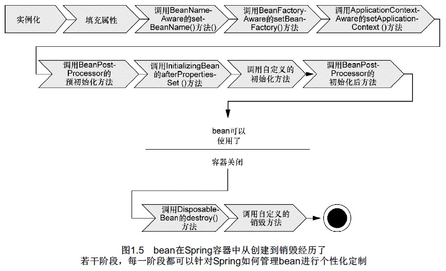

# 一、简化Java开发
## 1. Spring的主要特性
依赖注入DI和面向切面编程AOP。
## 2. 关键策略
轻量级和最小侵入性编程：POJO
松耦合：DI和AOP
声明式编程：切面和惯例
减少样板式代码：切面和模板
## 3. 优点
Spring不会强迫你实现Spring规范的接口或继承Spring规范的类。往往没有任何迹象表明你使用了Spring！
## 4. 依赖注入DI
装配（wiring）：创建应用组件之间协作的行为；
Spring的装配：有多种装配Bean的方式，最常见的是XML配置方式；
工作方式：Spring通过应用上下文（Application Context）装载、组装Bean；
Spring的上下文：有多种，区别在于如何加载它们的配置。常用的如ClassPathXmlApplicationContext，可用来加载位于系统classpath下的一个或多个XML文件。
(依赖注入更多参考《Dependency Injection》，Dhanji R.  Prasanna)

## 5. 应用切面AOP
DI让相互协作的软件组件保持松散耦合，而AOP编程允许你把遍布应用各处的功能分离出来形成可重用的组件。

## 6. 通过“模板封装”消除样板式代码
典型的如Spring JdbcTemplate，使得在执行数据库操作时，避免传统的JDBC样板式代码成为可能。

# 二、容纳你的Bean
## 1. Spring容器
在基于Spring的应用中，应用对象生存于Spring容器中。
容器：负责应用对象的创建、装配、配置、管理等整个生命周期，即负责了从创建到销毁的过程。
Spring容器：Spring自带集中容器实现，可归纳为Bean工厂（bean factories）和应用上下文（application）两类，重点应用的是应用上下文。
应用上下文：Spring主要的几种应用上下文：
ClassPathXMLApplicationContext——从类路径下的XML配置文件中加载上下文定义，把应用上下文定义文件当做类资源；
FileSystemXMLApplicationContext——读取文件系统下的XML配置文件并加载上下文定义；
XmlWebApplicationContext——读取Web应用下的XML配置文件并装载上下文；

## 2. 生命周期
正确理解Spring bean的生命周期非常重要，因为你或许要利用Spring提供的扩展点来自定义bean的创建过程。
<br/><br/>

在bean准备就绪之前，bean工厂执行了若干启动步骤。我们对图1.5进行详细描述：
```
1．Spring对bean进行实例化；
2．Spring将值和bean的引用注入到bean对应的属性中；
3．如果bean实现了BeanNameAware接口，Spring将bean的ID传递给setBean-Name()方法；
4．如果bean实现了BeanFactoryAware接口，Spring将调用setBeanFactory()方法，将BeanFactory容器实例传入；
5．如果bean实现了ApplicationContextAware接口，Spring将调用setApplicationContext()方法，将bean所在的应用上下文的引用传入进来；
6．如果bean实现了BeanPostProcessor接口，Spring将调用它们的post-ProcessBeforeInitialization()方法；
7．如果bean实现了InitializingBean接口，Spring将调用它们的after-PropertiesSet()方法。类似地，如果bean使用init-method声明了初始化方法，该方法也会被调用；
8．如果bean实现了BeanPostProcessor接口，Spring将调用它们的post-ProcessAfterInitialization()方法；
9．此时，bean已经准备就绪，可以被应用程序使用了，它们将一直驻留在应用上下文中，直到该应用上下文被销毁；
10．如果bean实现了DisposableBean接口，Spring将调用它的destroy()接口方法。同样，如果bean使用destroy-method声明了销毁方法，该方法也会被调用。
```

> 项目使用过InitializingBean接口，即初始化bean时就执行该方法，以预加载一些业务的数据。与init-methd注解功能一样，参考https://www.cnblogs.com/study-everyday/p/6257127.html。

# 源码
https://github.com/myitroad/spring-in-action-4/tree/master/Chapter_01/knight

## 使用xml将SlayDragonQuest注入到BraveKnight中
```
<?xml version="1.0" encoding="UTF-8"?>
<beans xmlns="http://www.springframework.org/schema/beans"
  xmlns:xsi="http://www.w3.org/2001/XMLSchema-instance"
  xsi:schemaLocation="http://www.springframework.org/schema/beans
      http://www.springframework.org/schema/beans/spring-beans.xsd">

  <bean id="knight" class="sia.knights.BraveKnight">
    <constructor-arg ref="quest" />
  </bean>

  <bean id="quest" class="sia.knights.SlayDragonQuest">
    <constructor-arg value="#{T(System).out}" />
  </bean>

</beans>

```

## 使用Java将SlayDragonQuest注入到BraveKnight中
```
package sia.knights.config;

import org.springframework.context.annotation.Bean;
import org.springframework.context.annotation.Configuration;

import sia.knights.BraveKnight;
import sia.knights.Knight;
import sia.knights.Quest;
import sia.knights.SlayDragonQuest;

@Configuration
public class KnightConfig {

  @Bean
  public Knight knight() {
    return new BraveKnight(quest());
  }

  @Bean
  public Quest quest() {
    return new SlayDragonQuest(System.out);
  }

}

```

## 使用xml将Minstel声明为一个切面
```
<?xml version="1.0" encoding="UTF-8"?>
<beans xmlns="http://www.springframework.org/schema/beans"
  xmlns:xsi="http://www.w3.org/2001/XMLSchema-instance"
  xmlns:aop="http://www.springframework.org/schema/aop"
  xsi:schemaLocation="http://www.springframework.org/schema/aop
      http://www.springframework.org/schema/aop/spring-aop.xsd
      http://www.springframework.org/schema/beans
      http://www.springframework.org/schema/beans/spring-beans.xsd">

  <bean id="knight" class="sia.knights.BraveKnight">
    <constructor-arg ref="quest" />
  </bean>

  <bean id="quest" class="sia.knights.SlayDragonQuest">
    <constructor-arg value="#{T(System).out}" />
  </bean>

  <bean id="minstrel" class="sia.knights.Minstrel">
    <constructor-arg value="#{T(System).out}" />
  </bean>

  <aop:config>
    <aop:aspect ref="minstrel">
      <aop:pointcut id="embark"
          expression="execution(* *.embarkOnQuest(..))"/>

      <aop:before pointcut-ref="embark"
          method="singBeforeQuest"/>

      <aop:after pointcut-ref="embark"
          method="singAfterQuest"/>
    </aop:aspect>
  </aop:config>

</beans>

```

