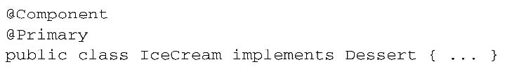
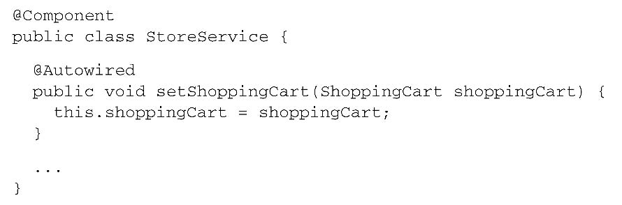

Chapter 3 Examples
==================
This folder contains example code for chapter 3 of Spring in Action, 4th Edition.
The samples are split across multiple directories:

 * profiles     : Examples illustrating profile configuration for section 3.1.
 * conditionals : Examples illustrating conditional configuration for section 3.2.
 * scopedbeans  : Examples illustrating scoped bean configuration for section 3.4.
 * externals    : Examples illustrating external configuration for section 3.5.

Note that because the examples evolve throughout the chapter and the book's text sometimes
shows multiple ways of accomplishing a goal, not all variations of the code in the book will
be represented in these samples. You are invited to use this source code as a starting point
and experiment using the variations presented in the text.

# 1. 环境与profile
在开发软件的时候，有一个很大的挑战就是将应用程序从一个环境迁移到另外一个环境。开发阶段中，某些环境相关做法可能并不适合迁移到生产环境中，甚至即便迁移过去也无法正常工作。

其中一种方式就是在单独的配置类（或XML文件）中配置每个bean，然后在构建阶段（可能会使用Maven的profiles）确定要将哪一个配置编译到可部署的应用中。

## 3.1 配置profile bean
过Spring并不是在构建的时候做出这样的决策，而是等到运行时再来确定。这样的结果就是同一个部署单元（可能会是WAR文件）能够适用于所有的环境，没有必要进行重新构建。

- Java 配置
在Java配置中，可以使用@Profile注解指定某个bean属于哪一个profile。在Spring 3.1中，只能在类级别上使用@Profile注解。不过，从Spring 3.2开始，你也可以在方法级别上使用@Profile注解，与@Bean注解一同使用。这样的话，就能将这两个bean的声明放到同一个配置类之中,如：
```
@Configuration
public class DataSourceConfig {

  @Bean(destroyMethod = "shutdown")
  @Profile("dev")
  public DataSource embeddedDataSource() {
    return new EmbeddedDatabaseBuilder()
        .setType(EmbeddedDatabaseType.H2)
        .addScript("classpath:schema.sql")
        .addScript("classpath:test-data.sql")
        .build();
  }

  @Bean
  @Profile("prod")
  public DataSource jndiDataSource() {
    JndiObjectFactoryBean jndiObjectFactoryBean = new JndiObjectFactoryBean();
    jndiObjectFactoryBean.setJndiName("jdbc/myDS");
    jndiObjectFactoryBean.setResourceRef(true);
    jndiObjectFactoryBean.setProxyInterface(javax.sql.DataSource.class);
    return (DataSource) jndiObjectFactoryBean.getObject();
  }

}
```
- XML配置
在根`<beans>`元素中嵌套定义`<beans>`元素，而不是为每个环境都创建一个profile XML文件。这能够将所有的profile bean定义放到同一个XML文件中，如：
```
<?xml version="1.0" encoding="UTF-8"?>
<beans xmlns="http://www.springframework.org/schema/beans"
  xmlns:xsi="http://www.w3.org/2001/XMLSchema-instance" xmlns:jdbc="http://www.springframework.org/schema/jdbc"
  xmlns:jee="http://www.springframework.org/schema/jee" xmlns:p="http://www.springframework.org/schema/p"
  xsi:schemaLocation="
    http://www.springframework.org/schema/jee
    http://www.springframework.org/schema/jee/spring-jee.xsd
    http://www.springframework.org/schema/jdbc
    http://www.springframework.org/schema/jdbc/spring-jdbc.xsd
    http://www.springframework.org/schema/beans
    http://www.springframework.org/schema/beans/spring-beans.xsd">

  <beans profile="dev">
    <jdbc:embedded-database id="dataSource" type="H2">
      <jdbc:script location="classpath:schema.sql" />
      <jdbc:script location="classpath:test-data.sql" />
    </jdbc:embedded-database>
  </beans>

  <beans profile="prod">
    <jee:jndi-lookup id="dataSource"
      lazy-init="true"
      jndi-name="jdbc/myDatabase"
      resource-ref="true"
      proxy-interface="javax.sql.DataSource" />
  </beans>
</beans>

```

## 3.2 激活profile
Spring在确定哪个profile处于激活状态时，需要依赖两个独立的属性：`spring.profiles.active`和`spring.profiles.default`。
如果`spring.profiles.active`和`spring.profiles.default`均没有设置的话，那就没有激活的profile，因此只会创建那些没有定义在 profile中的bean。
有多种方式来设置这两个属性：
- 作为DispatcherServlet的初始化参数；
- 作为Web应用的上下文参数；
- 作为JNDI条目；
- 作为环境变量；
- 作为JVM的系统属性；
- 在集成测试类上，使用@ActiveProfiles注解设置。

在Web应用的web.xml文件中设置默认的profile,使用DispatcherServlet方式激活profile：
<br/><br/>

**使用profile进行测试**
Spring提供了@ActiveProfiles注解，我们可以使用它来指定运行测试时要激活哪个profile。
<br/><br/>

# 2. 条件化的bean
假设你希望一个或多个bean只有在应用的类路径下包含特定的库时才创建。或者我们希望某个bean只有当另外某个特定的bean也声明了之后才会创建。我们还可能要求只有某个特定的环境变量设置之后，才会创建某个bean。
在Spring 4之前，很难实现这种级别的条件化配置，但是Spring 4引入了一个新的@Conditional注解，它可以用到带有@Bean注解的方法上。如果给定的条件计算结果为true，就会创建这个bean，否则的话，这个bean会被忽略。

设置给@Conditional的类可以是任意实现了Condition接口的类型。可以看出来，这个接口实现起来很简单直接，只需提供matches()方法的实现即可。如果matches()方法返回true，那么就会创建带有@Conditional注解的bean。

- 实现条件类
```
public class MagicExistsCondition implements Condition {

  @Override
  public boolean matches(ConditionContext context, AnnotatedTypeMetadata metadata) {
    Environment env = context.getEnvironment();
    return env.containsProperty("magic");
  }

}
```

- 定制条件装配JavaConfig
```
@Configuration
@PropertySource("classpath:conf.properties")
public class MagicConfig {

  @Bean
  @Conditional(MagicExistsCondition.class)
  public MagicBean magicBean() {
    return new MagicBean();
  }

}
```
其中，MagicBean是一个简单的bean，如下：
```
public class MagicBean {

}
```
配置文件conf.properties：
```
magic=something
```
matches()方法很简单但功能强大。它通过给定的ConditionContext对象进而得到Environment对象，并使用这个对象检查环境中是否存在名为magic的环境属性。

ConditionContext是一个接口，大致如下所示：
<br/><br/>

AnnotatedTypeMetadata则能够让我们检查带有@Bean注解的方法上还有什么其他的注解。像ConditionContext一样，AnnotatedTypeMetadata也是一个接口。
<br/><br/>

从Spring 4开始，@Profile注解进行了重构，使其基于@Conditional和Condition实现。

# 3. 处理自动装配的歧义性
发生歧义性的时候，Spring提供了多种可选方案来解决这样的问题。你可以将可选bean中的某一个设为首选（primary）的bean，或者使用限定符（qualifier）来帮助Spring将可选的bean的范围缩小到只有一个bean。
## 3.1 标示首选的bean
- 在声明bean的时候声明
通过将其中一个可选的bean设置为首选（primary）bean能够避免自动装配时的歧义性。如：
<br/><br/>

- 通过Java配置显式地声明
<br/><br/>

- 通过XML配置显式地声明
<br/><br/>

但是，如果你标示了两个或更多的首选bean，那么它就无法正常工作了。限定符是一种更为强大的机制，下面就将对其进行介绍。

## 3.2 限定自动装配的bean
@Qualifier注解是使用限定符的主要方式。它可以与@Autowired和@Inject协同使用，在注入的时候指定想要注入进去的是哪个bean。
如，注入特定的bean：
<br/><br/>

所有使用@Component注解声明的类都会创建为bean，并且bean的ID为首字母变为小写的类名。基于默认的bean ID作为限定符是非常简单的，但这有可能会引入一些问题。问题在于setDessert()方法上所指定的限定符与要注入的bean的名称是紧耦合的。对类名称的任意改动都会导致限定符失效。

**创建自定义的限定符**
需要做的就是在bean声明上添加@Qualifier注解。例如，它可以与@Component组合使用，如下所示：
<br/><br/>

如果多个bean都具备相同特性的话，这种做法也会出现问题。有了两个带有“cold”限定符的甜点。在自动装配Dessert bean的时候，我们再次遇到了歧义性的问题，需要使用更多的限定符来将可选范围限定到只有一个bean。
Java不允许在同一个条目上重复出现相同类型的多个注解。(Java 8允许出现重复的注解，只要这个注解本身在定义的时候带有@Repeatable注解就可以。不过，Spring的@Qualifier注解并没有在定义时添加@Repeatable注解。)。这时需要使用自定义的限定符注解。

**使用自定义的限定符注解**
自定义的@Cold注解，该注解的定义如下所示：
<br/><br/>

同样，你可以创建一个新的@Creamy注解来代替@Qualifier("creamy")：
<br/><br/>

现在，我们可以重新看一下IceCream，并为其添加@Cold和@Creamy注解，如下所示：
<br/><br/>

# 4. bean的作用域
在默认情况下，Spring应用上下文中所有bean都是作为以单例（singleton）的形式创建的。也就是说，不管给定的一个bean被注入到其他bean多少次，每次所注入的都是同一个实例。

Spring定义了多种作用域，可以基于这些作用域创建bean，包括：
- 单例（Singleton）：在整个应用中，只创建bean的一个实例。
- 原型（Prototype）：每次注入或者通过Spring应用上下文获取的时候，都会创建一个新的bean实例。
- 会话（Session）：在Web应用中，为每个会话创建一个bean实例。
- 请求（Rquest）：在Web应用中，为每个请求创建一个bean实例。

单例是默认的作用域，但是正如之前所述，对于易变的类型，这并不合适。如果选择其他的作用域，要使用@Scope注解，它可以与@Component或@Bean一起使用。有三种指定Bean作用域的方法：

- 声明Bean的作用域
<br/><br/>

- Java配置指定Bean的作用域
<br/><br/>

- XML配置指定Bean的作用域
<br/><br/>

不管你使用哪种方式来声明原型作用域，每次注入或从Spring应用上下文中检索该bean的时候，都会创建新的实例。这样所导致的结果就是每次操作都能得到自己的Notepad实例。

## 4.1 使用会话和请求作用域
在Web应用中，如果能够实例化在会话和请求范围内共享的bean，那将是非常有价值的事情。例如，在典型的电子商务应用中，可能会有一个bean代表用户的购物车。就购物车bean来说，会话作用域是最为合适的，因为它与给定的用户关联性最大。
<br/><br/>

要注意的是，@Scope同时还有一个proxyMode属性，它被设置成了ScopedProxyMode.INTERFACES。这个属性解决了将会话或请求作用域的bean注入到单例bean中所遇到的问题。在描述proxyMode属性之前，我们先来看一下proxyMode所解决问题的场景。
假设我们要将ShoppingCart bean注入到单例StoreService bean的Setter方法中，如下所示：
<br/><br/>

因为StoreService是一个单例的bean，会在Spring应用上下文加载的时候创建。当它创建的时候，Spring会试图将ShoppingCart bean注入到setShoppingCart()方法中。但是ShoppingCart bean是会话作用域的，此时并不存在。直到某个用户进入系统，创建了会话之后，才会出现ShoppingCart实例。

Spring并不会将实际的ShoppingCart bean注入到StoreService中，Spring会注入一个到ShoppingCart bean的代理，如图3.1所示。这个代理会暴露与ShoppingCart相同的方法，所以StoreService会认为它就是一个购物车。但是，当StoreService调用ShoppingCart的方法时，代理会对其进行懒解析并将调用委托给会话作用域内真正的ShoppingCart bean。

现在，我们带着对这个作用域的理解，讨论一下proxyMode属性。如配置所示，proxyMode属性被设置成了ScopedProxyMode.INTERFACES，这表明这个代理要实现ShoppingCart接口，并将调用委托给实现bean。
如果ShoppingCart是接口而不是类的话，这是可以的（也是最为理想的代理模式）。但如果ShoppingCart是一个具体的类的话，Spring就没有办法创建基于接口的代理了。此时，它必须使用CGLib来生成基于类的代理。所以，如果bean类型是具体类的话，我们必须要将proxyMode属性设置为ScopedProxyMode.TARGET_CLASS，以此来表明要以生成目标类扩展的方式创建代理。
<br/><br/>

## 4.2 在XML中声明作用域代理
要设置代理模式，我们需要使用Spring aop命名空间的一个新元素：
<br/><br/>

`<aop:scoped-proxy>`是与@Scope注解的proxyMode属性功能相同的Spring XML配置元素。它会告诉Spring为bean创建一个作用域代理。默认情况下，它会使用CGLib创建目标类的代理。但是我们也可以将proxy-target-class属性设置为false，进而要求它生成基于接口的代理：
<br/><br/>

# 5. 运行时值注入
在前面的介绍中，我们遇到过bean属性或构造器参数硬编码的情况，如：
- 基于Java的硬编码
<br/><br/>

- 基于XML的硬编码
<br/><br/>

我们可能会希望避免硬编码值，而是想让这些值在运行时再确定。为了实现这些功能，Spring提供了两种在运行时求值的方式：
- 属性占位符（Property placeholder）。
- Spring表达式语言（SpEL）。

## 5.1 注入外部的值
在Spring中，处理外部值的最简单方式就是声明属性源并通过Spring的Environment来检索属性。例如，程序清单3.7展现了一个基本的Spring配置类，它使用外部的属性来装配BlankDisc bean。
- 使用@PropertySource注解和Environment
```
@Configuration
@PropertySource("classpath:/com/soundsystem/app.properties")
public class EnvironmentConfig {

  @Autowired
  Environment env;

  @Bean
  public BlankDisc blankDisc() {
    return new BlankDisc(
        env.getProperty("disc.title"),
        env.getProperty("disc.artist"));
  }

}
```
其中，app.properties：
```
disc.title=Sgt. Peppers Lonely Hearts Club Band
disc.artist=The Beatles
```
**深入学习Spring的Environment**
当我们去了解Environment的时候会发现，程序清单3.7所示的getProperty()方法并不是获取属性值的唯一方法，getProperty()方法有四个重载的变种形式：
<br/><br/>

如果你希望这个属性必须要定义，那么可以使用getRequiredProperty()方法，如下所示：
<br/><br/>

如果想检查一下某个属性是否存在的话，那么可以调用Environment的containsProperty()方法：
<br/><br/>

**解析属性占位符**
Spring一直支持将属性定义到外部的属性的文件中，并使用占位符值将其插入到Spring bean中。在Spring装配中，占位符的形式为使用`${... }`包装的属性名称。作为样例，我们可以在XML中按照如下的方式解析BlankDisc构造器参数：
<br/><br/>

如果我们依赖于组件扫描和自动装配来创建和初始化应用组件的话，那么就没有指定占位符的配置文件或类了。在这种情况下，我们可以使用@Value注解，它的使用方式与@Autowired注解非常相似。比如，在BlankDisc类中，构造器可以改成如下所示：
<br/><br/>

**启用占位符**
为了使用占位符，我们必须要配置一个PropertyPlaceholderConfigurer bean或PropertySourcesPlaceholderConfigurer bean。从Spring 3.1开始，推荐使用PropertySourcesPlaceholderConfigurer，因为它能够基于Spring Environment及其属性源来解析占位符。
- Java配置启用占位符
如下的@Bean方法在Java中配置了PropertySourcesPlaceholderConfigurer：
<br/><br/>

- XML配置启用占位符
<br/><br/>

## 5.2 使用Spring表达式语言进行装配
Spring 3引入了Spring表达式语言（Spring Expression Language，SpEL），它能够以一种强大和简洁的方式将值装配到bean属性和构造器参数中，在这个过程中所使用的表达式会在运行时计算得到值。使用SpEL，你可以实现超乎想象的装配效果，这是使用其他的装配技术难以做到的（甚至是不可能的）。

SpEL拥有很多特性，包括：
- 使用bean的ID来引用bean；
- 调用方法和访问对象的属性；
- 对值进行算术、关系和逻辑运算；
- 正则表达式匹配；
- 集合操作。

第一件事情就是SpEL表达式要放到`#{ ... }`之中，这与属性占位符有些类似，属性占位符需要放到`${ ... }`之中。
**SpEL可进行的操作**
- 表达式使用Java类型

- 表达式使用bean属性

- 表达式使用系统属性
<br/><br/>


**使用SpEL表达式完成占位符的功能**
- 通过组件扫描创建bean
<br/><br/>

- 通过XML配置创建bean
<br/><br/>

**使用SpEL注意**
不要让你的表达式太智能。你的表达式越智能，对它的测试就越重要。SpEL毕竟只是String类型的值，可能测试起来很困难。鉴于这一点，我建议尽可能让表达式保持简洁，这样测试不会是什么大问题。