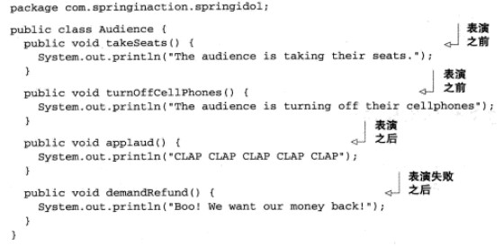

# 1. 什么是面向切面编程
AOP是什么
切面帮助我们模块化横切关注点。
横切关注点可被描述为影响应用【多处的】功能。如安全，应用许多方法会涉及安全规则。

继承与委托是最常见的实现重用 通用功能 的面向对象技术。但是继承往往会导致一个脆弱的对象体系；委托可能需要对委托对象进行复杂的调用。

切面提供了另一种选择，在很多场景下更清晰简洁。
在使用面向切面编程时，任然在一个地方定义通用功能，但是我们可以通过声明的方式定义这个功能以何种方式在何处应用，而无需修改受影响的类。
横切关注点可以被模块化为特殊的类，这些类被称为【切面】。

**好处**
1、一个关注点只集中于一处，而不是分散到多处代码中；
2、服务模块更简洁，因为它们只包含核心功能，而次要关注点被转移到切面中了。

## 1.1 定义AOP术语
【通知（advice）】：定义了切面是什么以及何时使用，Spring切面可以应用5种类型的通知——Before、After、After-returning、After-throwing、Around。
【切点（pointcut）】：定义了“何处”，切点的定义会匹配通知所要织入的一个或者多个连接点，通常使用明确的类和方法名称来指定这些切点（或正则方式）。
【连接点（join point）】：是在应用执行过程中能够插入切面的一个点。这个点可以使调用方法时、抛出异常时、甚至修改一个字段时。切面代码可以利用这些点插入到应用的正常流程之中，并添加新的行为。
【切面（Aspect）】：是通知和切点的结合。通知和切点共同定义了关于切面的全部内容，即在是什么、何时、何处完成其功能。
【引入（Introduction）】：引入允许我们向现有的类添加新方法或属性。
【织入（Weaving）】：是将切面应用到目标对象来创建新的代理对象的过程。切面在指定的连接点被织入到目标对象中，在目标对象的生命周期里有多个点可以进行织入：编译期、类加载期、运行期。

## 1.2 Spring对AOP的支持
AOP框架：
> AspectJ
> JBoss AOP
> Spring AOP（这是重点）

Spring AOP支持：
基于代理的经典AOP
@AspectJ注解驱动的切面
纯POJO切面
注入式AspectJ切面

Spring AOP特性：
Spring通知是Java编写的；
Spring在运行期通知对象；
Spring只支持方法连接点；

Spring基于动态代理，所以Spring只支持方法连接点，缺少对字段连接点的支持，无法创建细粒度的通知如拦截对象字段的修改；而且也不支持构造器连接点，如无法在Bean创建时应用通知。
若需要方法拦截之外的连接点拦截，可以利用Aspect来协助Spring AOP。

# 2. 通过切点来选择连接点
在Spring AOP中，需要使用AspectJ的切点表达式语言来定义切点。
另，Spring仅支持AspectJ切点指示器（pointcut designator）的一个子集。这是因为Spring是基于代理的，而某些切点表达式是与基于代理的AOP无关的。
 

## 2.1 编写切点

上图，使用execution()指示器选择Instrument的play()方法：表达式以*开始，标识了不关心返回值类型；然后指定了全限定类名和方法名；对方法参数列表，使用(..)标识切点选择任意的play()方法，无论该方法的入参是什么。

## 2.2 在切点中选择bean
使用Spring的bean()指示器：
Spring2.5引入了一个新的bean()指示器，允许我们在切点表达式中使用Bean的ID来标识Bean。
 

 

在执行Instrument的play()方法时应用通知，但限定Bean的ID为eddie，或ID不为eddie。

# 3. 使用注解创建切面
使用注解来创建切面是AspectJ 5所引入的关键特性。AspectJ 5之前，编写AspectJ切面需要学习一种Java语言的扩展，但是AspectJ面向注解的模型可以非常简便地通过少量注解把任意类转变为切面。

## 3.1 定义切面
从演出的角度来看，观众是非常重要的，但是对演出本身的功能来讲，它并不是核心，这是一个单独的关注点。因此，将观众定义为一个切面，并将其应用到演出上就是较为明智的做法。

程序清单4.1展现了Audience类，它定义了我们所需的一个切面。
 

Audience类使用@AspectJ注解进行了标注。该注解表明Audience不仅仅是一个POJO，还是一个切面。Audience类中的方法都使用注解来定义切面的具体行为。
Audience有四个方法，定义了一个观众在观看演出时可能会做的事情。在演出之前，观众要就坐（takeSeats()）并将手机调至静音状态（silenceCellPhones()）。如果演出很精彩的话，观众应该会鼓掌喝彩（applause()）。不过，如果演出没有达到观众预期的话，观众会要求退款（demandRefund()）。

可以看到，这些方法都使用了通知注解来表明它们应该在什么时候调用。AspectJ提供了五个注解来定义通知，如表4.2所示：
 

像其他的Java类一样，它可以装配为Spring中的bean：
 

**启用自动代理功能**
如果你就此止步的话，Audience只会是Spring容器中的一个bean。即便使用了AspectJ注解，但它并不会被视为切面，这些注解不会解析，也不会创建将其转换为切面的代理。
- 基于Java配置
如果你使用JavaConfig的话，可以在配置类的类级别上通过使用EnableAspectJ-AutoProxy注解启用自动代理功能。程序清单4.3展现了如何在JavaConfig中启用自动代理。

- 基于XML配置
假如你在Spring中要使用XML来装配bean的话，那么需要使用Spring aop命名空间中的`<aop:aspectj-autoproxy>`元素。下面的XML配置展现了如何完成该功能。

不管你是使用JavaConfig还是XML，AspectJ自动代理都会为使用@Aspect注解的bean创建一个代理，这个代理会围绕着所有该切面的切点所匹配的bean。在这种情况下，将会为Concertbean创建一个代理，Audience类中的通知方法将会在perform()调用前后执行。

## 3.2 创建环绕通知
环绕通知是最为强大的通知类型。它能够让你所编写的逻辑将被通知的目标方法完全包装起来。实际上就像在一个通知方法中同时编写前置通知和后置通知。
为了阐述环绕通知，我们重写Audience切面。这次，我们使用一个环绕通知来代替之前多个不同的前置通知和后置通知。

使用环绕通知重新实现Audience切面
 

这个通知所达到的效果与之前的前置通知和后置通知是一样的。但是，现在它们位于同一个方法中，不像之前那样分散在四个不同的通知方法里面。

关于这个新的通知方法，你首先注意到的可能是它接受ProceedingJoinPoint作为参数。这个对象是必须要有的，因为你要在通知中通过它来调用被通知的方法。通知方法中可以做任何的事情，当要将控制权交给被通知的方法时，它需要调用ProceedingJoinPoint的proceed()方法。

需要注意的是，别忘记调用proceed()方法。如果不调这个方法的话，那么你的通知实际上会阻塞对被通知方法的调用。有可能这就是你想要的效果，但更多的情况是你希望在某个点上执行被通知的方法。有意思的是，你可以不调用proceed()方法，从而阻塞对被通知方法的访问，与之类似，你也可以在通知中对它进行多次调用。要这样做的一个场景就是实现重试逻辑，也就是在被通知方法失败后，进行重复尝试。

## 3.3 处理通知中的参数
使用参数化的通知来记录磁道播放的次数
 

它表明传递给playTrack()方法的int类型参数也会传递到通知中去。参数的名称trackNumber也与切点方法签名中的参数相匹配。

然后，在Spring配置中将BlankDisc和TrackCounter定义为bean，并启用AspectJ自动代理：
 

## 3.4 通过注解引入新功能
Ruby和Groovy等编程语言有开放类的理念，他们可以不用直接修改对象或类的定义就能够为对象或类增加新的方法。但是Java不是动态语言，一旦类编译完成就很难为该类添加新的功能了。
利用“引入”的AOP概念，切面可以为Spring Bean添加新方法。
 

我们需要注意的是，当引入接口的方法被调用时，代理会把此调用委托给实现了新接口的某个其他对象。实际上，一个bean的实现被拆分到了多个类中。

为了验证该主意能行得通，我们为示例中的所有的Performance实现引入下面的Encoreable接口：
 

我们现在假设你能够访问Performance的所有实现，并对其进行修改，让它们都实现Encoreable接口。但是，从设计的角度来看，这并不是最好的做法，并不是所有的Performance都是具有Encoreable特性的。另外一方面，有可能无法修改所有的Performance实现，当使用第三方实现并且没有源码的时候更是如此。

值得庆幸的是，借助于AOP的引入功能，我们可以不必在设计上妥协或者侵入性地改变现有的实现。为了实现该功能，我们要创建一个新的切面：
 

EncoreableIntroducer是一个切面。但是，它与我们之前所创建的切面不同，它并没有提供前置、后置或环绕通知，而是通过@DeclareParents注解，将Encoreable接口引入到Performance bean中。

@DeclareParents注解由三部分组成：
- value属性指定了哪种类型的bean要引入该接口。在本例中，也就是所有实现Performance的类型。（标记符后面的加号表示是Performance的所有子类型，而不是Performance本身。）
- defaultImpl属性指定了为引入功能提供实现的类。在这里，我们指定的是DefaultEncoreable提供实现。
- @DeclareParents注解所标注的静态属性指明了要引入了接口。在这里，我们所引入的是Encoreable接口。

和其他的切面一样，我们需要在Spring应用中将EncoreableIntroducer声明为一个bean：
 

Spring的自动代理机制将会获取到它的声明，当Spring发现一个bean使用了@Aspect注解时，Spring就会创建一个代理，然后将调用委托给被代理的bean或被引入的实现，这取决于调用的方法属于被代理的bean还是属于被引入的接口。

在Spring中，注解和自动代理提供了一种很便利的方式来创建切面。它非常简单，并且只涉及到最少的Spring配置。但是，面向注解的切面声明有一个明显的劣势：你必须能够为通知类添加注解。为了做到这一点，必须要有源码。

如果你没有源码的话，或者不想将AspectJ注解放到你的代码之中，Spring为切面提供了另外一种可选方案。让我们看一下如何在Spring XML配置文件中声明切面。

# 4. 在XML中声明切面
有这样一种原则，那就是基于注解的配置要优于基于Java的配置，基于Java的配置要优于基于XML的配置。但是，如果你需要声明切面，但是又不能为通知类添加注解的时候，那么就必须转向XML配置了。

Spring提供了声明式切面的选择，在Spring AOP配置命名空间中，可以寻找到该方式。AOP配置元素如图：
 

## 4.1 声明前置通知、声明后置通知
如使用：
`<aop:before>`：定义了匹配切点的方法执行之前调用前置通知方法；
`<aop:after-returning>`：定义了一个返回后通知，在切点所匹配的方法调用之后再执行后置通知方法。
 

 

 

## 4.2 声明环绕通知
若不使用成员变量存储信息，前置通知和后置通知之间共享信息非常麻烦，环绕通知则有明显优势。
使用环绕通知可以完成前置通知和后置通知所实现的相同功能，但是只需要在一个方法中实现。
因为整个通知逻辑是在一个方法内实现的，所以不需要使用成员变量保存状态。
 

注意使用了ProceedingJoinPoint作为方法的入参，这个对象非常重要，它能让我们在通知里调用被通知方法。
当希望把控制转给被 通知的方法时，可以调用ProceedingJoinPoint的proceed()方法；
可以忽略调用proceed()方法来阻止执行被通知的方法；
还可以在通知里多次调用被通知的方法，如实现重试逻辑，在被通知的方法执行失败时反复重试。

声明环绕通知与声明其他类型的通知没有太大区别，仅仅需要`<aop:around>`元素。
 

## 4.3 为通知传递参数
有时候需要检验传递给方法的参数值，使用args(param)标识；
 

参数传递关键在于切点定义和`<aop:before>`的arg-names属性。
切点标识了thinkOfSomething()方法，指定了String参数。然后在args参数中标识了将thoughts作为参数；
同样，`<aop:before>`元素引用了thoughts参数，标识该参数必须传递给interceptThoughts()方法。
因此，无论什么时候调用volunteer Bean的thinkOfSomething()方法，Magician都将截听到他的想法。

## 4.4 通过切面引入新功能
前面的小节中，我向你展现了如何借助AspectJ的@DeclareParents注解为被通知的方法神奇地引入新的方法。但是AOP引入并不是AspectJ特有的。使用Spring aop命名空间中的`<aop:declare-parents>`元素，我们可以实现相同的功能。

如下的XML代码片段与之前基于AspectJ的引入功能是相同：
 

这里有两种方式标识所引入接口的实现。在本例中，我们使用default-impl属性用全限定类名来显式指定Encoreable的实现。或者，我们还可以使用delegate-ref属性来标识。
 

delegate-ref属性引用了一个Spring bean作为引入的委托。这需要在Spring上下文中存在一个ID为encoreableDelegate的bean。
 

切面只是实现了它们所包装Bean的相同接口的代理。
如果除了实现这些接口，代理还能发布新接口的话，切面通知的Bean看起来就实现了新的接口，即便底层实现类并没有实现这些接口。

当引入接口的方法被调用时，代理将此调用委托给实现了新接口的某个其他对象，实际上，Bean的实现被拆分到了多个类。
如为表演者Performer引入以下接口：
 

借助AOP引入，我们不需要为设计妥协或者侵入性地改变现有的实现，只需要使用`<aop:declare-parents>`元素：
 

`<aop:declare-parents>`声明了此切面所通知的Bean在它的对象层次结构中拥有新的父类型，如类型匹配Performer接口（types-matching属性指定）的那些Bean会实现Contestant接口（由implement-interface属性指定）。最后要解决的问题是Contestant接口中的方法实现来自何处。
有两种方式标识所引入接口的实现：使用 default-impl属性通过它的全限定类名来显示指定Contestant的实现；或者使用delegate-ref属性来表示，如：
 

delegate-ref属性应用了一个Spring Bean作为引入的委托，这需要在Spring上下文中存在一个ID为contestDelegate的Bean：
 

# 5. 注入AspectJ切面
虽然AspectJ切面与Spring是相互独立的，但使用Spring的依赖注入把Bean装配进AspectJ切面中是一个很好的体验。

# Spring 3知识点
四、注解切面
通过@AspectJ注解，不需要任何额外的类或Bean声明就能将类转换为一个切面。
 

（1）@AspectJ注解标注Audience类，使其不仅仅是一个POJO，还是一个切面
（2）@Pointcut注解定义一个可以在@AspectJ切面内科重用的切点
（3）@Before等注解通知来标注Audience类中的方法，并被赋予performance()切点名称，表示每一个通知方法应该应用在哪里。
因此，除了注解和午餐做的performance()方法，Audience类在实现上没有任何改变，仍然可以像下面一样在Spring中进行装配：
 

因为Audience类本身包含了所有它需要定义的切点和通知，因此不再需要在XML配置中声明切点和通知。
最后一件事是让Spring将Audience应用为一个切面，需要在Spring上下文声明一个自动代理Bean，该Bean知道如何把@AspectJ注解所标注的Bean转变为代理通知。Spring在aop命名空间提供了一个自定义的配置元素：`<aop:aspectj-autoproxy />`
 

1、注解环绕通知
使用@Around注解来注解方法即可。
但是注意，金丹使用@Around注解来标注方法并不足以调用proceed()方法，被环绕通知的方法必须接受一个ProceedingJoinPoint对象作为方法入参，并在对象上调用proceed()方法。如：
 

2、传递参数给所标注的通知
 

与XML配置相比，`<aop:pointcut>`元素变为@Pointcut注解；`<aop:before>`元素变为@Before注解，且不在需要arg-names属性注解。

3、标注引入
如何在无需改变Bean源码前提下，为已有的Bean引入接口。XML配置中使用`<aop:declare-parents>`,等价的注解是@AspectJ的@DeclareParents。
 

（1）value属性等同于`<aop:declare-parents>`的types-matching属性，标识示应该被入接口的Bean类型（目标Bean）；
（2）defaultImpl属性等同于`<aop:declare-parents>`的default-impl属性，标识所引入接口的实现（接口实现）；
（3）@DeclareParents注解标注的static属性指定了将被引入的接口。
另外，需要将ContestantIntroducer类声明为Spring上下文中的一个Bean：
 

现实中，Spring AOP只是基于代理的，且限于通知方法的调用，若需要的功能超果了Spring所支持的方法代理，可以考虑使用AspectJ。

## 源码
https://github.com/myitroad/spring-in-action-4/tree/master/Chapter_04/aop
