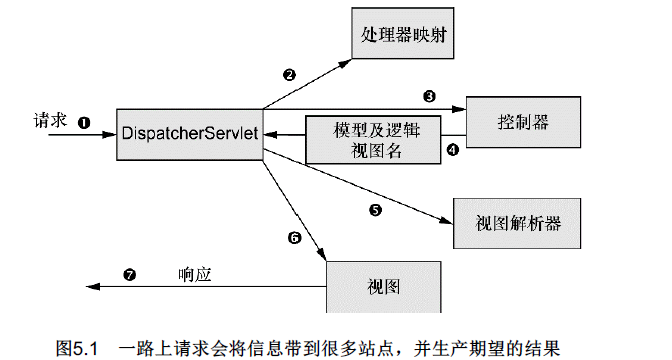
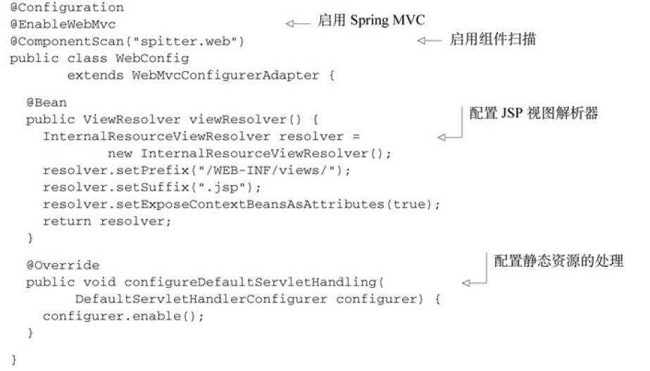
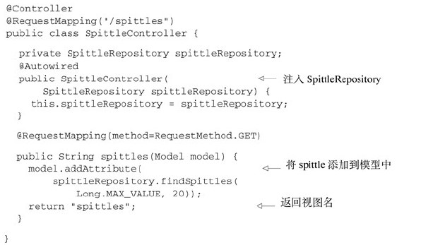
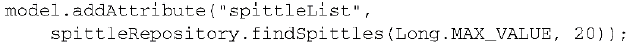
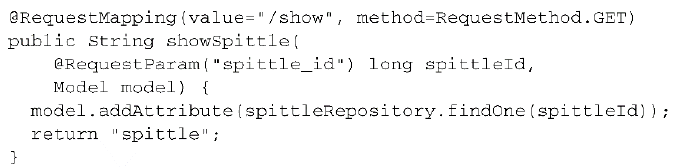
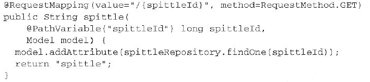

# 1. Spring MVC起步
## 1.1 跟踪Spring MVC的请求


- 前端控制器DispatcherServlet
请求旅程的第一站是Spring的DispatcherServlet。与大多数基于Java的Web框架一样，Spring MVC所有的请求都会通过一个前端控制器（front controller）Servlet。在Spring MVC中，DispatcherServlet就是前端控制器。
DispatcherServlet的任务是将请求发送给Spring MVC控制器（controller）。控制器是一个用于处理请求的Spring组件。在典型的应用程序中可能会有多个控制器，DispatcherServlet需要知道应该将请求发送给哪个控制器。所以DispatcherServlet以会查询一个或多个处理器映射（handler mapping） 来确定请求的下一站在哪里。处理器映射会根据请求所携带的URL信息来进行决策。
- 返回模型和视图名
一旦选择了合适的控制器，DispatcherServlet会将请求发送给选中的控制器。到了控制器，请求会卸下其负载（用户提交的信息）并耐心等待控制器处理这些信息。（实际上，设计良好的控制器本身只处理很少甚至不处理工作，而是将业务逻辑委托给一个或多个服务对象进行处理。）
控制器在完成逻辑处理后，通常会产生一些信息，这些信息需要返回给用户并在浏览器上显示。这些信息被称为模型（model）。不过仅仅给用户返回原始的信息是不够的——这些信息需要以用户友好的方式进行格式化，一般会是HTML。所以，信息需要发送给一个视图（view），通常会是JSP。
控制器所做的最后一件事就是将模型数据打包，并且标示出用于渲染输出的视图名。它接下来会将请求连同**模型和视图名**发送回DispatcherServlet。
- 视图解析器
这样，控制器就不会与特定的视图相耦合，传递给DispatcherServlet的视图名并不直接表示某个特定的JSP。实际上，它甚至并不能确定视图就是JSP。相反，它仅仅传递了一个逻辑名称，这个名字将会用来查找产生结果的真正视图。DispatcherServlet将会使用视图解析器（view resolver） 来将逻辑视图名匹配为一个特定的视图实现，它可能是也可能不是JSP。
既然DispatcherServlet已经知道由哪个视图渲染结果，那请求的任务基本上也就完成了。它的最后一站是视图的实现（可能是JSP） ，在这里它交付模型数据。请求的任务就完成了。视图将使用模型数据渲染输出，这个输出会通过响应对象传递给客户端（不会像听上去那样硬编码） 。

## 1.2 搭建Spring MVC
**配置DispatcherServlet**
DispatcherServlet是Spring MVC的核心。在这里请求会第一次接触到框架，它要负责将请求路由到其他的组件之中。使用Java将DispatcherServlet配置在Servlet容器中，而不会再使用web.xml文件。如下的程序清单展示了所需的Java类。
```
package spittr.config;

import org.springframework.web.servlet.support.AbstractAnnotationConfigDispatcherServletInitializer;

import spittr.web.WebConfig;

public class SpitterWebInitializer extends AbstractAnnotationConfigDispatcherServletInitializer {
  
  @Override
  protected Class<?>[] getRootConfigClasses() {
    return new Class<?>[] { RootConfig.class };
  }

  @Override
  protected Class<?>[] getServletConfigClasses() {
    return new Class<?>[] { WebConfig.class };
  }

  @Override
  protected String[] getServletMappings() {
    return new String[] { "/" };
  }

}
```

扩展AbstractAnnotationConfigDispatcherServletInitializer的任意类都会自动地配置Dispatcher-Servlet和Spring应用上下文，Spring的应用上下文会位于应用程序的Servlet上下文之中。
SpittrWebAppInitializer重写了三个方法
- getServletMappings()方法
第一个方法是getServletMappings()，它会将一个或多个路径映射到DispatcherServlet上。在本例中，它映射的是“/”，这表示它会是应用的默认Servlet。它会处理进入应用的所有请求。
- 另外两个方法的故事
为了理解其他的两个方法，我们首先要理解DispatcherServlet和一个Servlet监听器（也就是ContextLoaderListener）的关系。
DispatcherServlet加载包含Web组件的bean，如控制器、视图解析器以及处理器映射；而ContextLoaderListener要加载应用中的其他bean，这些bean通常是驱动应用后端的中间层和数据层组件。
 - getServletConfigClasses()方法
当DispatcherServlet启动的时候，它会创建Spring应用上下文，并加载配置文件或配置类中所声明的bean。也就是`getServletConfigClasses()`方法。使用定义在WebConfig配置类（使用Java配置）中的bean，是这样的：
```
@Configuration
@EnableWebMvc
@ComponentScan("spittr.web")
public class WebConfig extends WebMvcConfigurerAdapter {
  @Bean
  public ViewResolver viewResolver() {
    InternalResourceViewResolver resolver = new InternalResourceViewResolver();
    resolver.setPrefix("/WEB-INF/views/");
    resolver.setSuffix(".jsp");
    return resolver;
  }
  @Override
  public void configureDefaultServletHandling(DefaultServletHandlerConfigurer configurer) {
    configurer.enable();
  }
  @Override
  public void addResourceHandlers(ResourceHandlerRegistry registry) {
    // TODO Auto-generated method stub
    super.addResourceHandlers(registry);
  }
```
 - getRootConfigClasses()方法
在Spring Web应用中，通常还会有另外一个应用上下文。另外的这个应用上下文是由ContextLoaderListener创建的。`getRootConfigClasses()`方法定义的根配置定义在RootConfig，代码如下：
```
import spittr.config.RootConfig.WebPackage;
@Configuration
@Import(DataConfig.class)
@ComponentScan(basePackages={"spittr"},
    excludeFilters={
        @Filter(type=FilterType.CUSTOM, value=WebPackage.class)
    })
public class RootConfig {
  public static class WebPackage extends RegexPatternTypeFilter {
    public WebPackage() {
      super(Pattern.compile("spittr\\.web"));
    }
  }
}
```
而RootConfig又引入了一个配置类DataConfig如下：
```
@Configuration
public class DataConfig {
  @Bean
  public DataSource dataSource() {
    return new EmbeddedDatabaseBuilder()
            .setType(EmbeddedDatabaseType.H2)
            .addScript("schema.sql")
            .build();
  }
  @Bean
  public JdbcOperations jdbcTemplate(DataSource dataSource) {
    return new JdbcTemplate(dataSource);
  }
}
```
AbstractAnnotationConfigDispatcherServletInitializer会同时创建DispatcherServlet和ContextLoaderListener。`GetServletConfigClasses()`方法返回的带有@Configuration注解的类将会用来定义DispatcherServlet应用上下文中的bean。`getRootConfigClasses()`方法返回的带有@Configuration注解的类将会用来配置ContextLoaderListener创建的应用上下文中的bean。

**启用Spring MVC**
若Spring是使用XML进行配置的，你可以使用`<mvc:annotation-driven>`启用注解驱动的Spring MVC。
不过，现在我们会让Spring MVC的搭建过程尽可能简单并基于Java进行配置。创建的最简单的Spring MVC配置就是一个带有`@EnableWebMvc`注解的类。
<br/>

- 启动自动扫描
WebConfig现在添加了`@ComponentScan`注解，因此将会扫描`spitter.web`包来查找组件。我们所编写的控制器将会带有`@Controller`注解，这会使其成为组件扫描时的候选bean。因此，我们不需要在配置类中显式声明任何的控制器。
- 添加视图解析器
接下来，我们添加了一个`ViewResolver` bean。更具体来讲，是`InternalResourceViewResolver`。它会查找JSP文件，在查找的时候，它会在视图名称上加一个特定的前缀和后缀（例如，名为`home`的视图将会解析为`/WEB-INF/views/home.jsp`）。
- 添加静态资源处理器
最后，新的`WebConfig`类还扩展了`WebMvcConfigurerAdapter`并重写了其`configureDefaultServletHandling()`方法。通过调用`DefaultServletHandlerConfigurer`的`enable()`方法，我们要求DispatcherServlet将对静态资源的请求转发到Servlet容器中默认的Servlet上，而不是使用DispatcherServlet本身来处理此类请求。
WebConfig已经就绪，那RootConfig呢？因为本章聚焦于Web开发，而Web相关的配置通过DispatcherServlet创建的应用上下文都已经配置好了，因此现在的RootConfig相对很简单：
```
@Configuration
@Import(DataConfig.class)
@ComponentScan(basePackages={"spittr"},
    excludeFilters={
        @Filter(type=FilterType.CUSTOM, value=WebPackage.class)
    })
public class RootConfig {
  public static class WebPackage extends RegexPatternTypeFilter {
    public WebPackage() {
      super(Pattern.compile("spittr\\.web"));
    }
  }
}
```

> Note
Spittr应用有两个基本的领域概念：Spitter（应用的用户）和Spittle（用户发布的简短状态更新）。

# 2. 编写基本的控制器
```
@Controller
@RequestMapping("/")
public class HomeController {
  @RequestMapping(method = GET)
  public String home(Model model) {
    return "home";
  }
}
```
HomeController带有`@Controller`注解，因此组件扫描器会自动找到HomeController，并将其声明为Spring应用上下文中的一个bean（即DispatcherServlet启动的时候，它会创建Spring应用上下文）。

其实，你也可以让HomeController带有`@Component`注解，它所实现的效果是一样的，但是在表意性上可能会差一些，无法确定HomeController是什么组件类型。

鉴于我们配置InternalResourceViewResolver的方式，视图名“home”将会解析为“/WEB-INF/views/home.jsp”路径的JSP。

## 2.1 测试控制器
Spring现在包含了一种mock Spring MVC并针对控制器执行HTTP请求的机制。这样的话，在测试控制器的时候，就没有必要再启动Web服务器和Web浏览器了。
```
public class HomeControllerTest {

  @Test
  public void testHomePage() throws Exception {
    HomeController controller = new HomeController();
    MockMvc mockMvc = standaloneSetup(controller).build();
    mockMvc.perform(get("/"))
           .andExpect(view().name("home"));
  }

}

```

## 2.2 定义类级别的请求处理
`@RequestMapping`的value属性能够接受一个String类型的数组。到目前为止，我们给它设置的都是一个String类型的“/”。但是，我们还可以将它映射到对“/homepage”的请求，只需将类级别的`@RequestMapping`改为：


## 2.3 传递模型数据到视图中
<br/>


`spittles()`方法中给定了一个Model作为参数。这样，`spittles()`方法就能将Repository中获取到的Spittle列表填充到模型中。Model实际上就是一个Map（也就是key-value对的集合，如果你希望使用非Spring类型的话，那么可以用java.util.Map来代替Model。），它会传递给视图，这样数据就能渲染到客户端了。当调用`addAttribute()`方法并且不指定key的时候，那么key会根据值的对象类型推断确定。在本例中，因为它是一个`List<Spittle>`，因此，键将会推断为spittleList。`spittles()`方法所做的最后一件事是返回spittles作为视图的名字，这个视图会渲染模型。

如果你希望显式声明模型的key的话，那也尽可以进行指定：
<br/>


还有以下这种写法，完成同样的作用：
```
  @RequestMapping(method=RequestMethod.GET)
  public List<Spittle> spittles(
      @RequestParam(value="max", defaultValue=MAX_LONG_AS_STRING) long max,
      @RequestParam(value="count", defaultValue="20") int count) {
    return spittleRepository.findSpittles(max, count);
  }
```
它并没有返回视图名称，也没有显式地设定模型，这个方法返回的是Spittle列表。当处理器方法像这样返回对象或集合时，这个值会放到模型中，模型的key会根据其类型推断得出（在本例中，也就是spittleList）。

而逻辑视图的名称将会根据请求路径推断得出。因为这个方法处理针对“/spittles”的GET请求，因此视图的名称将会是spittles（去掉开头的斜线）。

模型中会存储一个Spittle列表，key为spittleList，然后这个列表会发送到名为spittles的视图中。按照我们配置InternalResourceViewResolver的方式，视图的JSP将会是“/WEBINF/views/spittles.jsp”。在`spittles.jsp`文件中可以使用JSTL（JavaServer Pages Standard Tag Library）的`<c:forEach>`标签渲染spittle列表：
```
<c:forEach items="${spittleList}" var="spittle" >
  <li id="spittle_<c:out value="spittle.id"/>">
    <div class="spittleMessage"><c:out value="${spittle.message}" /></div>
    <div>
      <span class="spittleTime"><c:out value="${spittle.time}" /></span>
      <span class="spittleLocation">(<c:out value="${spittle.latitude}" />, <c:out value="${spittle.longitude}" />)</span>
    </div>
  </li>
</c:forEach>
```

# 3. 接受请求的输入
查询参数（Query Parameter）。
表单参数（Form Parameter）。
路径变量（Path Variable）。

## 3.1 处理查询参数
```
  @RequestMapping(method=RequestMethod.GET)
  public List<Spittle> spittles(
      @RequestParam(value="max", defaultValue=MAX_LONG_AS_STRING) long max,
      @RequestParam(value="count", defaultValue="20") int count) {
    return spittleRepository.findSpittles(max, count);
  }
```
因为查询参数都是String类型的，因此defaultValue属性需要String类型的值。因此，使用Long.MAX_VALUE是不行的。我们可以将Long.MAX_VALUE转换为名为MAX_LONG_AS_STRING的String类型常量：
` private static final String MAX_LONG_AS_STRING = "9223372036854775807";`

尽管defaultValue属性给定的是String类型的值，但是当绑定到方法的max参数时，它会转换为Long类型。
> 业务逻辑需要的int类型不要改变，Controller层接受的参数也是int，尽量利用Spring的自动转换机制。

## 3.2 通过路径参数接受输入
对“/spittles/12345”发起GET请求要优于对“/spittles/show?spittle_id=12345”发起请求。前者能够识别出要查询的资源，而后者描述的是带有参数的一个操作——本质上是通过HTTP发起的RPC。



<br/>
*VS*
<br/>



`spittle()`方法会将参数传递到SpittleRepository的`findOne()`方法中，用来获取某个`Spittle`对象，然后将Spittle对象添加到模型中。模型的key将会是`spittle`，这是根据传递到addAttribute()方法中的`类型`推断得到的。

这样Spittle对象中的数据就可以渲染到视图中了，此时需要引用请求中key为spittle的属性（与模型的key一致）。如下为渲染Spittle的JSP视图片段：
```
<div class="spittleView">
  <div class="spittleMessage"><c:out value="${spittle.message}" /></div>
  <div>
    <span class="spittleTime"><c:out value="${spittle.time}" /></span>
  </div>
</div>
```

# 4. 处理表单
使用表单分为两个方面：展现表单以及处理用户通过表单提交的数据。
**展现表单**
- 控制器
```
@RequestMapping(value="/register", method=GET)
public String showRegistrationForm() {
  return "registerForm";
}
```
- 视图
```
<%@ taglib uri="http://java.sun.com/jsp/jstl/core" prefix="c" %>
<%@ page session="false" %>
<html>
  <head>
    <title>Spitter</title>
    <link rel="stylesheet" type="text/css" 
          href="<c:url value="/resources/style.css" />" >
  </head>
  <body>
    <h1>Register</h1>

    <form method="POST">
      First Name: <input type="text" name="firstName" /><br/>
      Last Name: <input type="text" name="lastName" /><br/>
      Email: <input type="email" name="email" /><br/>
      Username: <input type="text" name="username" /><br/>
      Password: <input type="password" name="password" /><br/>
      <input type="submit" value="Register" />
    </form>
  </body>
</html>
```

## 4.1 编写处理表单的控制器
**提交数据**
- Controller处理注册用户
```
@RequestMapping(value="/register", method=POST)
public String processRegistration(
    @Valid Spitter spitter, 
    Errors errors) {
  if (errors.hasErrors()) {
    return "registerForm";
  }
  
  spitterRepository.save(spitter);
  return "redirect:/spitter/" + spitter.getUsername();
}
```
当InternalResourceViewResolver看到视图格式中的“redirect:”前缀时，它就知道要将其解析为重定向的规则，而不是视图的名称。在本例中，它将会重定向到用户基本信息的页面。例如，如果Spitter.username属性的值为“jbauer”，那么视图将会重定向到“/spitter/jbauer”。
需要注意的是，除了“redirect:”，InternalResourceViewResolver还能识别“forward:”前缀。当它发现视图格式中以“forward:”作为前缀时，请求将会前往（forward）指定的URL路径，而不再是重定向。

- Controller跳转处理
```
@RequestMapping(value="/{username}", method=GET)
public String showSpitterProfile(@PathVariable String username, Model model) {
  Spitter spitter = spitterRepository.findByUsername(username);
  model.addAttribute(spitter);
  return "profile";
}
```
profile.jsp如下： 
```
  <h1>Your Profile</h1>
  <c:out value="${spitter.username}" /><br/>
  <c:out value="${spitter.firstName}" /> <c:out value="${spitter.lastName}" /><br/>
  <c:out value="${spitter.email}" />
</body>
```

**测试类**
Post请求的测试类大概这么写：
```
@Test
public void shouldProcessRegistration() throws Exception {
  SpitterRepository mockRepository = mock(SpitterRepository.class);
  Spitter unsaved = new Spitter("jbauer", "24hours", "Jack", "Bauer", "jbauer@ctu.gov");
  Spitter saved = new Spitter(24L, "jbauer", "24hours", "Jack", "Bauer", "jbauer@ctu.gov");
  when(mockRepository.save(unsaved)).thenReturn(saved);
  
  SpitterController controller = new SpitterController(mockRepository);
  MockMvc mockMvc = standaloneSetup(controller).build();

  mockMvc.perform(post("/spitter/register")
         .param("firstName", "Jack")
         .param("lastName", "Bauer")
         .param("username", "jbauer")
         .param("password", "24hours")
         .param("email", "jbauer@ctu.gov"))
         .andExpect(redirectedUrl("/spitter/jbauer"));
  
  verify(mockRepository, atLeastOnce()).save(unsaved);
}
```
## 4.2 校验表单
从Spring 3.0开始，在Spring MVC中提供了对Java校验API的支持。在Spring MVC中要使用Java校验API的话，并不需要什么额外的配置。
如，校验Spitter类，它的属性已经添加了校验注解：
```

import javax.validation.constraints.NotNull;
import javax.validation.constraints.Size;

import org.apache.commons.lang3.builder.EqualsBuilder;
import org.apache.commons.lang3.builder.HashCodeBuilder;
import org.hibernate.validator.constraints.Email;

public class Spitter {

  private Long id;
  
  @NotNull
  @Size(min=5, max=16)
  private String username;

  @NotNull
  @Size(min=5, max=25)
  private String password;
  
  @NotNull
  @Size(min=2, max=30)
  private String firstName;

  @NotNull
  @Size(min=2, max=30)
  private String lastName;
  
  @NotNull
  @Email
  private String email;
//...
}
```
我们已经为Spitter添加了校验注解，接下来需要修改`processRegistration()`方法来应用校验功能。启用校验功能的`processRegistration()`如下所示：
```
@RequestMapping(value="/register", method=POST)
  public String processRegistration(
      @Valid Spitter spitter,
      Errors errors) {
    if (errors.hasErrors()) {
      return "registerForm";
    }
    spitterRepository.save(spitter);
    return "redirect:/spitter/" + spitter.getUsername();
}
```
Spitter参数添加了@Valid注解，这会告知Spring，需要确保这个对象满足校验限制。
如果有校验出现错误的话，那么这些错误可以通过Errors对象进行访问，现在这个对象已作为`processRegistration()`方法的参数。（很重要一点需要注意，`Errors`参数要紧跟在带有@Valid注解的参数后面，@Valid注解所标注的就是要检验的参数。）`processRegistration()`方法所做的第一件事就是调用`Errors.hasErrors()`来检查是否有错误。
如果有错误的话，`Errors.hasErrors()`将会返回到registerForm，也就是注册表单的视图。这能够让用户的浏览器重新回到注册表单页面，所以他们能够修正错误，然后重新尝试提交。现在，会显示空的表单，但是在下一章中，我们将在表单中显示最初提交的值并将校验错误反馈给用户; 如果没有错误的话，Spitter对象将会通过Repository进行保存，控制器会像之前那样重定向到基本信息页面。

