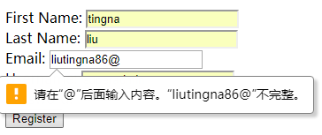

# 1. 理解视图解析
将控制器中请求处理的逻辑和视图中的渲染实现解耦是Spring MVC的一个重要特性。如果控制器中的方法直接负责产生HTML的话，就很难在不影响请求处理逻辑的前提下，维护和更新视图。控制器方法和视图的实现会在模型内容上达成一致，这是两者的最大关联，除此之外，两者应该保持足够的距离。
但是，如果控制器只通过逻辑视图名来了解视图的话，那Spring该如何确定使用哪一个视图实现来渲染模型呢？这就是Spring视图解析器的任务了。
Spring MVC定义了一个名为ViewResolver的接口，它大致如下所示：
```
public interface ViewResolver {
 View resolveViewName(String viewName, Locale locale) throws Exception;
}
```
当给resolveViewName()方法传入一个视图名和Locale对象时，它会返回一个View实例。View是另外一个接口，如下所示：
```
public interface View {
 void render(Map<String, ?> model, HttpServletRequest request, HttpServletResponse response) throws Exception;
}
```
一般来讲，我们并不需要关心这些接口。我在这里提及这些接口只是为了让你对视图解析内部如何工作有所了解。Spring提供了多个内置的实现，如表6.1所示，它们能够适应大多数的场景。
<br/><br/>
<br/><br/>
对于表6.1中的大部分视图解析器来讲，每一项都对应Java Web应用中特定的某种视图技术。InternalResourceViewResolver一般会用于JSP，TilesViewResolver用于Apache Tiles视图，而FreeMarkerViewResolver和VelocityViewResolver分别对应FreeMarker和Velocity模板视图。

# 2. 创建JSP视图
Spring提供了两种支持JSP视图的方式：
- InternalResourceViewResolver会将视图名解析为JSP文件。另外，如果在你的JSP页面中使用了JSP标准标签库（JavaServer Pages Standard Tag Library，JSTL）的话，InternalResourceViewResolver能够将视图名解析为JstlView形式的JSP文件，从而将JSTL本地化和资源bundle变量暴露给JSTL的格式化（formatting）和信息（message）标签。
- Spring提供了两个JSP标签库，一个用于表单到模型的绑定，另一个提供了通用的工具类特性。
不管你使用JSTL，还是准备使用Spring的JSP标签库，配置解析JSP的视图解析器都是非常重要的。尽管Spring还有其他的几个视图解析器都能将视图名映射为JSP文件，但就这项任务来讲，InternalResourceViewResolver是最简单和最常用的视图解析器。

## 2.1 配置适用于JSP的视图解析器
有一些视图解析器，如ResourceBundleViewResolver会直接将逻辑视图名映射为特定的View接口实现，而InternalResourceViewResolver所采取的方式并不那么直接。它遵循一种约定，会在视图名上添加前缀和后缀，进而确定一个Web应用中视图资源的物理路径。
<br/><br/>
通用的实践是将JSP文件放到Web应用的WEB-INF目录下，防止对它的直接访问。如果我们将所有的JSP文件都放在“/WEB-INF/views/”目录下，并且home页的JSP名为home.jsp，那么我们可以确定物理视图的路径就是逻辑视图名home再加上“/WEB-INF/views/”前缀和“.jsp”后缀。

- 使用Java方式配置InternalResourceViewResolver
```
  @Bean
  public ViewResolver viewResolver(){
    InternalResourceViewResolver resourceViewResolver = new InternalResourceViewResolver();
    resourceViewResolver.setPrefix("/WEB-INF/views/");
    resourceViewResolver.setSuffix(".jsp");
//    resourceViewResolver.setViewClass(JstlView.class);
    return resourceViewResolver;
  }
```

- 使用XML方式配置InternalResourceViewResolver
```
<bean id="viewResolver"
      class="org.springframework.web.servlet.view.InternalResourceViewResolver"
      p:prefix="/WEB-INF/views/"
      p:suffix=".jsp" >
      <!--p:viewClass="org.springframework.web.servlet.view.JstlView"/-->
</bean>
```
**解析JSTL视图 **
但是如果这些JSP使用JSTL标签来处理格式化和信息的话，那么我们会希望InternalResourceViewResolver将视图解析为JstlView。JSTL的格式化标签需要一个Locale对象，以便于恰当地格式化地域相关的值，如日期和货币。信息标签可以借助Spring的信息资源和Locale，从而选择适当的信息渲染到HTML之中。通过解析JstlView，JSTL能够获得Locale对象以及Spring中配置的信息资源。
如果想让InternalResourceViewResolver将视图解析为JstlView，而不是InternalResourceView的话，那么我们只需设置它
的viewClass属性即可。（Java、XML配置中屏蔽的配置）

## 2.2 使用Spring的JSP库
Spring提供了两个JSP标签库，一个用于表单到模型的绑定，另一个提供了通用的工具类特性。
### （1）将表单绑定到模型上
为了使用表单绑定库，需要在JSP页面中对其进行声明：
`<%@ taglib uri="http://www.springframework.org/tags/form" prefix="sf" %>`
需要注意，我将前缀指定为“sf”，但通常也可能使用“form”前缀，你可以选择任意喜欢的前缀。

在声明完表单绑定标签库之后，你就可以使用14个相关的标签了。如表6.2所示。
<br/><br/>
<br/><br/>
<br/><br/>

在注册JSP中使用这些标签后，所得到的程序如下所示：
```
   <sf:form method="POST" commandName="spitter" >
      <sf:errors path="*" element="div" cssClass="errors" />
      <sf:label path="firstName"
          cssErrorClass="error">First Name</sf:label>:
        <sf:input path="firstName" cssErrorClass="error" /><br/>
      <sf:label path="lastName"
          cssErrorClass="error">Last Name</sf:label>:
        <sf:input path="lastName" cssErrorClass="error" /><br/>
      <sf:label path="email"
          cssErrorClass="error">Email</sf:label>:
        <sf:input path="email" cssErrorClass="error" /><br/>
      <sf:label path="username"
          cssErrorClass="error">Username</sf:label>:
        <sf:input path="username" cssErrorClass="error" /><br/>
      <sf:label path="password"
          cssErrorClass="error">Password</sf:label>:
        <sf:password path="password" cssErrorClass="error" /><br/>
      <input type="submit" value="Register" />
    </sf:form>
```
在注册JSP中使用这些标签后，所得到的程序如下所示：
`<sf:form>`会渲染会一个HTML `<form>`标签，但它也会通过commandName属性构建针对某个模型对象的上下文信息。在其他的表单绑定标签中，会引用这个模型对象的属性。在之前的代码中，我们将`commandName`属性设置为`spitter`。因此，在模型中必须要有一个key为`spitter`的对象，否则的话，表单不能正常渲染（会出现JSP错误）。这意味着我们需要修改一下`SpitterController`，以确保模型中存在以`spitter`为key的Spitter对象：
```
  @RequestMapping(value="/register", method=GET)
  public String showRegistrationForm(Model model) {
    model.addAttribute(new Spitter());
    return "registerForm";
  }
```
模型中的key是根据对象类型推断得到的，也就是spitter，与我们所需要的完全一致。

将HTML `<input>`标签改成了`<sf:input>`。这个标签会渲染成一个HTML `<input>`标签，并且type属性将会设置为text。我们在这里设置了path属性，`<input>`标签的value属性值将会设置为模型对象中path属性所对应的值。

*利用HTML 5进行前端表单校验*
从Spring 3.1开始，`<sf:input>`标签能够允许我们指定type属性，这样的话，除了其他可选的类型外，还能指定HTML 5特定类型的文本域，如date、range和email。例如，我们可以按照如下的方式指定email域：
`Email: <sf:input path="email" type="email" /><br/>`
若输入格式不正确，就会产生如下提示：
<br/><br/>

> 前端校验，我倾向于每一个字段进行校验，即每输入一个字段即进行校验

*展现错误（后端验证）*
在第05章的`4.2 校验表单`一节中，说明了如何对Java Bean做属性校验，这里可以用上了。
如果存在校验错误的话，请求中会包含错误的详细信息，这些信息是与模型数据放到一起的。我们所需要做的就是到模型中将这些数据抽取出来，并展现给用户。`<sf:errors>`能够让这项任务变得很简单。

将`<sf:errors>`用到First Name输入域的场景，但是它可以按照同样简单的方式用到注册表单的其他输入域中。在这里，它的path属性设置成了firstName，也就是指定了要显示Spitter模型对象中哪个属性的错误。如果firstName属性没有错误的话，那么`<sf:errors>`不会渲染任何内容。但如果有校验错误的话，那么它将会在一个HTML `<span>`标签中显示错误信息。
```
<sf:label path="firstName"
          cssErrorClass="error">First Name</sf:label>:
<sf:input path="firstName" cssErrorClass="error"/>
<sf:errors path="firstName"/> <br/>
```
<br/><br/>

或者像完整表单的那个程序一样，所有字段校验异常都放在一起：
`<sf:errors path="*" element="div" cssClass="errors" />`

> 后端校验，是所有字段整体进行校验，可以将所有错误信息整体展示，也可以像前端校验一样，每个字段错误信息紧跟在最后

*友好的错误提示信息*
`Last name must be between 2 and 30 characters long. `这段信息怎么来的呢？

重新看一下Spitter类，我们可以在校验注解上设置message属性，使其引用对用户更为友好的信息，而这些信息可以定义在属性文件中：
```
public class Spitter {
  private Long id;
  @NotNull
  @Size(min=5, max=16, message="{username.size}")
  private String username;
  @NotNull
  @Size(min=5, max=25, message="{password.size}")
  private String password;
  @NotNull
  @Size(min=2, max=30, message="{firstName.size}")
  private String firstName;
  @NotNull
  @Size(min=2, max=30, message="{lastName.size}")
  private String lastName;
  @NotNull
  @Email
  private String email;
  ...
}
```
将其`@Size`注解的message设置为一个字符串，这个字符串是用大括号括起来的。如果没有大括号的话，message中的值将会作为展现给用户的错误信息。但是使用了大括号之后，我们使用的就是属性文件中的某一个属性，该属性包含了实际的信息。
接下来需要做的就是创建一个名为`ValidationMessages.properties`的文件，并将其放在根类路径之下：
```
firstName.size=First name must be between {min} and {max} characters long.
lastName.size=Last name must be between {min} and {max} characters long.
username.size=Username must be between {min} and {max} characters long.
password.size=Password must be between {min} and {max} characters long.
email.valid=The email address must be valid.
```
占位符——`{min}`和`{max}`——它们会引用`@Size`注解上所设置的min和max属性。

我们可以按需创建任意数量的ValidationMessages.properties文件，使其涵盖我们想支持的所有语言和地域。
> 如何实现国际化?

### （2）Spring通用的标签库
要使用Spring通用的标签库，我们必须要在页面上对其进行声明：
`<%@ taglib uri="http://www.springframework.org/tags" prefix="s" %>`
<br/><br/>

*展现国际化信息*
到现在为止，我们的JSP模板包含了很多硬编码的文本。这其实也算不上什么大问题，但是如果你要修改这些文本的话，就不那么容易了。而
且，没有办法根据用户的语言设置国际化这些文本。
Web是全球性的网络，你所构建的应用很可能会有全球化用户。因此，最好能够使用用户的语言与其进行交流，而不是只使用某一种语言。对于渲染文本来说，是很好的方案，文本能够位于一个或多个属性文件中。借助`<s:message>`，我们可以将硬编码的欢迎信息替换为如下的形式：
`<s:message code="spitter.welcome" text="Welcome" />`
`<s:message>`将会根据key为`spittr.welcome`的信息源来渲染文本。因此，如果我们希望`<s:message>`能够正常完成任务的话，就需要配置一个这样的信息源。加载属性文件失败，默认显示text中的内容（Welcome）。
Spring有多个信息源的类，它们都实现了MessageSource接口。在这些类中，更为常见和有用的是ResourceBundleMessageSource。它会从一个属性文件中加载信息，这个属性文件的名称是根据基础名称（base name）衍生而来的。如下的@Bean方法配置了ResourceBundleMessageSource：
```
  @Bean(name="messageSource")
  public MessageSource messageSource() {
    ResourceBundleMessageSource messageSource =
            new ResourceBundleMessageSource();
    messageSource.setBasename("messages");
    messageSource.setDefaultEncoding("UTF-8");
    return messageSource;
  }
```
创建默认的属性文件，名为`messages_zh_CN.properties`，写入：
```
spitter.welcome=Welcome to Spitter！
```
> 中文属性文件存在乱码问题未解决。

**创建URL（再也不用担心上下文了）**
`<s:url>`是一个很小的标签。它主要的任务就是创建URL，然后将其赋值给一个变量或者渲染到响应中。它是JSTL中`<c:url>`标签的替代者，但是它具备几项特殊的技巧。
按照其最简单的形式，`<s:url>`会接受一个相对于Servlet上下文的URL，并在渲染的时候，预先添加上Servlet上下文路径。
可以使用`<s:url>`创建URL，并将其赋值给一个变量供模板在稍后使用：
`<s:url value="/spitter/register" var="registerUrl" />`
`<a href="${registerUrl}">Register</a>`
如果应用的Servlet上下文名为`spittr`，那么在响应中将会渲染如下的HTML：
`<a href="/spittr/spitter/register">Register</a>`
默认情况下，URL是在页面作用域内创建的。但是通过设置scope属性，我们可以让<s:url>在应用作用域内、会话作用域内或请求作用域内创建URL：
`<s:url value="/spitter/register" var="registerUrl" scope="request"/>`
如果希望在URL上添加参数的话，那么你可以使用`<s:param>`标签。比如，如下的`<s:url>`使用两个内嵌的`<s:param>`标签，来设置“/spittles”的max和count参数：
```
  <s:url value="/spittles" var="spittlesUrl">
    <s:param name="max" value="60"/>
    <s:param name="count" value="20"/>
  </s:url>
```
创建带有路径（path）参数的URL该怎么办呢？我们该如何设置href属性，使其具有路径变量的占位符呢？
```
  <s:url value="/spitter/{username}" var="spitterUrl">
    <s:param name="username" value="josh"/>
  </s:url>
```
当href属性中的占位符匹配`<s:param>`中所指定的参数时，这个参数将会插入到占位符的位置中。如果`<s:param>`参数无法匹配href中的任何占位符，那么这个参数将会作为查询参数。
`<s:url>`标签还可以解决URL的转义需求。例如，如果你希望将渲染得到的URL内容展现在Web页面上（而不是作为超链接），那么你应该要求`<s:url>`进行HTML转义，这需要将htmlEscape属性设置为true。例如，如下的`<s:url>`将会渲染HTML转义后的URL：
```
    <s:url value="/spittles" htmlEscape="true">
      <s:param name="max" value="60"/>
      <s:param name="count" value="20"/>
    </s:url>
```
所渲染的URL结果如下所示：
`/spittr/spittles?max=60&amp;count=20`
另一方面，如果你希望在JavaScript代码中使用URL的话，那么应该将javaScriptEscape属性设置为true：
```
    <s:url value="/spittles" var="spittlesJSUrl" javaScriptEscape="true">
      <s:param name="max" value="60"/>
      <s:param name="count" value="20"/>
    </s:url>
```
这会渲染如下的结果到响应之中：
```
  <script>
    var spittlesUrl="${spittlesJSUrl}"
  </script>
```
即：
```
  <script>
    var spittlesUrl="\/spittr\/spittles?max=60&count=20"
  </script>
```

**转义内容**
`<s:escapeBody>`标签是一个通用的转义标签。它会渲染标签体中内嵌的内容，并且在必要的时候进行转义。
例如，假设你希望在页面上展现一个HTML代码片段。为了正确显示，我们需要将“`<`”和“`>`”字符替换为“`&lt;`”和“`&gt;`”，否则的话，浏览器将会像解析页面上其他HTML那样解析这段HTML内容。
```
<s:escapeBody htmlEscape="true">
  <h1>Hello</h1>
</s:escapeBody>
```
它将会在响应体中渲染成如下的内容：
`&lt;h1&gt;Hello&lt;/h1&gt;`
`<s:escapeBody>`只完成一件事，并且完成得非常好。与`<s:url>`不同，它只会渲染内容，并不能将内容设置为变量。

# 3. 使用Apache Tiles视图定义布局
假设我们想为应用中的所有页面定义一个通用的头部和底部。最原始的方式就是查找每个JSP模板，并为其添加头部和底部的HTML。但是这种方法的扩展性并不好，也难以维护。为每个页面添加这些元素会有一些初始成本，而后续的每次变更都会耗费类似的成本。
更好的方式是使用布局引擎，如Apache Tiles，定义适用于所有页面的通用页面布局。Spring MVC以视图解析器的形式为Apache Tiles提供了支持，这个视图解析器能够将逻辑视图名解析为Tile定义。
## 3.1 配置Tiles视图解析器
为了在Spring中使用Tiles，需要配置几个bean。我们需要一个TilesConfigurer bean，它会负责定位和加载Tile定义并协调生成Tiles。除此之外，还需要TilesViewResolver bean将逻辑视图名称解析为Tile定义。假设我们使用的是Tiles 3。
首先，配置TilesConfigurer来解析Tile定义。
```
  @Bean
  public TilesConfigurer tilesConfigurer() {
    TilesConfigurer tiles = new TilesConfigurer();
    tiles.setDefinitions(new String[] {
        "/WEB-INF/layout/tiles.xml",
        "/WEB-INF/views/**/tiles.xml"
    });
    tiles.setCheckRefresh(true);
    return tiles;
  }
```
当配置TilesConfigurer的时候，所要设置的最重要的属性就是definitions。这个属性接受一个String类型的数组，其中每个条目都指定一个Tile定义的XML文件。
接下来，让我们来配置TilesViewResolver，可以看到，这是一个很基本的bean定义，没有什么要设置的属性：
```
  @Bean
  public ViewResolver viewResolver() {
    return new TilesViewResolver();
  }
```
**定义Tiles**
Apache Tiles提供了一个文档类型定义（document type definition，DTD），用来在XML文件中指定Tile的定义。每个定义中需要包含一个`<definition>`元素，这个元素会有一个或多个`<put-attribute>`元素。例如，如下的XML文档为Spittr应用定义了几个Tile。
```
<?xml version="1.0" encoding="ISO-8859-1" ?>
<!DOCTYPE tiles-definitions PUBLIC
       "-//Apache Software Foundation//DTD Tiles Configuration 3.0//EN"
       "http://tiles.apache.org/dtds/tiles-config_3_0.dtd">
<tiles-definitions>
  <definition name="base" template="/WEB-INF/layout/page.jsp">
    <put-attribute name="header" value="/WEB-INF/layout/header.jsp" />
    <put-attribute name="footer" value="/WEB-INF/layout/footer.jsp" />
  </definition>
  <definition name="home" extends="base">
    <put-attribute name="body" value="/WEB-INF/views/home.jsp" />
  </definition>
  <definition name="registerForm" extends="base">
    <put-attribute name="body" value="/WEB-INF/views/registerForm.jsp" />
  </definition>
  <definition name="profile" extends="base">
    <put-attribute name="body" value="/WEB-INF/views/profile.jsp" />
  </definition>
  <definition name="spittles" extends="base">
    <put-attribute name="body" value="/WEB-INF/views/spittles.jsp" />
  </definition>
  <definition name="spittle" extends="base">
    <put-attribute name="body" value="/WEB-INF/views/spittle.jsp" />
  </definition>
</tiles-definitions>
```
每个`<definition>`元素都定义了一个Tile，它最终引用的是一个JSP模板。在名为base的Tile中，模板引用的是“/WEBINF/layout/page.jsp”。某个Tile可能还会引用其他的JSP模板，使这些JSP模板嵌入到主模板中。对于base Tile来讲，它引用的是一个头部JSP模板和一个底部JSP模板。
base Tile所引用的`page.jsp`模板如下面程序清单所示。
```
<%@ taglib uri="http://www.springframework.org/tags" prefix="s" %>
<%@ taglib uri="http://tiles.apache.org/tags-tiles" prefix="t" %>
<%@ page session="false" %>
<html>
  <head>
    <title>Spittr</title>
    <link rel="stylesheet"
          type="text/css"
          href="<s:url value="/resources/style.css" />" >
  </head>
  <body>
    <div id="header">
      <t:insertAttribute name="header" />
    </div>
    <div id="content">
      <t:insertAttribute name="body" />
    </div>
    <div id="footer">
      <t:insertAttribute name="footer" />
    </div>
  </body>
</html>
```
需要重点关注的事情就是如何使用Tile标签库中的`<t:insert Attribute>` JSP标签来插入其他的模板。在这里，用它来插入名为header、body和footer的模板。最终，它会形成图6.4所示的布局。
<br/><br/>
每个`<definition>`元素都定义了一个Tile，它最终引用的是一个JSP模板。在名为base的Tile中，模板引用的是“/WEBINF/layout/page.jsp”。某个Tile可能还会引用其他的JSP模板，使这些JSP模板嵌入到主模板中。对于base Tile来讲，它引用的是一个头部JSP模板和一个底部JSP模板。
base Tile所引用的`page.jsp`模板如下面程序清单所示。
```
<%@ taglib uri="http://www.springframework.org/tags" prefix="s" %>
<%@ taglib uri="http://tiles.apache.org/tags-tiles" prefix="t" %>
<%@ page session="false" %>
<html>
  <head>
    <title>Spittr</title>
    <link rel="stylesheet"
          type="text/css"
          href="<s:url value="/resources/style.css" />" >
  </head>
  <body>
    <div id="header">
      <t:insertAttribute name="header" />
    </div>
    <div id="content">
      <t:insertAttribute name="body" />
    </div>
    <div id="footer">
      <t:insertAttribute name="footer" />
    </div>
  </body>
</html>
```
需要重点关注的事情就是如何使用Tile标签库中的`<t:insert Attribute>` JSP标签来插入其他的模板。在这里，用它来插入名为header、body和footer的模板。最终，它会形成图6.4所示的布局。
在这里，base Tile不会期望单独使用。它会作为基础定义（这是其名字的来历），供其他的Tile定义扩展。在程序清单6.2的其余内容中，我们可以看到其他的Tile定义都是扩展自base Tile。它意味着它们会继承其header和footer属性的设置（当然，Tile定义中也可以覆盖掉这些属性），但是每一个都设置了body属性，用来指定每个Tile特有的JSP模板。
现在，我们关注一下home Tile，它扩展了base。因为它扩展了base，因此它会继承base中的模板和所有的属性。尽管home Tile定义相对来说很简单：
```
  <definition name="home" extends="base">
    <put-attribute name="body" value="/WEB-INF/views/home.jsp" />
  </definition>
```
但是它实际上包含了如下的定义：
```
  <definition name="home" extends="base">
   <put-attribute name="header" value="/WEB-INF/layout/header.jsp" />
    <put-attribute name="footer" value="/WEB-INF/layout/footer.jsp" />
    <put-attribute name="body" value="/WEB-INF/views/home.jsp" />
  </definition>
```
这里的关键点在于通用的元素放到了page.jsp、header.jsp以及footer.jsp中，其他的Tile模板中不再包含这部分内容。这使得它们能够跨页面重用，这些元素的维护也得以简化。

# 4. 使用Thymeleaf
标签库和JSP缺乏良好格式的一个副作用就是它很少能够与其产生的HTML类似。所以，在Web浏览器或HTML编辑器中查看未经渲染的JSP模板是非常令人困惑的，而且得到的结果看上去也非常丑陋。
同时，JSP规范是与Servlet规范紧密耦合的。这意味着它只能用在基于Servlet的Web应用之中。JSP模板不能作为通用的模板（如格式化Email），也不能用于非Servlet的Web应用。
Thymeleaf模板是原生的，不依赖于标签库。它能在接受原始HTML的地方进行编辑和渲染。因为它没有与Servlet规范耦合，因此Thymeleaf模板能够进入JSP所无法涉足的领域。现在，我们看一下如何在Spring MVC中使用Thymeleaf。
## 4.1 配置Thymeleaf视图解析器
为了要在Spring中使用Thymeleaf，我们需要配置三个启用Thymeleaf与Spring集成的bean：
- ThymeleafViewResolver：将逻辑视图名称解析为Thymeleaf模板视图；
- SpringTemplateEngine：处理模板并渲染结果；
- TemplateResolver：加载Thymeleaf模板。
如下为声明这些bean的Java配置：
```
@Bean
  public ViewResolver viewResolver(SpringTemplateEngine templateEngine) {
    ThymeleafViewResolver viewResolver = new ThymeleafViewResolver();
    viewResolver.setTemplateEngine(templateEngine);
    return viewResolver;
  }
  @Bean
  public SpringTemplateEngine templateEngine(TemplateResolver templateResolver) {
    SpringTemplateEngine templateEngine = new SpringTemplateEngine();
    templateEngine.setTemplateResolver(templateResolver);
    return templateEngine;
  }
  @Bean
  public TemplateResolver templateResolver() {
    TemplateResolver templateResolver = new ServletContextTemplateResolver();
    templateResolver.setPrefix("/WEB-INF/views/");
    templateResolver.setSuffix(".html");
    templateResolver.setTemplateMode("HTML5");
    return templateResolver;
  }
```
ThymeleafViewResolver是Spring MVC中ViewResolver的一个实现类。像其他的视图解析器一样，它会接受一个逻辑视图名称，并将其解析为视图。不过在该场景下，视图会是一个Thymeleaf模板。
需要注意的是ThymeleafViewResolver bean中注入了一个对SpringTemplate Engine bean的引用。SpringTemplateEngine会在Spring中启用Thymeleaf引擎，用来解析模板，并基于这些模板渲染结果。可以看到，我们为其注入了一个TemplateResolver bean的引用。
TemplateResolver会最终定位和查找模板。与之前配置InternalResource-ViewResolver类似，它使用了prefix和suffix属性。前缀和后缀将会与逻辑视图名组合使用，进而定位Thymeleaf引擎。它的templateMode属性被设置成了HTML 5，这表明我们预期要解析的模板会渲染成HTML 5输出。
所有的Thymeleaf bean都已经配置完成了，那么接下来我们该创建几个视图了。

## 4.2 定义Thymeleaf模板
Thymeleaf在很大程度上就是HTML文件，与JSP不同，它没有什么特殊的标签或标签库。Thymeleaf之所以能够发挥作用，是因为它通过自定义的命名空间，为标准的HTML标签集合添加Thymeleaf属性。如下的程序清单展现了home.html，也就是使用Thymeleaf命名空间的首页模板。
```
<html xmlns="http://www.w3.org/1999/xhtml"
      xmlns:th="http://www.thymeleaf.org">
  <head>
    <title>Spitter</title>
    <link rel="stylesheet"
          type="text/css"
          th:href="@{/resources/style.css}"></link>
  </head>
  <body>
    <h1>Welcome to Spitter</h1>
   <a th:href="@{/spittles}">Spittles</a> |
    <a th:href="@{/spitter/register}">Register</a>
  </body>
</html>
```
使用th:href属性的三个地方都用到了“@{}”表达式，用来计算相对于URL的路径（就像在JSP页面中，我们可能会使用的JSTL `<c:url>`标签或Spring`<s:url>`标签类似）。
这意味着Thymeleaf模板与JSP不同，它能够按照原始的方式进行编辑甚至渲染，而不必经过任何类型的处理器。当然，我们需要Thymeleaf来处理模板并渲染得到最终期望的输出。即便如此，如果没有任何特殊的处理，home.html也能够加载到Web浏览器中，并且看上去与完整渲染的效果很类似。为了更加清晰地阐述这一点，图6.6对比了home.jsp（上方）和home.html（下方）在Web浏览器中的显式效果。

<br/><br/>
**借助Thymeleaf实现表单绑定**
Thymeleaf模板片段，它会渲染First Name输入域：
```
<label th:class="${#fields.hasErrors('firstName')}? 'error'">First Name</label>:
          <input type="text" th:field="*{firstName}"
                 th:class="${#fields.hasErrors('firstName')}? 'error'" /><br/>
```
在这里，我们不再使用Spring JSP标签中的cssClassName属性，而是在标准的HTML标签上使用`th:class`属性。th:class属性会渲染为一个class属性，它的值是根据给定的表达式计算得到的。在上面的这两个th:class属性中，它会直接检查firstName域有没有校验错误。如果有的话，class属性在渲染时的值为error。如果这个域没有错误的话，将不会渲染class属性.
`<input>`标签使用了`th:field`属性，用来引用后端对象的firstName域。通过使用`th:field`，我们将value属性设置为`firstName的值`，同时还会将name属性设置为`firstName`。

你可能会想知道“`${}`”和“`*{}`”括起来的表达式到底有什么区别。“`${}`”表达式（如``${spitter}``）是变量表达式（variable expression）。一般来讲，它们会是对象图导航语言（Object-Graph Navigation Language，OGNL）表达式（http://commons.apache.org/proper/commonsognl/）。但在使用Spring的时候，它们是SpEL表达式。在`${spitter}`这个例子中，它会解析为key为spitter的model属性。
而对于“`*{}`”表达式，它们是选择表达式（selection expression）。变量表达式是基于整个SpEL上下文计算的，而选择表达式是基于某一个选中对象计算的。在本例的表单中，选中对象就是`<form>`标签中`th:object`属性所设置的对象：模型中的Spitter对象。因此，“`*{firstName}`”表达式就会计算为Spitter对象的firstName属性。
