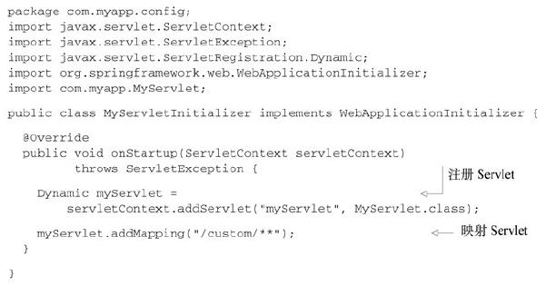
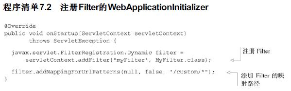
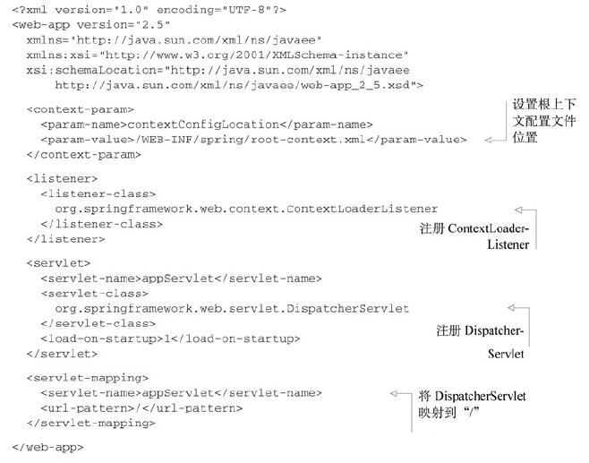
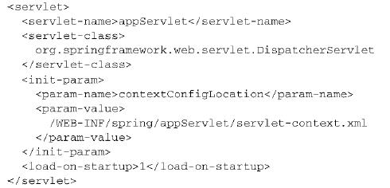
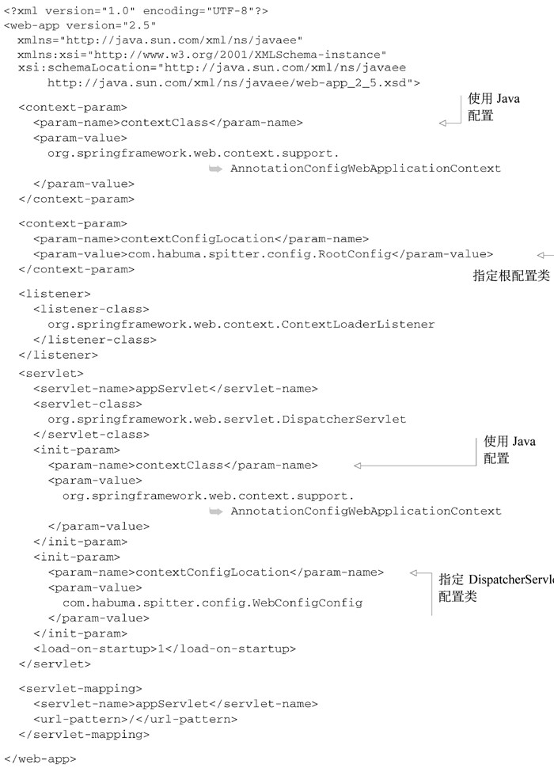

    Spring MVC 的高级技术
------------

# 1. Spring MVC配置的替代方案
## 1.1　自定义DispatcherServlet配置
AbstractAnnotationConfigDispatcherServletInitializer实际上还有更多的方法可以进行重载，从而实现额外的配置。此类的方法之一就是`customizeRegistration()`。在AbstractAnnotationConfigDispatcherServletInitializer将DispatcherServlet注册到Servlet容器中之后，就会调用`customizeRegistration()`，并将Servlet注册后得到的`Registration.Dynamic`传递进来。通过重载`customizeRegistration()`方法，我们可以对DispatcherServlet进行额外的配置。


在Spring MVC中处理multipart请求和文件上传, 如果计划使用Servlet 3.0对multipart配置的支持，那么需要使用DispatcherServlet的registration来启用multipart请求。我们可以重载customizeRegistration()方法来设置MultipartConfigElement，如下所示：
```
 @Override
  protected void customizeRegistration(Dynamic registration) {
    registration.setMultipartConfig(
        new MultipartConfigElement("/tmp/spittr/uploads", 2097152, 4194304, 0));
  }
```
借助`customizeRegistration()`方法中的`ServletRegistration.Dynamic`，我们能够完成多项任务，包括:
- 调用`setLoadOnStartup()`设置`load-on-startup`优先级
- 通过`setInitParameter()`设置初始化参数
- 通过调用`setMultipartConfig()`配置Servlet 3.0对multipart的支持。

在前面的样例中，我们设置了对multipart的支持，将上传文件的临时存储目录设置在“/tmp/spittr/uploads”中。

## 1.2　添加其他的Servlet和Filter
基于Java的初始化器（initializer）的一个好处就在于我们可以定义任意数量的初始化器类。因此，如果我们想往Web容器中注册其他组件的话，只需创建一个新的初始化器就可以了。最简单的方式就是实现Spring的WebApplicationInitializer接口。例如，如下的程序清单展现了如何创建WebApplicationInitializer实现并注册一个Servlet。
<br/><br/>

程序清单7.1是相当基础的Servlet注册初始化器类。它注册了一个Servlet并将其映射到一个路径上。我们也可以通过这种方式来手动注册DispatcherServlet。（但这并没有必要，因为AbstractAnnotationConfigDispatcherServletInitializer没用太多代码就将这项任务完成得很漂亮。）

我们还可以创建新的WebApplicationInitializer实现来注册Listener和Filter。例如，如下的程序清单展现了如何注册Filter。
<br/><br/>

## 1.3　在web.xml中声明DispatcherServlet
如下是一个基本的web.xml文件，它按照传统的方式搭建了DispatcherServlet和ContextLoaderListener。
**程序清单7.3　在web.xml中搭建Spring MVC**
<br/><br/>

就像我在第5章曾经介绍过的，ContextLoaderListener和DispatcherServlet各自都会加载一个Spring应用上下文。
- 上下文参数contextConfigLocation指定了一个XML文件的地址，这个文件定义了根应用上下文，它会被ContextLoaderListener加载。如程序清单7.3所示，根上下文会从“/WEB-INF/spring/root-context.xml”中加载bean定义。

- DispatcherServlet会根据Servlet的名字找到一个文件，并基于该文件加载应用上下文。在程序清单7.3中，Servlet的名字是appServlet，因此DispatcherServlet会从“/WEB-INF/appServlet-context.xml”文件中加载其应用上下文。如果你希望指定DispatcherServlet配置文件的位置的话，那么可以在Servlet上指定一个contextConfigLocation初始化参数。例如，如下的配置中，DispatcherServlet会从“/WEB-INF/spring/appServlet/servlet-context.xml”加载它的bean：
<br/><br/>
上面阐述的都是如何让DispatcherServlet和ContextLoaderListener从XML中加载各自的应用上下文。但是，在本书中的大部分内容中，我们都更倾向于使用Java配置而不是XML配置。因此，我们需要让Spring MVC在启动的时候，从带有@Configuration注解的类上加载配置。

要在Spring MVC中使用基于Java的配置，我们需要告诉DispatcherServlet和ContextLoaderListener使用AnnotationConfigWebApplicationContext，这是一个WebApplicationContext的实现类，它会加载Java配置类，而不是使用XML。要实现这种配置，我们可以设置contextClass上下文参数以及DispatcherServlet的初始化参数。如下的程序清单展现了一个新的web.xml，在这个文件中，它所搭建的Spring MVC使用基于Java的Spring配置：
<br/><br/>

# 2. 处理multipart形式的数据
## 2.1　配置multipart解析器
DispatcherServlet并没有实现任何解析multipart请求数据的功能。它将该任务委托给了Spring中MultipartResolver策略接口的实现，通过这个实现类来解析multipart请求中的内容。从Spring 3.1开始，Spring内置了两个MultipartResolver的实现供我们选择：
- CommonsMultipartResolver：使用Jakarta Commons FileUpload解析multipart请求；
- StandardServletMultipartResolver：依赖于Servlet 3.0对multipart请求的支持（始于Spring 3.1）。
一般来讲，在这两者之间，StandardServletMultipartResolver可能会是优选的方案.

**使用Servlet 3.0解析multipart请求**
兼容Servlet 3.0的StandardServletMultipartResolver没有构造器参数，也没有要设置的属性。这样，在Spring应用上下文中，将其声明为bean就会非常简单，如下所示：
```
  @Bean
  public MultipartResolver multipartResolver() throws IOException {
    return new StandardServletMultipartResolver();
  }
```
如果我们想要指定文件在上传时，临时写入目录在什么位置的话，该如何实现？不是在Spring中配置StandardServletMultipartResolver，而是要在Servlet中指定multipart的配置。至少，我们必须要指定在文件上传的过程中，所写入的临时文件路径。如果不设定这个最基本配置的话，StandardServletMultipartResolver就无法正常工作。具体来讲，我们必须要在web.xml或Servlet初始化类中，将multipart的具体细节作为DispatcherServlet配置的一部分。比如，本章刚开始部分的代码，我们想限制文件的大小不超过2MB，整个请求不超过4MB，而且所有的文件都要写到磁盘中。下面的代码使用MultipartConfigElement设置了这些临界值：：
```
 @Override
  protected void customizeRegistration(Dynamic registration) {
    registration.setMultipartConfig(
        new MultipartConfigElement("/tmp/spittr/uploads", 2097152, 4194304, 0));
  }
```
如果我们使用更为传统的web.xml来配置MultipartConfigElement的话，那么可以使用<servlet>中的<multipart-config>元素，如下所示：
<br/><br/>

> StandardServletMultipartResolver会是最佳的选择，但是如果我们需要将应用部署到非Servlet 3.0的容器中，那么就得需要替代的方案。Spring内置了CommonsMultipartResolver，可以作为StandardServletMultipartResolver的替代方案。
## 7.2.2　处理multipart请求
现在已经在Spring中（或Servlet容器中）配置好了对mutipart请求的处理，那么接下来我们就可以编写控制器方法来接收上传的文件。要实现这一点，最常见的方式就是在某个控制器方法参数上添加@RequestPart注解。

# 3. 处理异常
# 4. 为控制器添加通知
# 5. 跨重定向请求传递数据