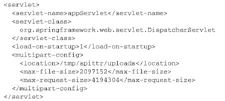

    Spring MVC 的高级技术
------------

# 1. Spring MVC配置的替代方案
## 1.1　自定义DispatcherServlet配置
AbstractAnnotationConfigDispatcherServletInitializer实际上还有更多的方法可以进行重载，从而实现额外的配置。此类的方法之一就是`customizeRegistration()`。在AbstractAnnotationConfigDispatcherServletInitializer将DispatcherServlet注册到Servlet容器中之后，就会调用`customizeRegistration()`，并将Servlet注册后得到的`Registration.Dynamic`传递进来。通过重载`customizeRegistration()`方法，我们可以对DispatcherServlet进行额外的配置。


在Spring MVC中处理multipart请求和文件上传, 如果计划使用Servlet 3.0对multipart配置的支持，那么需要使用DispatcherServlet的registration来启用multipart请求。我们可以重载customizeRegistration()方法来设置MultipartConfigElement，如下所示：
```
 @Override
  protected void customizeRegistration(Dynamic registration) {
    registration.setMultipartConfig(
        new MultipartConfigElement("/tmp/spittr/uploads", 2097152, 4194304, 0));
  }
```
借助`customizeRegistration()`方法中的`ServletRegistration.Dynamic`，我们能够完成多项任务，包括:
- 调用`setLoadOnStartup()`设置`load-on-startup`优先级
- 通过`setInitParameter()`设置初始化参数
- 通过调用`setMultipartConfig()`配置Servlet 3.0对multipart的支持。

在前面的样例中，我们设置了对multipart的支持，将上传文件的临时存储目录设置在“/tmp/spittr/uploads”中。

## 1.2　添加其他的Servlet和Filter
基于Java的初始化器（initializer）的一个好处就在于我们可以定义任意数量的初始化器类。因此，如果我们想往Web容器中注册其他组件的话，只需创建一个新的初始化器就可以了。最简单的方式就是实现Spring的WebApplicationInitializer接口。例如，如下的程序清单展现了如何创建WebApplicationInitializer实现并注册一个Servlet。
<br/><br/>

程序清单7.1是相当基础的Servlet注册初始化器类。它注册了一个Servlet并将其映射到一个路径上。我们也可以通过这种方式来手动注册DispatcherServlet。（但这并没有必要，因为AbstractAnnotationConfigDispatcherServletInitializer没用太多代码就将这项任务完成得很漂亮。）

我们还可以创建新的WebApplicationInitializer实现来注册Listener和Filter。例如，如下的程序清单展现了如何注册Filter。
<br/><br/>

## 1.3　在web.xml中声明DispatcherServlet
如下是一个基本的web.xml文件，它按照传统的方式搭建了DispatcherServlet和ContextLoaderListener。
**程序清单7.3　在web.xml中搭建Spring MVC**
<br/><br/>

就像我在第5章曾经介绍过的，ContextLoaderListener和DispatcherServlet各自都会加载一个Spring应用上下文。
- 上下文参数contextConfigLocation指定了一个XML文件的地址，这个文件定义了根应用上下文，它会被ContextLoaderListener加载。如程序清单7.3所示，根上下文会从“/WEB-INF/spring/root-context.xml”中加载bean定义。

- DispatcherServlet会根据Servlet的名字找到一个文件，并基于该文件加载应用上下文。在程序清单7.3中，Servlet的名字是appServlet，因此DispatcherServlet会从“/WEB-INF/appServlet-context.xml”文件中加载其应用上下文。如果你希望指定DispatcherServlet配置文件的位置的话，那么可以在Servlet上指定一个contextConfigLocation初始化参数。例如，如下的配置中，DispatcherServlet会从“/WEB-INF/spring/appServlet/servlet-context.xml”加载它的bean：
<br/><br/>
上面阐述的都是如何让DispatcherServlet和ContextLoaderListener从XML中加载各自的应用上下文。但是，在本书中的大部分内容中，我们都更倾向于使用Java配置而不是XML配置。因此，我们需要让Spring MVC在启动的时候，从带有@Configuration注解的类上加载配置。

要在Spring MVC中使用基于Java的配置，我们需要告诉DispatcherServlet和ContextLoaderListener使用AnnotationConfigWebApplicationContext，这是一个WebApplicationContext的实现类，它会加载Java配置类，而不是使用XML。要实现这种配置，我们可以设置contextClass上下文参数以及DispatcherServlet的初始化参数。如下的程序清单展现了一个新的web.xml，在这个文件中，它所搭建的Spring MVC使用基于Java的Spring配置：
<br/><br/>

# 2. 处理multipart形式的数据
## 2.1　配置multipart解析器
DispatcherServlet并没有实现任何解析multipart请求数据的功能。它将该任务委托给了Spring中MultipartResolver策略接口的实现，通过这个实现类来解析multipart请求中的内容。从Spring 3.1开始，Spring内置了两个MultipartResolver的实现供我们选择：
- CommonsMultipartResolver：使用Jakarta Commons FileUpload解析multipart请求；
- StandardServletMultipartResolver：依赖于Servlet 3.0对multipart请求的支持（始于Spring 3.1）。
一般来讲，在这两者之间，StandardServletMultipartResolver可能会是优选的方案.

**使用Servlet 3.0解析multipart请求**
兼容Servlet 3.0的StandardServletMultipartResolver没有构造器参数，也没有要设置的属性。这样，在Spring应用上下文中，将其声明为bean就会非常简单，如下所示：
```
  @Bean
  public MultipartResolver multipartResolver() throws IOException {
    return new StandardServletMultipartResolver();
  }
```
如果我们想要指定文件在上传时，临时写入目录在什么位置的话，该如何实现？不是在Spring中配置StandardServletMultipartResolver，而是要在Servlet中指定multipart的配置。至少，我们必须要指定在文件上传的过程中，所写入的临时文件路径。如果不设定这个最基本配置的话，StandardServletMultipartResolver就无法正常工作。具体来讲，我们必须要在web.xml或Servlet初始化类中，将multipart的具体细节作为DispatcherServlet配置的一部分。比如，本章刚开始部分的代码，我们想限制文件的大小不超过2MB，整个请求不超过4MB，而且所有的文件都要写到磁盘中。下面的代码使用MultipartConfigElement设置了这些临界值：：
```
 @Override
  protected void customizeRegistration(Dynamic registration) {
    registration.setMultipartConfig(
        new MultipartConfigElement("/tmp/spittr/uploads", 2097152, 4194304, 0));
  }
```
如果我们使用更为传统的web.xml来配置MultipartConfigElement的话，那么可以使用`<servlet>`中的`<multipart-config>`元素，如下所示：
<br/><br/>

> StandardServletMultipartResolver会是最佳的选择，但是如果我们需要将应用部署到非Servlet 3.0的容器中，那么就得需要替代的方案。Spring内置了CommonsMultipartResolver，可以作为StandardServletMultipartResolver的替代方案。
## 7.2.2　处理multipart请求
现在已经在Spring中（或Servlet容器中）配置好了对mutipart请求的处理，那么接下来我们就可以编写控制器方法来接收上传的文件。要实现这一点，最常见的方式就是在某个控制器方法参数上添加@RequestPart注解。

假设我们允许用户在注册Spittr应用的时候上传一张图片，那么我们需要修改表单：
<br/><br/>

`<form>`标签现在将enctype属性设置为multipart/form-data，这会告诉浏览器以multipart数据的形式提交表单，而不是以表单数据的形式进行提交。在multipart中，每个输入域都会对应一个part。

除了注册表单中已有的输入域，我们还添加了一个新的`<input>`域，其type为file。这能够让用户选择要上传的图片文件。accept属性用来将文件类型限制为JPEG、PNG以及GIF图片。根据其name属性，图片数据将会发送到multipart请求中的profilePicture part之中。

现在，我们需要修改processRegistration()方法，使其能够接受上传的图片。其中一种方式是添加byte数组参数，并为其添加`@RequestPart`注解。如下为示例：
<br/><br/>

当注册表单提交的时候，profilePicture属性将会给定一个byte数组，这个数组中包含了请求中对应part的数据（通过`@RequestPart`指定）。如果用户提交表单的时候没有选择文件，那么这个数组会是空（而不是null）。

**接受MultipartFile**
使用上传文件的原始byte比较简单但是功能有限。因此，Spring还提供了MultipartFile接口，它为处理multipart数据提供了内容更为丰富的对象。
- 程序清单7.5　Spring所提供的MultipartFile接口，用来处理上传的文件：
```
public interface MultipartFile {
    String getName();

    String getOriginalFilename();

    String getContentType();

    boolean isEmpty();

    long getSize();

    byte[] getBytes() throws IOException;

    InputStream getInputStream() throws IOException;

    void transferTo(File var1) throws IOException, IllegalStateException;
}
```
MultipartFile提供了获取上传文件byte的方式，但是它所提供的功能并不仅限于此，还能获得原始的文件名、大小以及内容类型。它还提供了一个InputStream，用来将文件数据以流的方式进行读取。

除此之外，MultipartFile还提供了一个便利的transferTo()方法，它能够帮助我们将上传的文件写入到文件系统中。

# 3. 处理异常
Spring提供了多种方式将异常转换为响应：
- 特定的Spring异常将会自动映射为指定的HTTP状态码；
- 异常上可以添加@ResponseStatus注解，从而将其映射为某一个HTTP状态码；
- 在方法上可以添加@ExceptionHandler注解，使其用来处理异常。
## 3.1　将异常映射为HTTP状态码
- 表7.1　Spring的一些异常会默认映射为HTTP状态码
<br/><br/>

尽管这些内置的映射是很有用的，但是对于应用所抛出的异常它们就无能为力了。幸好，Spring提供了一种机制，能够通过`@ResponseStatus`注解将异常映射为HTTP状态码。

如，抛出自定义异常SpittleNotFoundException：
```
  @RequestMapping(value="/{spittleId}", method=RequestMethod.GET)
  public String spittle(
      @PathVariable("spittleId") long spittleId,
      Model model) {
    Spittle spittle = spittleRepository.findOne(spittleId);
    if (spittle == null) {
      throw new SpittleNotFoundException();
    }
    model.addAttribute(spittle);
    return "spittle";
  }
```
异常SpittleNotFoundException：
```
@ResponseStatus(value=HttpStatus.NOT_FOUND, reason="Spittle Not Found")
public class SpittleNotFoundException extends RuntimeException {

}
```

## 3.2　编写异常处理的方法
假设用户试图创建的Spittle与已创建的Spittle文本完全相同，那么SpittleRepository的save()方法将会抛出DuplicateSpittle Exception异常。
```
  @RequestMapping(method=RequestMethod.POST)
  public String saveSpittle(SpittleForm form, Model model) {
    try {
      spittleRepository.save(new Spittle(null, form.getMessage(), new Date(),
          form.getLongitude(), form.getLatitude()));
      return "redirect:/spittles";
    } catch (DuplicateSpittleException e) {
      return "error/duplicate";
    }
  }
```

**改进**
如果能让saveSpittle()方法只关注正确的路径，而让其他方法处理异常的话，那么它就能简单一些。
```
  @RequestMapping(method=RequestMethod.POST)
  public String saveSpittle(SpittleForm form, Model model) {
      spittleRepository.save(new Spittle(null, form.getMessage(), new Date(),
          form.getLongitude(), form.getLatitude()));
      return "redirect:/spittles";
  }
```
我们为SpittleController添加一个新的方法，它会处理抛出DuplicateSpittleException的情况：
```
  @ExceptionHandler(DuplicateSpittleException.class)
  public String handleNotFound() {
    return "error/duplicate";
  }
```
异常定义如下：
```
public class DuplicateSpittleException extends RuntimeException {

}
```
它返回的是一个String，这与处理请求的方法是一致的，指定了要渲染的逻辑视图名，它能够告诉用户他们正在试图创建一条重复的条目。

我们不用在每一个可能抛出DuplicateSpittleException的方法中添加异常处理代码，这一个方法就涵盖了所有的功能。

既然`@ExceptionHandler`注解所标注的方法能够处理同一个控制器类中所有处理器方法的异常，那么你可能会问有没有一种方法能够处理所有控制器中处理器方法所抛出的异常呢。从Spring 3.2开始，这肯定是能够实现的，我们只需将其定义到控制器通知类中即可。

什么是控制器通知方法？接着看:

# 4. 为控制器添加通知
如果控制器类的特定切面能够运用到整个应用程序的所有控制器中，那么这将会便利很多。举例来说，如果要在多个控制器中处理异常，那@ExceptionHandler注解所标注的方法是很有用的。不过，如果多个控制器类中都会抛出某个特定的异常，那么你可能会发现要在所有的控制器方法中重复相同的@ExceptionHandler方法。

Spring 3.2为这类问题引入了一个新的解决方案：控制器通知。控制器通知（controller advice）是任意带有@ControllerAdvice注解的类，这个类会包含一个或多个如下类型的方法：
- @ExceptionHandler注解标注的方法；
- @InitBinder注解标注的方法；
- @ModelAttribute注解标注的方法。

在带有@ControllerAdvice注解的类中，以上所述的这些方法会运用到整个应用程序所有控制器中带有@RequestMapping注解的方法上。
@ControllerAdvice注解本身已经使用了@Component，因此@ControllerAdvice注解所标注的类将会自动被组件扫描获取到，就像带有@Component注解的类一样。

@ControllerAdvice最为实用的一个场景就是将所有的@ExceptionHandler方法收集到一个类中，这样所有控制器的异常就能在一个地方进行一致的处理。
```
@ControllerAdvice
public class AppWideExceptionHandler {

  @ExceptionHandler(DuplicateSpittleException.class)
  public String handleNotFound() {
    return "error/duplicate";
  }

}
```
现在，如果任意的控制器方法抛出了DuplicateSpittleException，不管这个方法位于哪个控制器中，都会调用这个duplicateSpittleHandler()方法来处理异常。

# 5. 跨重定向请求传递数据
在第5章，在控制器方法返回的视图名称中，我们借助了“redirect:”前缀的力量。当控制器方法返回的String值以“redirect:”开头的话，那么这个String不是用来查找视图的，而是用来指导浏览器进行重定向的路径。
`return "redirect:/spitter/" + spitter.getUsername();`
如图7.1所示，当控制器的结果是重定向的话，原始的请求就结束了，并且会发起一个新的GET请求。原始请求中所带有的模型数据也就随着请求一起消亡了。在新的请求属性中，没有任何的模型数据，这个请求必须要自己计算数据。
<br/><br/>

显然，对于重定向来说，模型并不能用来传递数据。但是我们也有一些其他方案，能够从发起重定向的方法传递数据给处理重定向方法中：
- 使用URL模板以路径变量和/或查询参数的形式传递数据；
- 通过flash属性发送数据。

首先，我们看一下Spring如何帮助我们通过路径变量和/或查询参数的形式传递数据。

## 5.1　通过URL模板进行重定向
我们以路径变量的形式传递了新创建Spitter的username。但是按照现在的写法，username的值是直接连接到重定向String上的。这能够正常运行，但是还远远不能说没有问题。当构建URL或SQL查询语句的时候，使用String连接是很危险的。

processRegistration()方法的最后一行可以改写为如下的形式：
```
  @RequestMapping(value="/register", method=POST)
  public String processRegistration(Spitter spitter, Model model){
    spitterRepository.save(spitter);

    model.addAttribute("username", spitter.getUsername());
    return "redirect:/spitter/{username}";
  }
```
现在，username作为占位符填充到了URL模板中，而不是直接连接到重定向String中，所以username中所有的不安全字符都会进行转义。这样会更加安全，这里允许用户输入任何想要的内容作为username，并会将其附加到路径上。

**更多查询参数**
```
  @RequestMapping(value="/register", method=POST)
  public String processRegistration(Spitter spitter, Model model){
    spitterRepository.save(spitter);
    model.addAttribute("username", spitter.getUsername());
    model.addAttribute("spitterId", spitter.getId());
    return "redirect:/spitter/{username}";
  }
```
所返回的重定向String并没有太大的变化。但是，因为模型中的spitterId属性没有匹配重定向URL中的任何占位符，所以它会自动以查询参数的形式附加到重定向URL上。

如果username属性的值是habuma并且spitterId属性的值是42，那么结果得到的重定向URL路径将会是“/spitter/habuma?spitterId=42”。

通过路径变量和查询参数的形式跨重定向传递数据是很简单直接的方式，但它也有一定的限制。它只能用来发送简单的值，如String和数字的值。在URL中，并没有办法发送更为复杂的值，但这正是flash属性能够提供帮助的领域。

## 5.2　使用flash属性
在重定向之前，我们其实已经得到了Spitter对象。为什么不将其发送给处理重定向的方法，并将其展现出来呢？

有个方案是将Spitter放到会话中。会话能够长期存在，并且能够跨多个请求。所以我们可以在重定向发生之前将Spitter放到会话中，并在重定向后，从会话中将其取出。当然，我们还要负责在重定向后在会话中将其清理掉。

Spring认为我们并不需要管理这些数据，相反，Spring提供了将数据发送为flash属性（flash attribute）的功能。按照定义，flash属性会一直携带这些数据直到下一次请求，然后才会消失。

Spring提供了通过RedirectAttributes设置flash属性的方法，这是Spring 3.1引入的Model的一个子接口。RedirectAttributes提供了Model的所有功能，除此之外，还有几个方法是用来设置flash属性的。

具体来讲，RedirectAttributes提供了一组addFlashAttribute()方法来添加flash属性:
```
  @RequestMapping(value="/register", method=POST)
  public String processRegistration(Spitter spitter,
                                    RedirectAttributes redirectAttributes) throws IOException {
    spitterRepository.save(spitter);
    redirectAttributes.addAttribute("username", spitter.getUsername());
    redirectAttributes.addFlashAttribute("spitter",spitter);
    return "redirect:/spitter/{username}";
  }
```
> 我们还可以不设置key参数，  让key根据值的类型自行推断得出：`redirectAttributes.addFlashAttribute(spitter);`

在重定向执行之前，所有的flash属性都会复制到会话中。在重定向后，存在会话中的flash属性会被取出，并从会话转移到模型之中。处理重定向的方法就能从模型中访问Spitter对象了，就像获取其他的模型对象一样。图7.2阐述了它是如何运行的。
<br/><br/>

为了完成flash属性的流程，如下展现了更新版本的showSpitterProfile()方法，在从数据库中查找之前，它会首先从模型中检查Spitter对象：
```
  @RequestMapping(value="/{username}", method=GET)
  public String showSpitterProfile(
          @PathVariable String username, Model model) {
    if (!model.containsAttribute("spitter")) {
      model.addAttribute(
          spitterRepository.findByUsername(username));
    }
    return "profile";
  }
```

