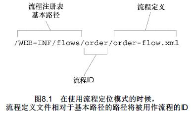
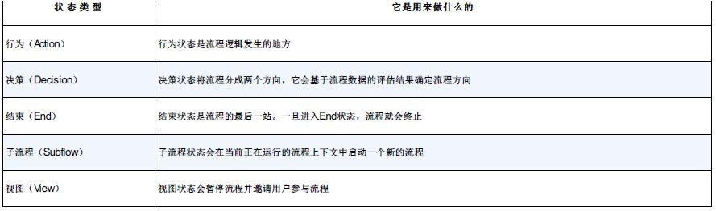
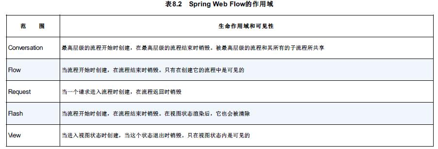
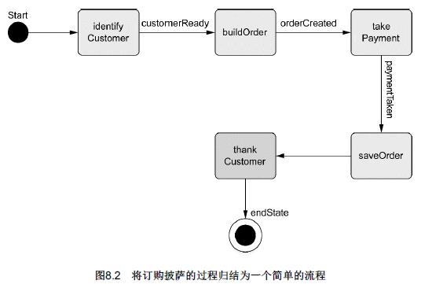
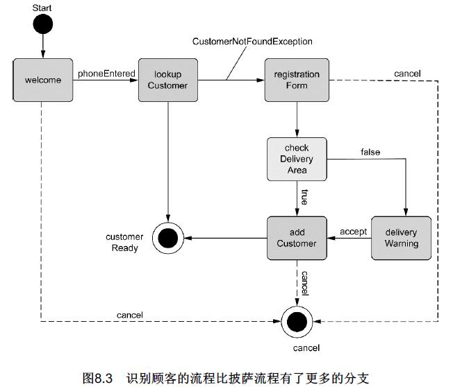
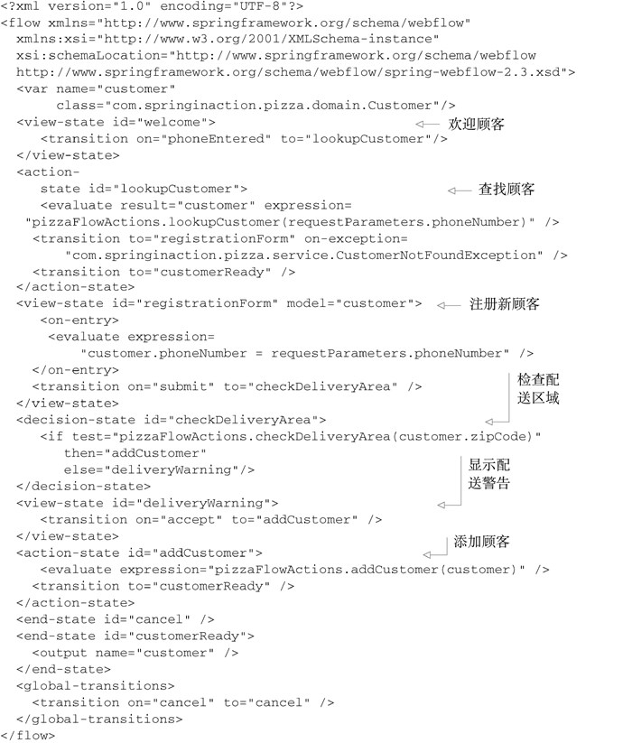
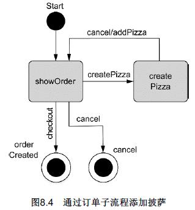
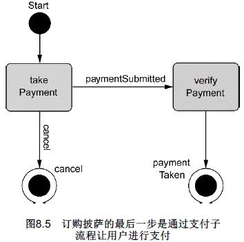

Spring Web Flow是Spring MVC的扩展，它支持开发基于流程的应用程序。它将流程的定义与实现流程行为的类和视图分离开来。

# 1　在Spring中配置Web Flow
Spring Web Flow是构建于Spring MVC基础之上的。这意味着所有的流程请求都需要首先经过Spring MVC的DispatcherServlet。我们需要在Spring应用上下文中配置一些bean来处理流程请求并执行流程。

现在，还不支持在Java中配置Spring Web Flow，所以我们别无选择，只能在XML中对其进行配置。有一些bean会使用Spring Web Flow的Spring配置文件命名空间来进行声明。

## 1.1　装配流程执行器
正如其名字所示，流程执行器（flow executor）驱动流程的执行。

当用户进入一个流程时，流程执行器会为用户创建并启动一个流程执行实例。当流程暂停的时候（如为用户展示视图时），流程执行器会在用户执行操作后恢复流程。
`<flow:flow-executor id="flowExecutor" />`

## 1.2　配置流程注册表
流程注册表（flow registry）的工作是加载流程定义并让流程执行器能够使用它们。
在这里的声明中，流程注册表会在“/WEB-INF/flows”目录下查找流程定义，这是通过base-path属性指明的。依据`<flow:flow-location-pattern>`元素的值，任何文件名以“-flow.xml”结尾的XML文件都将视为流程定义。
```
  <flow:flow-registry id="flowRegistry"
           base-path="/WEB-INF/flows">
     <flow:flow-location-pattern value="/**/*-flow.xml" />
  </flow:flow-registry>
```

所有的流程都是通过其ID来进行引用的。这里我们使用了`<flow:flow-location-pattern>`元素，流程的ID就是相对于base-path的路径——或者双星号所代表的路径。图8.1展示了示例中的流程ID是如何计算的。
<br/><br/>


作为另一种方式，我们可以去除base-path属性，而显式声明流程定义文件的位置,流程的ID是从流程定义文件的文件名中获得的：
```
  <flow:flow-registry id="flowRegistry">
    <flow:flow-location path="/WEB-INF/flows/pizza/pizza-flow.xml" />
  </flow:flow-registry>
```
或者直接指定ID：
```
  <flow:flow-registry id="flowRegistry">
    <flow:flow-location id="pizza" path="/WEB-INF/flows/pizza/pizza-flow.xml" />
  </flow:flow-registry>
```

## 1.3　处理流程请求
我们在前一章曾经看到，DispatcherServlet一般将请求分发给控制器。但是对于流程而言，我们需要一个FlowHandlerMapping来帮助DispatcherServlet将流程请求发送给Spring Web Flow。在Spring应用上下文中，FlowHandlerMapping的配置如下：
```
  <bean class="org.springframework.webflow.mvc.servlet.FlowHandlerMapping">
    <property name="flowRegistry" ref="flowRegistry" />
  </bean>
```
FlowHandlerMapping装配了流程注册表的引用，这样它就能知道如何将请求的URL匹配到流程上。例如，如果我们有一个ID为pizza的流程，FlowHandlerMapping就会知道如果请求的URL模式（相对于应用程序的上下文路径）是“/pizza”的话，就要将其匹配到这个流程上。

然而，FlowHandlerMapping的工作仅仅是将流程请求定向到Spring Web Flow上，响应请求的是FlowHandlerAdapter。FlowHandlerAdapter等同于Spring MVC的控制器，它会响应发送的流程请求并对其进行处理。FlowHandlerAdapter可以像下面这样装配成一个Spring bean，如下所示：
```
  <bean class="org.springframework.webflow.mvc.servlet.FlowHandlerAdapter">
    <property name="flowExecutor" ref="flowExecutor" />
  </bean>
```
这个处理适配器是DispatcherServlet和Spring Web Flow之间的桥梁。它会处理流程请求并管理基于这些请求的流程。在这里，它装配了流程执行器的引用，而后者是为所处理的请求执行流程的。


# 2　流程的组件
在Spring Web Flow中，流程是由三个主要元素定义的：状态、转移和流程数据。
## 2.1　状态
Spring Web Flow定义了五种不同类型的状态，如表8.1所示。通过选择Spring Web Flow的状态几乎可以把任意的安排功能构造成会话式的Web应用。
<br/><br/>
**视图状态**
在流程定义的XML文件中，`<view-state>`用于定义视图状态：
`<view-state id="welcome"/>`
在这个简单的示例中，id属性有两个含义。它在流程内标示这个状态。除此以外，因为在这里没有在其他地方指定视图，所以它也指定了流程到达这个状态时要展现的逻辑视图名为welcome。

如果你愿意显式指定另外一个视图名，那可以使用view属性做到这一点：
`<view-state id="welcome" view="greeting"/>`

如果流程为用户展现了一个表单，你可能希望指明表单所绑定的对象。为了做到这一点，可以设置model属性：
`<view-state id="takePayment" model="flowScope.paymentDetails"/>`

**行为状态**
视图状态会涉及到流程应用程序的用户，而行为状态则是应用程序自身在执行任务。行为状态一般会触发Spring所管理bean的一些方法并根据方法调用的执行结果转移到另一个状态。
在流程定义XML中，行为状态使用`<action-state>`元素来声明。这里是一个例子：
```
    <action-state id="saveOrder">
        <evaluate expression="pizzaFlowActions.saveOrder(order)" />
        <transition to="thankYou" />
    </action-state>
```
expression是SpEL表达式，它表明将会找到ID为pizzaFlowActions的bean并调用其saveOrder()方法。

**决策状态**
有可能流程会完全按照线性执行，从一个状态进入另一个状态，没有其他的替代路线。但是更常见的情况是流程在某一个点根据流程的当前情况进入不同的分支。
决策状态能够在流程执行时产生两个分支。决策状态将评估一个Boolean类型的表达式，然后在两个状态转移中选择一个，这要取决于表达式会计算出true还是false。在XML流程定义中，决策状态通过`<decision-state>`元素进行定义。
```
    <decision-state id="checkDeliveryArea">
      <if test="pizzaFlowActions.checkDeliveryArea(order.customer.zipCode)"
          then="addCustomer"
          else="deliveryWarning"/>
    </decision-state>
```
**子流程状态**
将流程分成独立的部分是个不错的主意。`<subflow-state>`允许在一个正在执行的流程中调用另一个流程。这类似于在一个方法中调用另一个方法。
`<subflow-state>`可以这样声明：
```
    <subflow-state id="order" subflow="pizza/order">
      <input name="order" value="order"/>
      <transition on="orderCreated" to="payment" />
    </subflow-state>
```
在这里，`<input>`元素用于传递订单对象作为子流程的输入。如果子流程结束的`<end-state>`状态ID为orderCreated，那么流程将会转移到名为payment的状态。

**结束状态**
最后，所有的流程都要结束。这就是当流程转移到结束状态时所做的。<end-state>元素指定了流程的结束，它一般会是这样声明的：
`<end-state id="customerReady" />`

当到达<end-state>状态，流程会结束。接下来会发生什么取决于几个因素：
- 如果结束的流程是一个子流程，那调用它的流程将会从`<subflow-state>`处继续执行。`<end-state>`的ID将会用作事件触发从`<subflow-state>`开始的转移。
- 如果`<end-state>`设置了view属性，指定的视图将会被渲染。视图可以是相对于流程路径的视图模板，如果添加“externalRedirect:”前缀的话，将会重定向到流程外部的页面，如果添加“flowRedirect:”将重定向到另一个流程中。
- 如果结束的流程不是子流程，也没有指定view属性，那这个流程只是会结束而已。浏览器最后将会加载流程的基本URL地址，当前已没有活动的流程，所以会开始一个新的流程实例。

## 2.2　转移
正如我在前面所提到的，转移连接了流程中的状态。流程中除结束状态之外的每个状态，至少都需要一个转移，这样就能够知道一旦这个状态完成时流程要去向哪里。状态可以有多个转移，分别对应于当前状态结束时可以执行的不同的路径。

转移使用`<transition>`元素来进行定义，它会作为各种状态元素（`<action-state>`、`<view-state>`、`<subflow-state>`）的子元素。最简单的形式就是`<transition>`元素在流程中指定下一个状态：
`<transition to="customerReady" />`
属性to用于指定流程的下一个状态。

更常见的转移定义是基于事件的触发来进行的。在视图状态，事件通常会是用户采取的动作。在行为状态，事件是评估表达式得到的结果。而在子流程状态，事件取决于子流程结束状态的ID。在任意的事件中（这里没有任何歧义），你可以使用on属性来指定触发转移的事件：
`<transition on="phoneEntered" to="lookupCustomer"/>`
如果触发了phoneEntered事件，流程将会进入lookupCustomer状态。

在抛出异常时，流程也可以进入另一个状态:
```
<transition to="registrationForm"
            on-exception="com.springinaction.pizza.service.CustomerNotFoundException" />
```

**全局转移**
在创建完流程之后，你可能会发现有一些状态使用了一些通用的转移。例如，如果在整个流程中到处都有如下<transition>:
`<transition on="cancel" to="endState" />`

与其在多个状态中都重复通用的转移，我们可以将`<transition>`元素作为`<global-transitions>`的子元素，把它们定义为全局转移。例如：
```
    <global-transitions>
      <transition on="cancel" to="endState" />
    </global-transitions>
```
定义完这个全局转移后，流程中的所有状态都会默认拥有这个cancel转移。

## 2.3　流程数据
当流程从一个状态进行到另一个状态时，它会带走一些数据。有时候，这些数据只需要很短的时间（可能只要展现页面给用户）。有时候，这些数据会在整个流程中传递并在流程结束的时候使用。

**声明变量**
流程数据保存在变量中，而变量可以在流程的各个地方进行引用。它能够以多种方式创建。在流程中创建变量的最简单形式是使用`<var>`元素：
`<var name="order" class="com.springinaction.pizza.domain.Order"/>`
这个变量可以在流程的任意状态进行访问。

作为行为状态的一部分或者作为视图状态的入口，你有可能会使用`<evaluate>`元素来创建变量。例如：
```
<evaluate result="viewScope.toppingsList"
              expression="T(com.springinaction.pizza.domain.Topping).asList()" />
```
`<evaluate>`元素计算了一个表达式（SpEL表达式）并将结果放到了名为toppingsList的变量中，这个变量是视图作用域的.

`<set>`元素也可以设置变量的值：
```
<set name="flowScope.pizza"
              value="new com.springinaction.pizza.domain.Pizza()" />
```
`<set>`元素与`<evaluate>`元素很类似，都是将变量设置为表达式计算的结果。这里，我们设置了一个流程作用域内的pizza变量，它的值是Pizza对象的新实例。

**定义流程数据的作用域**
流程中携带的数据会拥有不同的生命作用域和可见性，这取决于保存数据的变量本身的作用域。Spring Web Flow定义了五种不同作用域，如表8.2所示。
<br/><br/>

当使用`<var>`元素声明变量时，变量始终是流程作用域的，也就是在定义变量的流程内有效。当使用`<set>`或`<evaluate>`的时候，作用域通过name或result属性的前缀指定。
```
<evaluate result="viewScope.toppingsList"
              expression="T(com.springinaction.pizza.domain.Topping).asList()" />
```

# 3　组合起来：披萨流程
## 3.1　定义基本流程
图8.2阐述了这个流程。
<br/><br/>

以下的程序清单8.1展示了如何使用Spring Web Flow的XML流程定义来实现披萨订单的整体流程。
```
<?xml version="1.0" encoding="UTF-8"?>
<flow xmlns="http://www.springframework.org/schema/webflow"
  xmlns:xsi="http://www.w3.org/2001/XMLSchema-instance"
  xsi:schemaLocation="http://www.springframework.org/schema/webflow
  http://www.springframework.org/schema/webflow/spring-webflow-2.0.xsd">

    <var name="order" class="com.springinaction.pizza.domain.Order"/>

    <!-- Customer -->
    <subflow-state id="customer" subflow="pizza/customer">
      <input name="order" value="order"/>
      <transition on="customerReady" to="order" />
    </subflow-state>

    <!-- Order -->
    <subflow-state id="order" subflow="pizza/order">
      <input name="order" value="order"/>
      <transition on="orderCreated" to="payment" />
    </subflow-state>

    <!-- Payment -->
    <subflow-state id="payment" subflow="pizza/payment">
      <input name="order" value="order"/>
      <transition on="paymentTaken" to="saveOrder"/>
    </subflow-state>

    <action-state id="saveOrder">
        <evaluate expression="pizzaFlowActions.saveOrder(order)" />
        <transition to="thankYou" />
    </action-state>

    <view-state id="thankYou">
      <transition to="endState" />
    </view-state>

    <!-- End state -->
    <end-state id="endState" />

    <global-transitions>
      <transition on="cancel" to="endState" />
    </global-transitions>
</flow>
```
在流程定义中，我们看到的第一件事就是order变量的声明。每次流程开始的时候，都会创建一个Order实例。Order类会带有关于订单的所有信息，包含顾客信息、订购的披萨列表以及支付详情。

流程定义的主要组成部分是流程的状态。默认情况下，流程定义文件中的第一个状态也会是流程访问中的第一个状态。在本例中，也就是identifyCustomer状态（一个子流程）。但是如果你愿意的话，你可以通过`<flow>`元素的start-state属性将任意状态指定为开始状态。

识别顾客、构造披萨订单以及支付这样的活动太复杂了，并不适合将其强行塞入一个状态。这是我们为何在后面将其单独定义为流程的原因。

流程变量order将在前三个状态中进行填充并在第四个状态中进行保存。identifyCustomer子流程状态使用了`<output>`元素来填充order的customer属性，将其设置为顾客子流程收到的输出。buildOrder和takePayment状态使用了不同的方式，它们使用`<input>`将order流程变量作为输入，这些子流程就能在其内部填充order对象。

在订单得到顾客、一些披萨以及支付细节后，就可以对其进行保存了。saveOrder是处理这个任务的行为状态。它使用`<evaluate>`来调用ID为pizzaFlowActions的bean的saveOrder()方法，并将保存的订单对象传递进来。订单完成保存后，它会转移到thankYou。

thankYou状态是一个简单的视图状态，后台使用了“/WEB-INF/flows/pizza/thankYou.jsp”这个JSP文件，包含如下所示：
```
<a href='${flowExecutionUrl}&_eventId=finished'>Finish</a>
```
Spring Web Flow为视图的用户提供了一个flowExecutionUrl变量，它包含了流程的URL。结束链接将一个“_eventId”参数关联到URL上，以便回到Web流程时触发finished事件。这个事件将会让流程到达结束状态。

流程将会在结束状态完成。鉴于在流程结束后没有下一步做什么的具体信息，流程将会重新从identifyCustomer状态开始，以准备接受另一个披萨订单。

## 3.2　收集顾客信息
这个流程不是线性的而是在好几个地方根据不同的条件有了分支。例如，在查找顾客后，流程可能结束（如果找到了顾客），也有可能转移到注册表单（如果没有找到顾客）。同样，在checkDeliveryArea状态，顾客有可能会被警告也有可能不被警告他们的地址在配送范围之外。
<br/><br/>

程序清单8.4　使用Web流程来识别饥饿的披萨顾客
<br/><br/>

**询问电话号码**
```
<%@ taglib prefix="c" uri="http://java.sun.com/jsp/jstl/core" %>
<%@ taglib prefix="form" uri="http://www.springframework.org/tags/form" %>
<html>

  <head><title>Spring Pizza</title></head>

  <body>
  	<h2>Welcome to Spring Pizza!!!</h2>

		<form:form>
      <input type="hidden" name="_flowExecutionKey"
             value="${flowExecutionKey}"/>
		  <input type="text" name="phoneNumber"/><br/>
      <input type="submit" name="_eventId_phoneEntered" value="Lookup Customer" />
		</form:form>
	</body>
</html>
```
这个简单的表单提示用户输入其电话号码。但是表单中有两个特殊的部分来驱动流程继续。

首先要注意的是隐藏的“_flowExecutionKey”输入域。当进入视图状态时，流程暂停并等待用户采取一些行为。赋予视图的流程执行key（flow execution key）就是一种返回流程的“回程票”（claim ticket）。当用户提交表单时，流程执行key会在“_flowExecutionKey”输入域中返回并在流程暂停的位置进行恢复。

还要注意的是提交按钮的名字。按钮名字的“_eventId_”部分是提供给Spring Web Flow的一个线索，它表明了接下来要触发事件。当点击这个按钮提交表单时，会触发phoneEntered事件进而转移到lookupCustomer。

**查找顾客**
当欢迎表单提交后，顾客的电话号码将包含在请求参数中并准备用于查询顾客。lookupCustomer状态的`<evaluate>`元素是查找发生的地方。它将电话号码从请求参数中抽取出来并传递到pizzaFlowActions bean的lookupCustomer()方法中。

**注册新顾客**
registrationForm状态是要求用户填写配送地址的。就像我们之前看到的其他视图状态，它将被渲染成JSP。JSP文件如下所示。
```
<%@ taglib prefix="c" uri="http://java.sun.com/jsp/jstl/core" %>
<%@ taglib prefix="form" uri="http://www.springframework.org/tags/form" %>
<html>

  <head><title>Spring Pizza</title></head>

  <body>
    <h2>Customer Registration</h2>

    <form:form commandName="order">
      <input type="hidden" name="_flowExecutionKey"
             value="${flowExecutionKey}"/>
      <b>Phone number: </b><form:input path="customer.phoneNumber"/><br/>
      <b>Name: </b><form:input path="customer.name"/><br/>
      <b>Address: </b><form:input path="customer.address"/><br/>
      <b>City: </b><form:input path="customer.city"/><br/>
      <b>State: </b><form:input path="customer.state"/><br/>
      <b>Zip Code: </b><form:input path="customer.zipCode"/><br/>
      <input type="submit" name="_eventId_submit"
             value="Submit" />
      <input type="submit" name="_eventId_cancel"
             value="Cancel" />
    </form:form>
	</body>
</html>
```
**检查配送区域**
在顾客提供其地址后，我们需要确认他的住址在配送范围之内。如果Spizza不能派送给他们，那么我们要让顾客知道并建议他们自己到店面里取走披萨。
为了做出这个判断，我们使用了决策状态。决策状态checkDeliveryArea有一个<if>元素.

如果顾客在配送区域内的话，那流程转移到addCustomer状态。否则，顾客被带入到deliveryWarning视图状态。deliveryWarning背后的视图就是“/WEB-INF/flows/pizza/customer/deliveryWarning.jspx”，如下所示：
程序清单8.7　告知顾客不能将披萨配送到他们的地址
```
<%@ taglib prefix="c" uri="http://java.sun.com/jsp/jstl/core" %>
<html>
  <head><title>Spring Pizza</title></head>

  <body>
		<h2>Delivery Unavailable</h2>

		<p>The address is outside of our delivery area. The order
		may still be taken for carry-out.</p>

		<a href="${flowExecutionUrl}&_eventId=accept">Accept</a> |
		<a href="${flowExecutionUrl}&_eventId=cancel">Cancel</a>
  </body>
</html>
```

**存储顾客数据**
当流程抵达addCustomer状态时，用户已经输入了他们的地址。为了将来使用，这个地址需要以某种方式存储起来（可能会存储在数据库中）。

**结束流程**
一般来讲，流程的结束状态并不会那么有意思。但是这个流程中，它不仅仅只有一个结束状态，而是两个。

一方面，当customer流程走完所有正常的路径后，它最终会到达ID为customerReady的结束状态。当调用它的披萨流程恢复时，它会接收到一个customerReady事件，这个事件将使得流程转移到buildOrder状态。要注意的是customerReady结束状态包含了一个<output>元素。在流程中这个元素等同于Java中的return语句。它从子流程中传递一些数据到调用流程。在本示例中，<output>元素返回customer流程变量，这样在披萨流程中，就能够将identifyCustomer子流程的状态
指定给订单。
另一方面，如果在识别顾客流程的任意地方触发了cancel事件，将会通过ID为cancel的结束状态退出流程，这也会在披萨流程中触发cancel事件并导致转移（通过全局转移）到披萨流程的结束状态。

## 3.3　构建订单
在识别完顾客之后，主流程的下一件事就是确定他们想要什么类型的披萨。订单子流程就是用于提示用户创建披萨并将其放入订单中的，如图8.4所示。
<br/><br/>

showOrder状态位于订单子流程的中心位置。这是用户进入这个流程时看到的第一个状态，它也是用户在添加披萨到订单后要转移到的状态。它展现了订单的当前状态并允许用户添加其他的披萨到订单中。

要添加披萨到订单时，流程会转移到createPizza状态。这是另外一个视图状态，允许用户选择披萨的尺寸和面饼上面的配料。在这里，用户可以添加或取消披萨，两种事件都会使流程转移回showOrder状态。

从showOrder状态，用户可能提交订单也可能取消订单。两种选择都会结束订单子流程，但是主流程会根据选择不同进入不同的执行路径。如下显示了如何将图中所阐述的内容转变成Spring Web Flow定义。

```
<?xml version="1.0" encoding="UTF-8"?>
<flow xmlns="http://www.springframework.org/schema/webflow"
  xmlns:xsi="http://www.w3.org/2001/XMLSchema-instance"
  xsi:schemaLocation="http://www.springframework.org/schema/webflow
  http://www.springframework.org/schema/webflow/spring-webflow-2.0.xsd">

    <input name="order" required="true" />

    <!-- Order -->
    <view-state id="showOrder">
        <transition on="createPizza" to="createPizza" />
        <transition on="checkout" to="orderCreated" />
        <transition on="cancel" to="cancel" />
    </view-state>

    <view-state id="createPizza" model="flowScope.pizza">
        <on-entry>
          <set name="flowScope.pizza"
              value="new com.springinaction.pizza.domain.Pizza()" />

          <evaluate result="viewScope.toppingsList"
              expression="T(com.springinaction.pizza.domain.Topping).asList()" />
        </on-entry>
        <transition on="addPizza" to="showOrder">
          <evaluate expression="order.addPizza(flowScope.pizza)" />
        </transition>
        <transition on="cancel" to="showOrder" />
    </view-state>


    <!-- End state -->
    <end-state id="cancel" />
    <end-state id="orderCreated" />
</flow>
```
这里使用的`<input>`元素实际上就定义了这个子流程的签名。这个流程需要一个名为order的参数。
`<on-entry>`元素添加了一个新的Pizza对象到流程作用域内，当表单提交时，表单的内容会填充到该对象中。

## 3.4　支付
在披萨流程要结束的时候，最后的子流程提示用户输入他们的支付信息。这个简单的流程如图8.5所示。
<br/><br/>

像订单子流程一样，支付子流程也使用<input>元素接收一个Order对象作为输入。

你可以看到，进入支付子流程的时候，用户会到达takePayment状态。这是一个视图状态，在这里用户可以选择使用信用卡、支票或现金进行支付。提交支付信息后，将进入verifyPayment状态。这是一个行为状态，它将校验支付信息是否可以接受。
```
<?xml version="1.0" encoding="UTF-8"?>
<flow xmlns="http://www.springframework.org/schema/webflow"
  xmlns:xsi="http://www.w3.org/2001/XMLSchema-instance"
  xsi:schemaLocation="http://www.springframework.org/schema/webflow
  http://www.springframework.org/schema/webflow/spring-webflow-2.0.xsd">

    <input name="order" required="true"/>

    <view-state id="takePayment" model="flowScope.paymentDetails">
        <on-entry>
          <set name="flowScope.paymentDetails"
              value="new com.springinaction.pizza.domain.PaymentDetails()" />

          <evaluate result="viewScope.paymentTypeList"
              expression="T(com.springinaction.pizza.domain.PaymentType).asList()" />
        </on-entry>
        <transition on="paymentSubmitted" to="verifyPayment" />
        <transition on="cancel" to="cancel" />
    </view-state>

    <action-state id="verifyPayment">
        <evaluate result="order.payment" expression=
            "pizzaFlowActions.verifyPayment(flowScope.paymentDetails)" />
        <transition to="paymentTaken" />
    </action-state>

    <!-- End state -->
    <end-state id="cancel" />
    <end-state id="paymentTaken" />
</flow>
```
在我们结束Spring Web Flow话题之前，让我们快速了解一下如何对流程及其状态的访问增加安全保护。

# 4　保护Web流程
在下一章中，我们将会看到如何使用Spring Security来保护Spring应用程序。但现在我们讨论的是Spring Web Flow，让我们快速地看一下Spring Web Flow是如何结合Spring Security支持流程级别的安全性的。
```
    <view-state id="restricted">
        <secured attributes="ROLE_ADMIN" match="all"/>
    </view-state>
```
