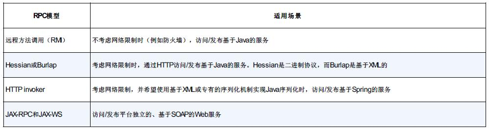
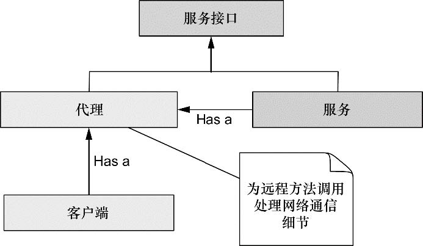
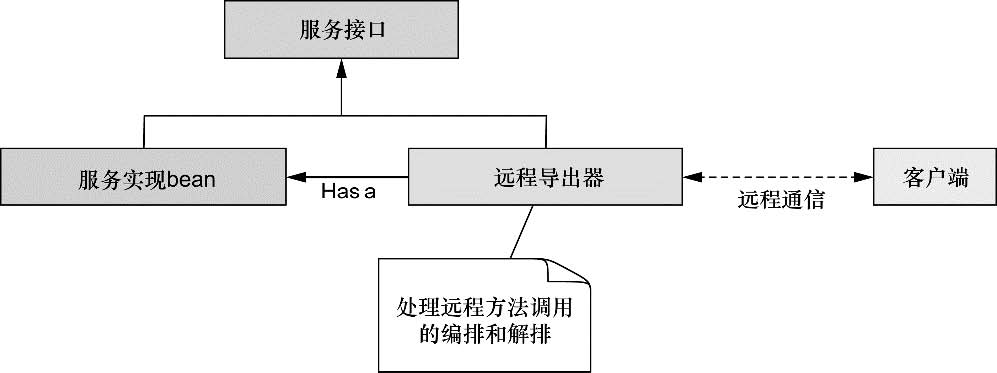
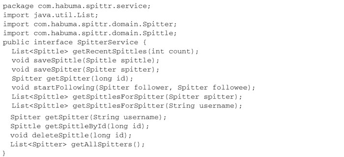
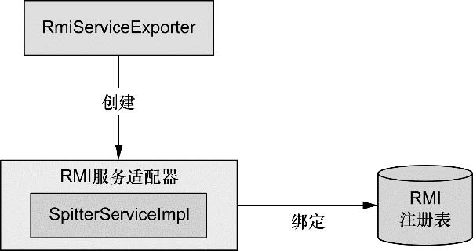
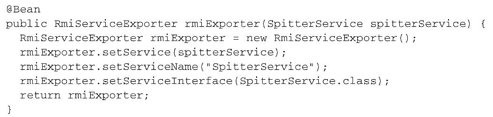
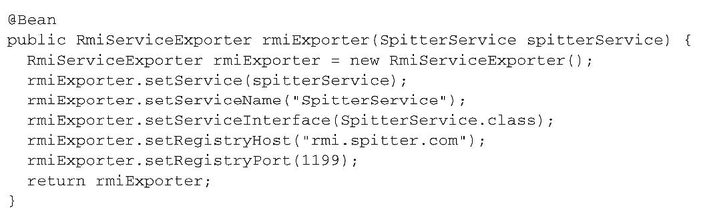
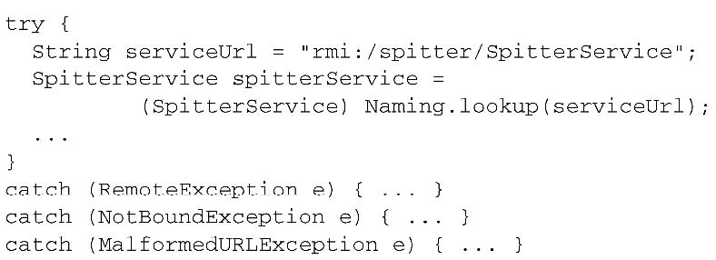
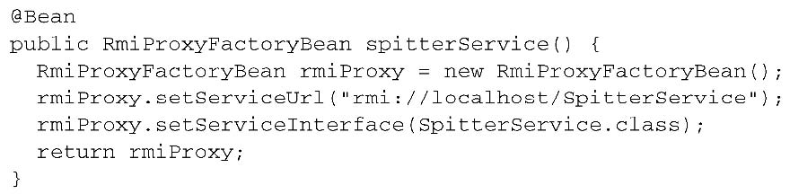
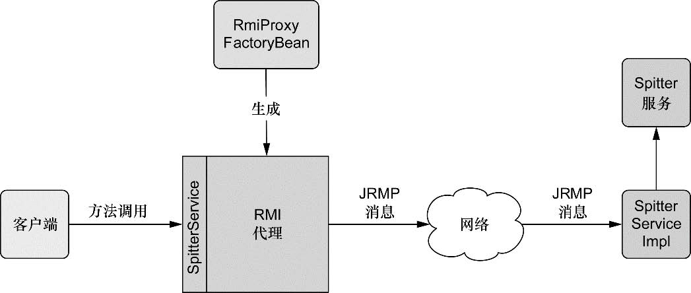

第15章　使用远程服务
-----------

# 1　Spring远程调用概览
！！！
图15.1　第三方客户端能够远程调用Spittr的服务，从而实现与Spittr应用交互

其他应用与Spittr之间的会话开始于客户端应用的一个远程过程调用（remote procedure call，RPC）。从表面上看，RPC类似于调用一个本地对象的一个方法。这两者都是同步操作，会阻塞调用代码的执行，直到被调用的过程执行完毕。

Spring支持多种不同的RPC模型，包括RMI、Caucho的Hessian和Burlap以及Spring自带的HTTP invoker。表15.1概述了每一个RPC模型，并简要讨论了它们所适用的不同场景。

表15.1　Spring通过多种远程调用技术支持RPC
<br/><br/>

在所有的模型中，服务都作为Spring所管理的bean配置到我们的应用中。这是通过一个代理工厂bean实现的，这个bean能够把远程服务像本地对象一样装配到其他bean的属性中去。图15.2展示了它是如何工作的。

<br/><br/>
图15.2　在Spring中，远程服务被代理，所以它们能够像其他Spring bean一样被装配到客户端代码中

在服务器端，我们可以使用表15.1所列出的任意一种模型将Spring管理的bean发布为远程服务。图15.3展示了远程导出器（remote exporter）如何将bean方法发布为远程服务。

<br/><br/>
图15.3　使用远程导出器将Spring管理的bean发布为远程服务

无论我们开发的是使用远程服务的代码，还是实现这些服务的代码，或者两者兼而有之，在Spring中，使用远程服务纯粹是一个配置问题。我们不需要编写任何Java代码就可以支持远程调用。我们的服务bean也不需要关心它们是否参与了一个RPC（当然，任何传递给远程调用的bean或从远程调用返回的bean可能需要实现java.io.Serializable接口）。

# 2　使用RMI
Spring简化了RMI模型，它提供了一个代理工厂bean，能让我们把RMI服务像本地JavaBean那样装配到我们的Spring应用中。Spring还提供了一个远程导出器，用来简化把Spring管理的bean转换为RMI服务的工作。

## 2.1　导出RMI服务
如果你曾经创建过RMI服务，应该会知道这会涉及如下几个步骤：
- 1．编写一个服务实现类，类中的方法必须抛出java.rmi.RemoteException异常；
- 2．创建一个继承于java.rmi.Remote的服务接口；
- 3．运行RMI编译器（rmic），创建客户端stub类和服务端skeleton类；
- 4．启动一个RMI注册表，以便持有这些服务；
- 5．在RMI注册表中注册服务。

**在Spring中配置RMI服务**
幸运的是，Spring提供了更简单的方式来发布RMI服务，不用再编写那些需要抛出RemoteException异常的特定RMI类，只需简单地编写实现服务功能的POJO就可以了，Spring会处理剩余的其他事项。

程序清单15.1　SpitterService定义了Spittr应用的服务层
<br/><br/>
RmiServiceExporter可以把任意Spring管理的bean发布为RMI服务。如图15.4所示，RmiServiceExporter把bean包装在一个适配器类中，然后适配器类被绑定到RMI注册表中，并且代理到服务类的请求——在本例中服务类也就是SpitterServiceImpl。
<br/><br/>
图15.4　RmiServiceExporter把POJO包装到服务适配器中，并将服务适配器绑定到RMI注册表中，从而将POJO转换为RMI服务

使用RmiServiceExporter将SpitterServiceImpl发布为RMI服务的最简单方式是在Spring中使用如下的@Bean方法进行配置：
<br/><br/>

默认情况下，RmiServiceExporter会尝试绑定到本地机器1099端口上的RMI注册表。如果在这个端口没有发现RMI注册表，RmiServiceExporter将会启动一个注册表。如果希望绑定到不同端口或主机上的RMI注册表，那么我们可以通过registryPort和registryHost属性来指定。
<br/><br/>

## 2.2　装配RMI服务
传统上，RMI客户端必须使用RMI API的Naming类从RMI注册表中查找服务。例如，下面的代码片段演示了如何获取Spitter的RMI服务：
<br/><br/>

虽然这段代码可以获取Spitter的RMI服务的引用，但是它存在两个问题：
- 传统的RMI查找可能会导致3种检查型异常的任意一种（RemoteException、NotBoundException和MalformedURLException），这些异常必须被捕获或重新抛出；
- 需要Spitter服务的任何代码都必须自己负责获取该服务。这属于样板代码，与客户端的功能并没有直接关系。

Spring的RmiProxyFactoryBean是一个工厂bean，该bean可以为RMI服务创建代理。使用RmiProxyFactoryBean引用SpitterService的RMI服务是非常简单的，只需要在客户端的Spring配置中增加如下的@Bean方法：
<br/><br/>

图15.5展示了客户端和RMI代理的交互。
<br/><br/>
图15.5　RmiProxyFactoryBean生成一个代理对象，该对象代表客户端来负责与远程的RMI服务进行通信。客户端通过服务的接口与代理进行交互，就如同远程服务就是一个本地的POJO

现在已经把RMI服务声明为Spring管理的bean，我们就可以把它作为依赖装配进另一个bean中，就像任意非远程的bean那样。例如，假设客户端需要使用Spitter服务为指定的用户获取Spittle列表，我们可以使用@Autowired注解把服务代理装配进客户端中：
```
@Autowired
SpitterService spitterService;
```

我们还可以像本地bean一样调用它的方法：
```
  public List<Spittle> getSpittles(String userName) {
    Spitter spitter= spitterService.getSpittle(userName);
    return spitterService.getSpittlesForSpitter(spitter);
  }
```

**某些限制与突破**
RMI是一种实现远程服务交互的好办法，但是它存在某些限制。首先，RMI很难穿越防火墙，这是因为RMI使用任意端口来交互——这是防火墙通常所不允许的。在企业内部网络环境中，我们通常不需要担心这个问题。但是如果在互联网上运行，我们用RMI可能会遇到麻烦。即使RMI提供了对HTTP的通道的支持（通常防火墙都允许），但是建立这个通道也不是件容易的事。

另外一件需要考虑的事情是RMI是基于Java的。这意味着客户端和服务端必须都是用Java开发的。因为RMI使用了Java的序列化机制，所以通过网络传输的对象类型必须要保证在调用两端的Java运行时中是完全相同的版本。对我们的应用而言，这可能是个问题，也可能不是问题。但是选择RMI做远程服务时，必须要牢记这一点。

Caucho Technology（Resin应用服务器背后的公司）开发了一套应对RMI限制的远程调用解决方案。实际上，Caucho提供了两种解决方案：Hessian和Burlap。让我们看一下如何在Spring中使用Hessian和Burlap处理远程服务。

# 3　使用Hessian和Burlap发布远程服务

# 4　使用Spring的HttpInvoker

# 5　发布和使用Web服务