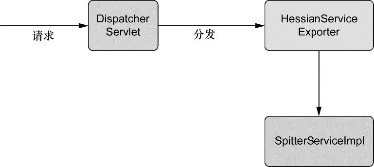

第15章　使用远程服务
-----------

# 1　Spring远程调用概览
<br/><br/>
图15.1　第三方客户端能够远程调用Spittr的服务，从而实现与Spittr应用交互

其他应用与Spittr之间的会话开始于客户端应用的一个远程过程调用（remote procedure call，RPC）。从表面上看，RPC类似于调用一个本地对象的一个方法。这两者都是同步操作，会阻塞调用代码的执行，直到被调用的过程执行完毕。

Spring支持多种不同的RPC模型，包括RMI、Caucho的Hessian和Burlap以及Spring自带的HTTP invoker。表15.1概述了每一个RPC模型，并简要讨论了它们所适用的不同场景。

表15.1　Spring通过多种远程调用技术支持RPC
<br/><br/>

在所有的模型中，服务都作为Spring所管理的bean配置到我们的应用中。这是通过一个代理工厂bean实现的，这个bean能够把远程服务像本地对象一样装配到其他bean的属性中去。图15.2展示了它是如何工作的。

<br/><br/>
图15.2　在Spring中，远程服务被代理，所以它们能够像其他Spring bean一样被装配到客户端代码中

在服务器端，我们可以使用表15.1所列出的任意一种模型将Spring管理的bean发布为远程服务。图15.3展示了远程导出器（remote exporter）如何将bean方法发布为远程服务。

<br/><br/>
图15.3　使用远程导出器将Spring管理的bean发布为远程服务

无论我们开发的是使用远程服务的代码，还是实现这些服务的代码，或者两者兼而有之，在Spring中，使用远程服务纯粹是一个配置问题。我们不需要编写任何Java代码就可以支持远程调用。我们的服务bean也不需要关心它们是否参与了一个RPC（当然，任何传递给远程调用的bean或从远程调用返回的bean可能需要实现java.io.Serializable接口）。

# 2　使用RMI
Spring简化了RMI模型，它提供了一个代理工厂bean，能让我们把RMI服务像本地JavaBean那样装配到我们的Spring应用中。Spring还提供了一个远程导出器，用来简化把Spring管理的bean转换为RMI服务的工作。

## 2.1　导出RMI服务
如果你曾经创建过RMI服务，应该会知道这会涉及如下几个步骤：
- 1．编写一个服务实现类，类中的方法必须抛出java.rmi.RemoteException异常；
- 2．创建一个继承于java.rmi.Remote的服务接口；
- 3．运行RMI编译器（rmic），创建客户端stub类和服务端skeleton类；
- 4．启动一个RMI注册表，以便持有这些服务；
- 5．在RMI注册表中注册服务。

**在Spring中配置RMI服务**
幸运的是，Spring提供了更简单的方式来发布RMI服务，不用再编写那些需要抛出RemoteException异常的特定RMI类，只需简单地编写实现服务功能的POJO就可以了，Spring会处理剩余的其他事项。

程序清单15.1　SpitterService定义了Spittr应用的服务层
<br/><br/>
RmiServiceExporter可以把任意Spring管理的bean发布为RMI服务。如图15.4所示，RmiServiceExporter把bean包装在一个适配器类中，然后适配器类被绑定到RMI注册表中，并且代理到服务类的请求——在本例中服务类也就是SpitterServiceImpl。
<br/><br/>
图15.4　RmiServiceExporter把POJO包装到服务适配器中，并将服务适配器绑定到RMI注册表中，从而将POJO转换为RMI服务

使用RmiServiceExporter将SpitterServiceImpl发布为RMI服务的最简单方式是在Spring中使用如下的@Bean方法进行配置：
<br/><br/>

默认情况下，RmiServiceExporter会尝试绑定到本地机器1099端口上的RMI注册表。如果在这个端口没有发现RMI注册表，RmiServiceExporter将会启动一个注册表。如果希望绑定到不同端口或主机上的RMI注册表，那么我们可以通过registryPort和registryHost属性来指定。
<br/><br/>

## 2.2　装配RMI服务
传统上，RMI客户端必须使用RMI API的Naming类从RMI注册表中查找服务。例如，下面的代码片段演示了如何获取Spitter的RMI服务：
<br/><br/>

虽然这段代码可以获取Spitter的RMI服务的引用，但是它存在两个问题：
- 传统的RMI查找可能会导致3种检查型异常的任意一种（RemoteException、NotBoundException和MalformedURLException），这些异常必须被捕获或重新抛出；
- 需要Spitter服务的任何代码都必须自己负责获取该服务。这属于样板代码，与客户端的功能并没有直接关系。

Spring的RmiProxyFactoryBean是一个工厂bean，该bean可以为RMI服务创建代理。使用RmiProxyFactoryBean引用SpitterService的RMI服务是非常简单的，只需要在客户端的Spring配置中增加如下的@Bean方法：
<br/><br/>

图15.5展示了客户端和RMI代理的交互。
<br/><br/>
图15.5　RmiProxyFactoryBean生成一个代理对象，该对象代表客户端来负责与远程的RMI服务进行通信。客户端通过服务的接口与代理进行交互，就如同远程服务就是一个本地的POJO

现在已经把RMI服务声明为Spring管理的bean，我们就可以把它作为依赖装配进另一个bean中，就像任意非远程的bean那样。例如，假设客户端需要使用Spitter服务为指定的用户获取Spittle列表，我们可以使用@Autowired注解把服务代理装配进客户端中：
```
@Autowired
SpitterService spitterService;
```

我们还可以像本地bean一样调用它的方法：
```
  public List<Spittle> getSpittles(String userName) {
    Spitter spitter= spitterService.getSpittle(userName);
    return spitterService.getSpittlesForSpitter(spitter);
  }
```

**某些限制与突破**
RMI是一种实现远程服务交互的好办法，但是它存在某些限制。首先，RMI很难穿越防火墙，这是因为RMI使用任意端口来交互——这是防火墙通常所不允许的。在企业内部网络环境中，我们通常不需要担心这个问题。但是如果在互联网上运行，我们用RMI可能会遇到麻烦。即使RMI提供了对HTTP的通道的支持（通常防火墙都允许），但是建立这个通道也不是件容易的事。

另外一件需要考虑的事情是RMI是基于Java的。这意味着客户端和服务端必须都是用Java开发的。因为RMI使用了Java的序列化机制，所以通过网络传输的对象类型必须要保证在调用两端的Java运行时中是完全相同的版本。对我们的应用而言，这可能是个问题，也可能不是问题。但是选择RMI做远程服务时，必须要牢记这一点。

Caucho Technology（Resin应用服务器背后的公司）开发了一套应对RMI限制的远程调用解决方案。实际上，Caucho提供了两种解决方案：Hessian和Burlap。让我们看一下如何在Spring中使用Hessian和Burlap处理远程服务。

# 3　使用Hessian和Burlap发布远程服务
Hessian和Burlap是Caucho Technology提供的两种基于HTTP的轻量级远程服务解决方案。借助于尽可能简单的API和通信协议，它们都致力于简化Web服务。

Hessian，像RMI一样，使用二进制消息进行客户端和服务端的交互。但与其他二进制远程调用技术（例如RMI）不同的是，它的二进制消息可以移植到其他非Java的语言中，包括PHP、Python、C++和C#。

Burlap是一种基于XML的远程调用技术，这使得它可以自然而然地移植到任何能够解析XML的语言上。正因为它基于XML，所以相比起Hessian的二进制格式而言，Burlap可读性更强。但是和其他基于XML的远程技术（例如SOAP或XML-RPC）不同，Burlap的消息结构尽可能的简单，不需要额外的外部定义语言（例如WSDL或IDL）。

## 3.1　使用Hessian和Burlap导出bean的功能
**导出Hessian服务**
HessianServiceExporter对Hessian服务所执行的功能与RmiServiceExporter对RMI服务所执行的功能是相同的：它把POJO的public方法发布成Hessian服务的方法。不过，正如图15.6所示，其实现过程与RmiServiceExporter将POJO发布为RMI服务是不同的。
<br/><br/>
图15.6　HessianServiceExporter是一个Spring MVC控制器，它可以接收Hessian请求，并把这些请求转换成对POJO的调用从而将POJO导出为一个Hessian服务
HessianServiceExporter（稍后会有更详细的介绍）是一个Spring MVC控制器，它接收Hessian请求，并将这些请求转换成对被导出POJO的方法调用。在如下Spring的声明中，HessianServiceExporter会把spitterService bean导出为Hessian服务：
<br/><br/>

与RmiServiceExporter不同的是，我们不需要设置serviceName属性。在RMI中，serviceName属性用来在RMI注册表中注册一个服务。而Hessian没有注册表，因此也就没必要为Hessian服务进行命名。

**配置Hessian控制器**
RmiServiceExporter和HessianServiceExporter另外一个主要区别就是，由于Hessian是基于HTTP的，所以HessianSeriviceExporter实现为一个Spring MVC控制器。这意味着为了使用导出的Hessian服务，我们需要执行两个额外的配置步骤：
- 在web.xml中配置Spring的DispatcherServlet，并把我们的应用部署为　Web应用；
- 在Spring的配置文件中配置一个URL处理器，把Hessian服务的URL分发给对应的Hessian服务bean。

在第5章的配置中，任何以“.service”结束的URL请求都将由DispatcherServlet处理，它会把请求传递给匹配这个URL的控制器。因此“/spitter.service”的请求最终将被hessianSpitterServicebean所处理（它实际上仅仅是一个SpitterServiceImpl的代理）。

那我们是如何知道这个请求会转给hessianSpitterSevice处理呢？我们还需要配置一个URL映射来确保DispatcherServlet把请求转给hessianSpitterService。如下的SimpleUrlHandlerMappingbean可以做到这一点：

如果为了可读性，或者不那么在乎宽带优势（二进制比XML的优势），我们还可以选择使用Burlap基于XML的协议。让我们看看如何把一个服务导出为Burlap服务。

**导出Burlap服务**
<br/><br/>

## 3.2　访问Hessian/Burlap服务
在客户端代码中，基于RMI的服务与基于Hessian的服务之间唯一的差别在于要使用Spring的HessianProxyFactoryBean来代替RmiProxyFactoryBean。客户端调用基于Hessian的Spitter服务可以用如下的配置声明：
<br/><br/>

既然Hessian是基于HTTP的，当然我们在这里要设置一个HTTP URL（URL是由我们先前定义的URL映射所决定的）。图15.7展示了客户端以及由HessianProxyFactoryBean所生成的代理之间是如何交互的。
<br/><br/>
图15.7　HessianProxyFactoryBean和BurlapProxyFactoryBean生成的代理对象负责通过HTTP（Hessian为二进制、Burlap为XML）与远程对象通信

事实证明，把Burlap服务装配进客户端同样也没有太多新意。二者唯一的区别在于，我们要使用BurlapProxyFactoryBean来代替HessianProxyFactoryBean。

**优劣点与HttpInvoker**
因为Hessian和Burlap都是基于HTTP的，它们都解决了RMI所头疼的防火墙渗透问题。但是当传递过来的RPC消息中包含序列化对象时，RMI就完胜Hessian和Burlap了。因为Hessian和Burlap都采用了私有的序列化机制，而RMI使用的是Java本身的序列化机制。如果我们的数据模型非常复杂，Hessian/Burlap的序列化模型就可能无法胜任了。

我们还有一个两全其美的解决方案。让我们看一下Spring的HTTP invoker，它基于HTTP提供了RPC（像Hessian/Burlap一样），同时又使用了Java的对象序列化机制（像RMI一样）。

# 4　使用Spring的HttpInvoker
HTTP invoker是一个新的远程调用模型，作为Spring框架的一部分，能够执行基于HTTP的远程调用（让防火墙不为难），并使用Java的序列化机制（让开发者也乐观其变）。

## 4.1　将bean导出为HTTP服务
为了把Spitter服务导出为一个基于HTTP invoker的服务，我们需要像下面的配置一样声明一个HttpInvokerServiceExporter bean：
<br/><br/>

如图15.8所示，HttpInvokerServiceExporter的工作方式与HessianServiceExporter和BurlapServiceExporter很相似。HttpInvokerServiceExporter也是一个Spring的MVC控制器，它通过DispatcherServlet接收来自于客户端的请求，并将这些请求转换成对实现服务的POJO的方法调用。

<br/><br/>
图15.8　HttpInvokerServiceExporter工作方式与Hessian和Burlap很相似，通过Spring MVC的DispatcherServlet接收请求，并将这些请求转换成对Spring bean的方法调用

因为HttpInvokerServiceExporter是一个Spring MVC控制器，我们需要建立一个URL处理器，映射HTTP URL到对应的服务上，就像Hessian和Burlap导出器所做的一样：
<br/><br/>

同样，像之前一样，我们需要确保匹配了DispatcherServlet，这样才能处理对“*.service”扩展的请求。

## 4.2　通过HTTP访问服务

<br/><br/>
图15.9　HttpInvokerProxyFactoryBean是一个代理工厂bean，用于生成一个代理，该代理使用Spring特有的基于HTTP协议进行远程通信

为了把基于HTTP invoker的远程服务装配进我们的客户端Spring应用上下文中，我们必须将 HttpInvokerProxyFactoryBean 配置为一个bean来代理它，如下所示：
<br/><br/>

**优缺点与Web服务**
要记住HTTP invoker有一个重大的限制：它只是一个Spring框架所提供的远程调用解决方案。这意味着客户端和服务端必须都是Spring应用。并且，至少目前而言，也隐含表明客户端和服务端必须是基于Java的。另外，因为使用了Java的序列化机制，客户端和服务端必须使用相同版本的类（与RMI类似）。

RMI、Hessian、Burlap和HTTP invoker都是远程调用的可选解决方案。但是当面临无所不在的远程调用时，Web服务是势不可挡的。下一节，我们将了解Spring如何对基于SOAP的Web服务远程调用提供支持。

# 5　发布和使用Web服务
我们将使用Spring对JAX-WS的支持来把Spitter服务发布为Web服务并使用此Web服务。首先，我们来看一下如何在Spring中创建JAX-WS Web服务。

## 5.1　创建基于Spring的JAX-WS端点
**在Spring中自动装配JAX-WS端点**
JAX-WS编程模型使用注解将类和类的方法声明为Web服务的操作。使用@WebService注解所标注的类被认为Web服务的端点，而使用@WebMethod注解所标注的方法被认为是操作。

就像大规模应用中的其他对象一样，JAX-WS端点很可能需要与其他对象交互来完成工作。这意味着JAX-WS端点可以受益于依赖注入。但是如果端点的生命周期由JAX-WS运行时来管理，而不是由Spring来管理的话，这似乎不可能把Spring管理的bean装配进JAX-WS管理的端点实例中。

装配JAX-WS端点的秘密在于继承SpringBeanAutowiringSupport。通过继承SpringBeanAutowiringSupport，我们可以使用@Autowired注解标注端点的属性，依赖就会自动注入了。SpitterServiceEndpoint展示了它是如何工作的。

程序清单15.2　JAX-WS端点中的SpitterBeanAutowiringSupport
<br/><br/>

我们在SpitterService属性上使用@Autowired注解来表明它应该自动注入一个从Spring应用上下文中所获取的bean。在这里，端点委托注入的SpitterService来完成实际的工作。

**导出独立的JAX-WS端点（JDK1.6）**
正如我所说的，当对象的生命周期不是由Spring管理的，而对象的属性又需要注入Spring所管理的bean时，SpringBeanAutowiringSupport很有用。在合适场景下，还是可以把Spring管理的bean导出为JAX-WS端点的。

SpringSimpleJaxWsServiceExporter的工作方式很类似于本章前边所介绍的其他服务导出器。它把Spring管理的bean发布为JAX-WS运行时中的服务端点。与其他服务导出器不同，SimpleJaxWsServiceExporter不需要为它指定一个被导出bean的引用，它会将使用JAX-WS注解所标注的所有bean发布为JAX-WS服务。

  SimpleJaxWsServiceExporter可以使用如下的@Bean方法来配置：
```
  @Bean
  public SimpleJaxWsServiceExporter jaxWsServiceExporter(){
    return new SimpleJaxWsServiceExporter();
  }
```
正如我们所看到的，SimpleJaxWsServiceExporter不需要再做其他的事情就可以完成所有的工作。当启动的时候，它会搜索Spring应用上下文来查找所有使用@WebService注解的bean。当找到符合的bean时，SimpleJaxWsServiceExporter使用http://localhost:8080/ 地址将bean发布为JAX-WS端点。SpitterServiceEndpoint就是其中一个被查找到的bean。

程序清单15.3　SimpleJaxWsServiceExporter将bean转变为JAX-WS端点
!!!
我们注意到SpitterServiceEndpoint的新实现不再继承SpringBeanAutowiring-Support了。它完全就是一个Spring bean，因此SpitterServiceEndpoint不需要继承任何特殊的支持类就可以实现自动装配。

因为SimpleJaxWsServiceEndpoint的默认基本地址为http://localhost:8080/，而SpitterServiceEndpoint使用了@Webservice(servicename="SpitterService")注解，所以这两个bean所形成的Web服务地址均为http://localhost:8080/SpitterService。但是我们可以完全控制服务URL，如果希望调整服务URL的话，我们可以调整基本地址。例如，如下SimpleJaxWsServiceEndpoint的配置把相同的服务端点发布到http://localhost:8888 /srvices/SpitterService。
```
  @Bean
  public SimpleJaxWsServiceExporter jaxWsServiceExporter(){
    SimpleJaxWsServiceExporter exporter = new SimpleJaxWsServiceExporter();
    exporter.setBaseAddress("http://localhost:8888/services/")
  }
```
**【注意】版本支持**
SimpleJaxWsServiceEndpoint就像看起来那么简单，但是我们应该注意它只能用在支持将端点发布到指定地址的JAX-WS运行时中。这包含了Sun 1.6 JDK自带的JAX-WS运行时。其他的JAX-WS运行时，例如JAX-WS 2.1的参考实现，不支持这种类型的端点发布，因此也就不能使用SimpleJaxWsServiceEndpoint。

## 5.2　在客户端代理JAX-WS服务
使用JaxWsProxyFactoryBean，我们可以在Spring中装配Spitter Web服务，与任意一个其他的bean一样.
<br/><br/>
图15.10　JaxWsPortProxyFactoryBean生成可以与远程Web服务交互的代理。这些代理可以被装配到其他bean中，就像它们是本地POJO一样

我们可以像下面这样配置JaxWsPortProxyFactoryBean来引用Spitter服务：
<br/><br/>

剩下的三个属性的值通常可以通过查看服务的WSDL来确定。为了演示，我们假设为Spitter服务的WSDL如下所示：
<br/><br/>
虽然不太可能这么做，但是在服务的WSDL中定义多个服务和端口是允许的。鉴于此，JaxWsPortProxyFactoryBean需要我们使用portName和serviceName属性指定端口和服务名称。WSDL中`<wsdl:port>`和`<wsdl:service>`元素的name属性可以帮助我们识别出这些属性该设置成什么。

最后，namespaceUri属性指定了服务的命名空间。命名空间将有助于JaxWsPortProxyFactoryBean去定位WSDL中的服务定义。正如端口和服务名一样，我们可以在WSDL中找到该属性的正确值。它通常会在`<wsdl:definitions>`的targetNamespace属性中。

# 6　小结
尽管这是开发Web服务的一种简单方式，但从架构角度来看，它可能不是最佳的选择。在下一章，我们将学习构建分布式应用的另一种选择，把应用暴露为RESTful资源。