第16章　使用Spring MVC创建REST API
---------------------------

# 1　了解REST
## 1.1　REST的基础知识
REST与RPC几乎没有任何关系。RPC是面向服务的，并关注于行为和动作；而REST是面向资源的，强调描述应用程序的事物和名词。
为了理解REST是什么，我们将它的首字母缩写拆分为不同的构成部分：
- 表述性（Representational）：REST资源实际上可以用各种形式来进行表述，包括XML、JSON（JavaScript Object Notation）甚至HTML——最适合资源使用者的任意形式；
- 状态（State）：当使用REST的时候，我们更关注资源的状态而不是对资源采取的行为；
- 转移（Transfer）：REST涉及到转移资源数据，它以某种表述性形式从一个应用转移到另一个应用。


REST中会有行为，它们是通过HTTP方法来定义的。具体来讲，也就是GET、POST、PUT、DELETE、PATCH以及其他的HTTP方法构成了REST中的动作。这些HTTP方法通常会匹配为如下的CRUD动作：
- Create：POST
- Read：GET
- Update：PUT或PATCH
- Delete：DELETE

## 1.2　Spring是如何支持REST的
当前的4.0版本中，Spring支持以下方式来创建REST资源：
- 控制器可以处理所有的HTTP方法，包含四个主要的REST方法：GET、PUT、DELETE以及POST。Spring 3.2及以上版本还支持PATCH方法；
- 借助@PathVariable注解，控制器能够处理参数化的URL（将变量输入作为URL的一部分）；
- 借助Spring的视图和视图解析器，资源能够以多种方式进行表述，包括将模型数据渲染为XML、JSON、Atom以及RSS的View实现；
- 可以使用ContentNegotiatingViewResolver来选择最适合客户端的表述；
- 借助@ResponseBody注解和各种HttpMethodConverter实现，能够替换基于视图的渲染方式；
- 类似地，@RequestBody注解以及HttpMethodConverter实现可以将传入的HTTP数据转化为传入控制器处理方法的Java对象；
- 借助RestTemplate，Spring应用能够方便地使用REST资源。

# 2　创建第一个REST端点
Spring提供了两种方法将资源的Java表述形式转换为发送给客户端的表述形式：
- 内容协商（Content negotiation）：选择一个视图，它能够将模型渲染为呈现给客户端的表述形式；
- 消息转换器（Message conversion）：通过一个消息转换器将控制器所返回的对象转换为呈现给客户端的表述形式。

## 2.1　协商资源表述
在面向人类访问的Web应用程序中，选择的视图通常来讲都会渲染为HTML。视图解析方案是个简单的一维活动。如果根据视图名匹配上了视图，那这就是我们要用的视图了。

当要将视图名解析为能够产生资源表述的视图时，我们就有另外一个维度需要考虑了。视图不仅要匹配视图名，而且所选择的视图要适合客户端。如果客户端想要JSON，那么渲染HTML的视图就不行了。

Spring的ContentNegotiatingViewResolver是一个特殊的视图解析器，它考虑到了客户端所需要的内容类型。
要理解ContentNegotiatingViewResolver是如何工作的，这涉及内容协商的两个步骤：
- 1．确定请求的媒体类型；
- 2．找到适合请求媒体类型的最佳视图。

**确定请求的媒体类型**
ContentNegotiatingViewResolver将会考虑到Accept头部信息并使用它所请求的媒体类型，但是它会首先查看URL的文件扩展名。如果URL在结尾处有文件扩展名的话，ContentNegotiatingViewResolver将会基于该扩展名确定所需的类型。如果扩展名是“.json”的话，那么所需的内容类型必须是“application/json”。如果扩展名是“.xml”，那么客户端请求的就是“application/xml”。当然，“.html”扩展名表明客户端所需的资源表述为HTML（text/html）。

如果根据文件扩展名不能得到任何媒体类型的话，那就会考虑请求中的Accept头部信息。在这种情况下，Accept头部信息中的值就表明了客户端想要的MIME类型，没有必要再去查找了。

最后，如果没有Accept头部信息，并且扩展名也无法提供帮助的话，ContentNegotiatingViewResolver将会使用“/”作为默认的内容类型，这就意味着客户端必须要接收服务器发送的任何形式的表述。

一旦内容类型确定之后，ContentNegotiatingViewResolver就该将逻辑视图名解析为渲染模型的View。与Spring的其他视图解析器不同，ContentNegotiatingViewResolver本身不会解析视图。而是委托给其他的视图解析器，让它们来解析视图。

**影响媒体类型的选择**
在上述的选择过程中，我们阐述了确定所请求媒体类型的默认策略。但是通过为其设置一个ContentNegotiationManager，我们能够改变它的行为。借助Content-NegotiationManager我们所能做到的事情如下所示：
- 指定默认的内容类型，如果根据请求无法得到内容类型的话，将会使用默认值；
- 通过请求参数指定内容类型；
- 忽视请求的Accept头部信息；
- 将请求的扩展名映射为特定的媒体类型；
- 将JAF（Java Activation Framework）作为根据扩展名查找媒体类型的备用方案。

有三种配置ContentNegotiationManager的方法：
- 直接声明一个ContentNegotiationManager类型的bean；
- 通过ContentNegotiationManagerFactoryBean间接创建bean；
- 重载WebMvcConfigurerAdapter的configureContentNegotiation()方法。

直接创建ContentNegotiationManager有一些复杂，除非有充分的原因，否则我们不会愿意这样做。后两种方案能够让创建ContentNegotiationManager更加简单。
- 使用XML配置ContentNegotiationManager
```
<bean id="contentNegotiationManager"
		  class="org.springframework.web.accept.ContentNegotiationManagerFactoryBean"
		  p:defaultContentType ="application/json">
</bean>
```

- 使用Java配置configureContentNegotiation
```
    @Override
    public void configureContentNegotiation(ContentNegotiationConfigurer configurer) {
      configurer.defaultContentType(MediaType.APPLICATION_JSON);
    }
```

现在，我们已经有了ContentNegotiationManagerbean，接下来就需要将它注入到ContentNegotiatingViewResolver的contentNegotiationManager属性中。
```
    @Bean
    public ViewResolver cnViewResolver(ContentNegotiationManager cnm) {
      ContentNegotiatingViewResolver cnvr =
          new ContentNegotiatingViewResolver();
      cnvr.setContentNegotiationManager(cnm);
      return cnvr;
    }
```

如下的程序清单是一个非常简单的配置样例，当我使用ContentNegotiatingViewResolver的时候，通常会采用这种用法：它默认会使用HTML视图，但是对特定的视图名称将会渲染为JSON输出。
<br/>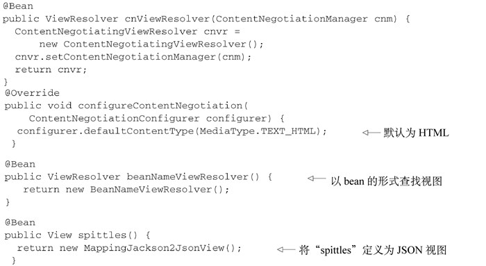<br/>

如果逻辑视图的名称为“spittles”，那么我们所配置的BeanNameViewResolver将会解析spittles()方法中所声明的View。这是因为bean名称匹配逻辑视图的名称。如果没有匹配的View的话，ContentNegotiatingViewResolver将会采用默认的行为，将其输出为HTML。

**ContentNegotiatingViewResolver的优势与限制**
ContentNegotiatingViewResolver最大的优势在于，它在Spring MVC之上构建了REST资源表述层，控制器代码无需修改。相同的一套控制器方法能够为面向人类的用户产生HTML内容，也能针对不是人类的客户端产生JSON或XML。

ContentNegotiatingViewResolver还有一个相关的小问题，所选中的View会渲染模型给客户端，而不是资源。这里有个细微但很重要的区别。当客户端请求JSON格式的Spittle对象列表时，客户端希望得到的响应可能如下所示：
<br/>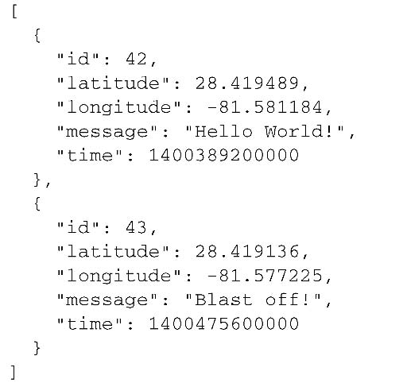<br/>

<br/>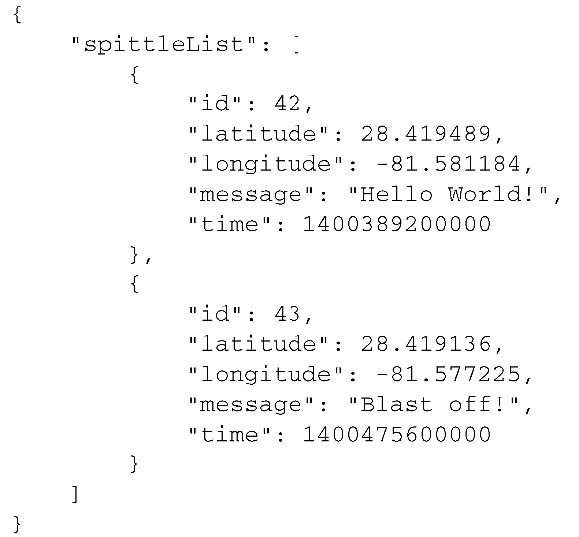<br/>

因为有这些限制，我通常建议不要使用ContentNegotiatingViewResolver。我更加倾向于使用Spring的消息转换功能来生成资源表
述。接下来，我们看一下如何在控制器代码中使用Spring的消息转换器。

## 2.2　使用HTTP信息转换器
消息转换（message conversion）提供了一种更为直接的方式，它能够将控制器产生的数据转换为服务于客户端的表述形式。当使用消息转换功能时，DispatcherServlet不再需要那么麻烦地将模型数据传送到视图中。实际上，这里根本就没有模型，也没有视图，只有控制器产生的数据，以及消息转换器（message converter）转换数据之后所产生的资源表述。

表16.1　Spring提供了多个HTTP信息转换器，用于实现资源表述与各种Java类型之间的互相转换
<br/>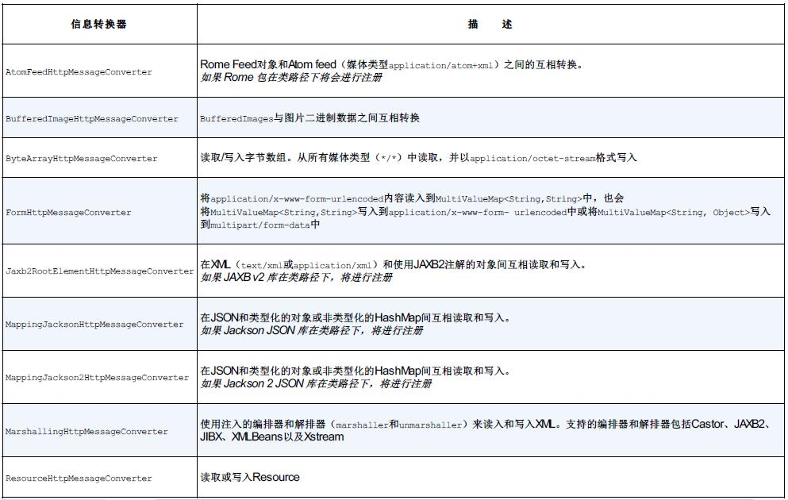<br/>
<br/>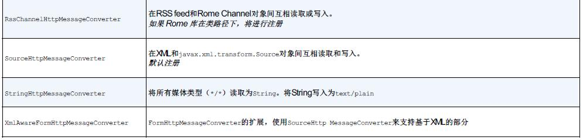<br/>

**在响应体中返回资源状态**
正常情况下，当处理方法返回Java对象（除String外或View的实现以外）时，这个对象会放在模型中并在视图中渲染使用。但是，如果使用了消息转换功能的话，我们需要告诉Spring跳过正常的模型/视图流程，并使用消息转换器。有不少方式都能做到这一点，但是最简单的方法是为控制器方法添加@ResponseBody注解。

@ResponseBody注解会告知Spring，我们要将返回的对象作为资源发送给客户端，并将其转换为客户端可接受的表述形式。更具体地讲，DispatcherServlet将会考虑到请求中Accept头部信息，并查找能够为客户端提供所需表述形式的消息转换器。消息转换器会将控制器返回的Spittle列表转换为JSON文档，并将其写入到响应体中。响应大致会如下所示：
```
  @RequestMapping(method=RequestMethod.GET, produces = "application/json")
  public @ResponseBody  List<Spittle> spittles(
      @RequestParam(value="max", defaultValue=MAX_LONG_AS_STRING) long max,
      @RequestParam(value="count", defaultValue="20") int count) {
    return spittleRepository.findSpittles(max, count);
  }
```
<br/>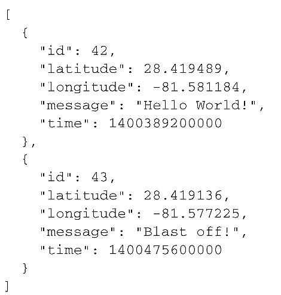<br/>

谈及Accept头部信息，请注意getSpitter()的@RequestMapping注解。在这里，我使用了produces属性表明这个方法只处理预期输出为JSON的请求。也就是说，这个方法只会处理Accept头部信息包含“application/json”的请求。其他任何类型的请求，即使它的URL匹配指定的路径并且是GET请求也不会被这个方法处理。这样的请求会被其他的方法来进行处理（如果存在适当方法的话），或者返回客户端HTTP 406（Not Acceptable）响应。

**在请求体中接收资源状态**
@ResponseBody能够告诉Spring在把数据发送给客户端的时候，要使用某一个消息器，与之类似，@RequestBody也能告诉Spring查找一个消息转换器，将来自客户端的资源表述转换为对象。例如，假设我们需要一种方式将客户端提交的新Spittle保存起来。我们可以按照如下的方式编写控制器方法来处理这种请求：
```
  @RequestMapping(method=RequestMethod.POST,consumes = "application/json")
  public @ResponseBody  Spittle saveSpittle(@RequestBody Spittle spittle) {
    return spittleRepository.save(spittle);
  }
```
@RequestMapping表明它只能处理“/spittles”（在类级别的@RequestMapping中进行了声明）的POST请求。

@RequestMapping有一个consumes属性，我们将其设置为“application/json”。consumes属性的工作方式类似于produces，不过它会关注请求的Content-Type头部信息。它会告诉Spring这个方法只会处理对“/spittles”的POST请求，并且要求请求的Content-Type头部信息为“application/json”。

**为控制器默认设置消息转换**
Spring 4.0引入了@RestController注解，能够在这个方面给我们提供帮助。如果在控制器类上使用@RestController来代替@Controller的话，Spring将会为该控制器的所有处理方法应用消息转换功能。我们不必为每个方法都添加@ResponseBody了。

# 3　提供资源之外的其他内容
## 3.1　发送错误信息到客户端
```
 @RequestMapping(value="/{spittleId}", method=RequestMethod.GET)
  public @ResponseBody Spittle spittleById(@PathVariable("spittleId") long spittleId, {
    return spittleRepository.findOne(spittleId);
  }
```
如果根据给定的ID，无法找到某个Spittle对象的ID属性能够与之匹配，findOne()方法返回null的时候，你觉得会发生什么呢？结果就是spittleById()方法会返回null，响应体为空，不会返回任何有用的数据给客户端。同时，响应中默认的HTTP状态码是200（OK），表示所有的事情运行正常。

现在，我们考虑一下在这种场景下应该发生什么。至少，状态码不应该是200，而应该是404（Not Found），告诉客户端它们所要求的内容没有找到。如果响应体中能够包含错误信息而不是空的话就更好了。

Spring提供了多种方式来处理这样的场景：
- 使用@ResponseStatus注解可以指定状态码；
- 控制器方法可以返回ResponseEntity对象，该对象能够包含更多响应相关的元数据；
- 异常处理器能够应对错误场景，这样处理器方法就能关注于正常的状况。

**使用ResponseEntity**
作为@ResponseBody的替代方案，控制器方法可以返回一个ResponseEntity对象。ResponseEntity中可以包含响应相关的元数据（如头部信息和状态码）以及要转换成资源表述的对象。
```
  @RequestMapping(value="/{spittleId}", method=RequestMethod.GET)
  public ResponseEntity<Spittle> spittle(@PathVariable("spittleId") long spittleId, {
    Spittle spittle = spittleRepository.findOne(spittleId);
    HttpStatus status = spittle != null ? HttpStatus.OK : HttpStatus.NOT_FOUND;
    return new ResponseEntity<Spittle>(spittle, status);
  }
```

**处理错误**
spittleById()方法中的if代码块是处理错误的，但这是控制器中错误处理器（error handler）所擅长的领域。错误处理器能够处理导致问题的场景，这样常规的处理器方法就能只关心正常的逻辑处理路径了。

我们重构一下代码来使用错误处理器。首先，定义能够对应SpittleNotFoundException的错误处理器：
```
  @ExceptionHandler(SpittleNotFoundException.class)
  @ResponseStatus(HttpStatus.NOT_FOUND)
  public @ResponseBody Error spittleNotFound(SpittleNotFoundException e) {
    long spittleId = e.getSpittleId();
    return new Error(4, "Spittle [" + spittleId + "] not found");
  }
```
其中涉及的类：
- Error类
```
public class Error {

  private int code;
  private String message;

  public Error(int code, String message) {
    this.code = code;
    this.message = message;
  }

  public int getCode() {
    return code;
  }

  public String getMessage() {
    return message;
  }

}
```

- 异常类：
```
public class SpittleNotFoundException extends RuntimeException {

  private static final long serialVersionUID = 1L;

  private long spittleId;

  public SpittleNotFoundException(long spittleId) {
    this.spittleId = spittleId;
  }

  public long getSpittleId() {
    return spittleId;
  }

}
```
我们可以移除掉spittleById()方法中大多数的错误处理代码：
```
  @RequestMapping(value="/{id}", method=RequestMethod.GET, produces="application/json")
  public Spittle spittleById(@PathVariable Long id) {
    Spittle spittle = spittleRepository.findOne(id);
    if (spittle == null) {
      throw new SpittleNotFoundException(id);
    }
    return spittle;
  }
```
以上，现在我们已经知道spittleById()将会返回Spittle并且HTTP状态码始终会是200（OK），那么就可以不再使用ResponseEntity，而是将其替换为@ResponseBody。如果控制器类上使用了@RestController，我们不再需要@ResponseBody。

## 3.2　在响应中设置头部信息
客户端知道新创建了资源，你觉得客户端会不会感兴趣新创建的资源在哪里呢？

当创建新资源的时候，将资源的URL放在响应的Location头部信息中，并返回给客户端是一种很好的方式。因此，我们需要有一种方式来填充响应头部信息，此时我们的老朋友ResponseEntity就能提供帮助了。

如下的程序清单展现了一个新版本的saveSpittle()，它会返回ResponseEntity用来告诉客户端新创建的资源。
```
  @RequestMapping(method=RequestMethod.POST, consumes="application/json")
  @ResponseStatus(HttpStatus.CREATED)
  public ResponseEntity<Spittle> saveSpittle(@RequestBody Spittle spittle, UriComponentsBuilder ucb) {
    Spittle saved = spittleRepository.save(spittle);

    HttpHeaders headers = new HttpHeaders();
    URI locationUri = ucb.path("/spittles/")
        .path(String.valueOf(saved.getId()))
        .build()
        .toUri();
    headers.setLocation(locationUri);

    ResponseEntity<Spittle> responseEntity = new ResponseEntity<Spittle>(saved, headers, HttpStatus.CREATED);
    return responseEntity;
  }
```
在处理器方法所得到的UriComponentsBuilder中，会预先配置已知的信息如host、端口以及Servlet内容。

注意，路径的构建分为两步。第一步调用path()方法，将其设置为“/ spittles/”，也就是这个控制器所能处理的基础路径。然后，在第二次调用path()的时候，使用了已保存Spittle的ID。我们可以推断出来，每次调用path()都会基于上次调用的结果。在路径设置完成之后，调用build()方法来构建UriComponents对象，根据这个对象调用toUri()就能得到新创建Spittle的URI。

# 4　编写REST客户端
## 4.1　了解RestTemplate的操作
RestTemplate定义了36个与REST资源交互的方法，其中的大多数都对应于HTTP的方法。但是，在本章中我没有足够的篇幅涵盖所有的36个方法。

除了TRACE以外，RestTemplate涵盖了所有的HTTP动作。除此之外，execute()和exchange()提供了较低层次的通用方法来使用任意的HTTP方法。
表16.2中的大多数操作都以三种方法的形式进行了重载：
- 一个使用java.net.URI作为URL格式，不支持参数化URL；
- 一个使用String作为URL格式，并使用Map指明URL参数；
- 一个使用String作为URL格式，并使用可变参数列表指明URL参数。

表16.2　RestTemplate定义了11个独立的操作，而每一个都有重载，这样一共是36个方法
<br/>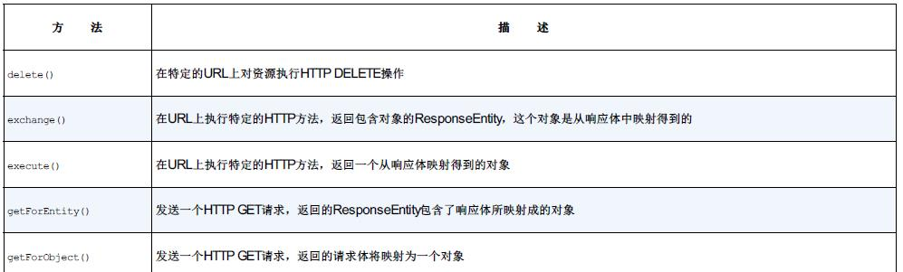<br/>

<br/>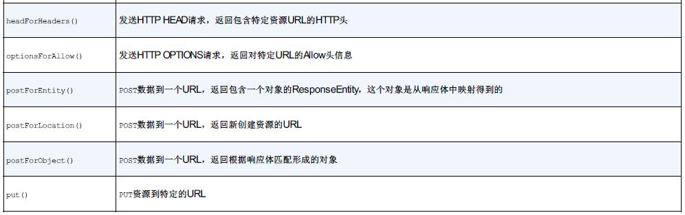<br/>

## 4.2　GET资源
让我们首先看一下稍微简单的getForObject()方法。然后再看看如何使用getForEntity()方法来从GET响应中获取更多的信息。
## 4.3　检索资源
<br/>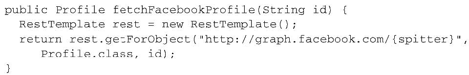<br/>

## 4.4　抽取响应的元数据
<br/>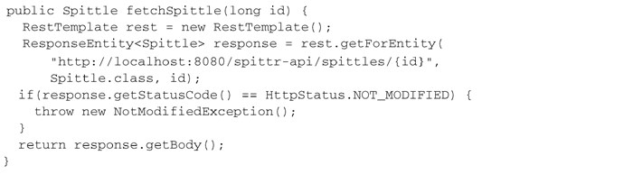<br/>

## 4.5　PUT资源
<br/>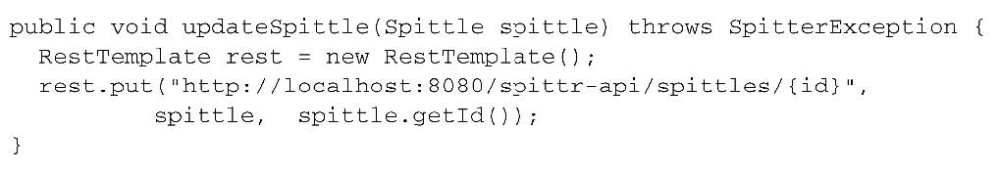<br/>


## 4.6　DELETE资源
<br/>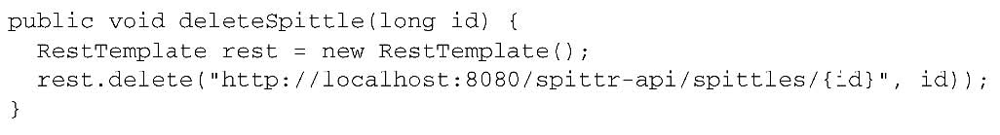<br/>

## 4.7　POST资源数据
postForObject()和postForEntity()对POST请求的处理方式与发送GET请求的getForObject()和getForEntity()方法是类似的。另一个方法是getForLocation()，它是POST请求所特有的。

## 4.8　在POST请求中获取响应对象
<br/>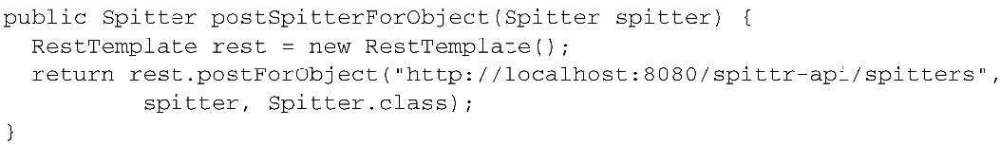<br/>

<br/>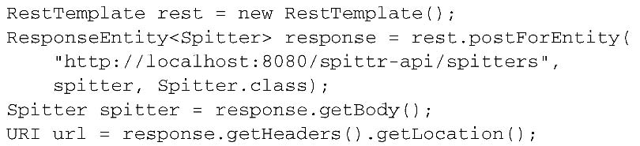<br/>

## 4.9　在POST请求后获取资源位置
<br/>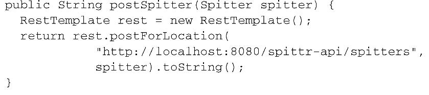<br/>

## 4.10　交换资源
不同于getForEntity()——或getForObject()——exchange()方法允许在请求中设置头信息。
如果不指明头信息，exchange()对Spitter的GET请求会带有如下的头信息：
<br/>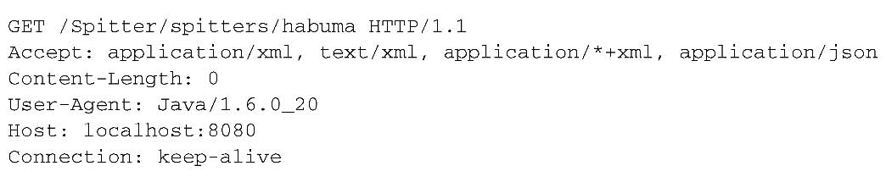<br/>

假设我们希望服务端以JSON格式发送资源。在这种情况下，我们需要将“application/json”设置为Accept头信息的唯一值。设置请求头信息是很简单的，只需构造发送给exchange()方法的HttpEntity对象即可，HttpEntity中包含承载头信息的MultiValueMap：
<br/>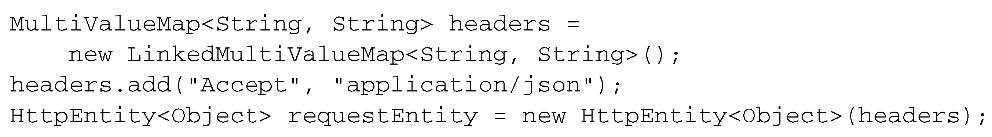<br/>

现在，我们可以传入HttpEntity来调用exchange()：
<br/>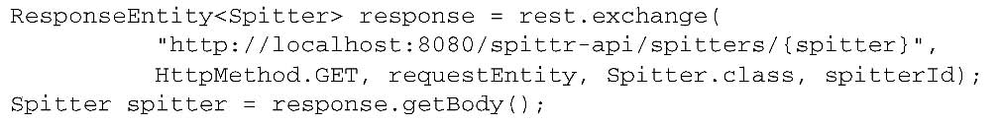<br/>

# 源码
https://github.com/myitroad/spring-in-action-4/tree/master/Chapter_16
