第17章　Spring消息
-------------
# 1　异步消息简介
像RMI和Hessian/Burlap这样的远程调用机制是同步的。如图17.1所示，当客户端调用远程方法时，客户端必须等到远程方法完成后，才能继续执行。即使远程方法不向客户端返回任何信息，客户端也要被阻塞直到服务完成。
<br/>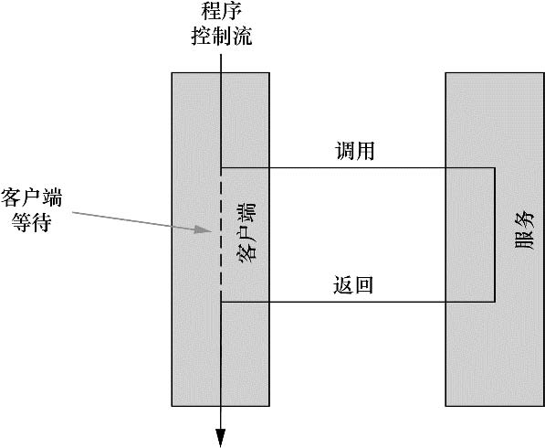<br/>

消息则是异步发送的，如图17.2所示，客户端不需要等待服务处理消息，甚至不需要等待消息投递完成。客户端发送消息，然后继续执行，这是因为客户端假定服务最终可以收到并处理这条消息。
<br/>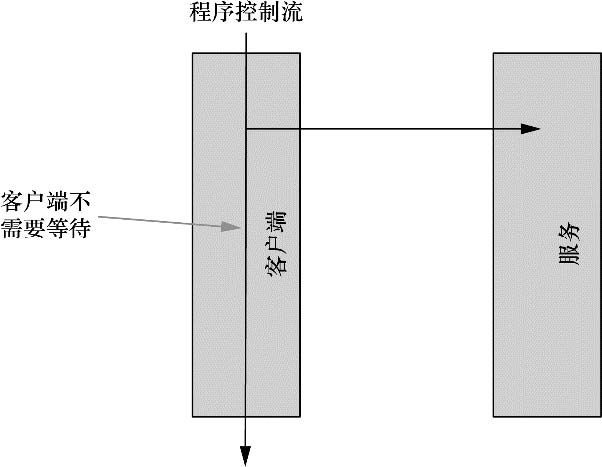<br/>

## 1.1　发送消息
在异步消息中有两个主要的概念：消息代理（message broker）和目的地（destination）。当一个应用发送消息时，会将消息交给一个消息代理。

尽管不同的消息系统会提供不同的消息路由模式，但是有两种通用的目的地：队列（queue）和主题（topic）。每种类型都与特定的消息模型相关联，分别是点对点模型（队列）和发布/订阅模型（主题）。

**点对点消息模型**

在点对点模型中，每一条消息都有一个发送者和一个接收者，如图17.3所示。当消息代理得到消息时，它将消息放入一个队列中。当接收者请求队列中的下一条消息时，消息会从队列中取出，并投递给接收者。因为消息投递后会从队列中删除，这样就可以保证消息只能投递给一个接收者。
<br/><br/>
图17.3　消息队列对消息发送者和消息接收者进行了解耦。虽然队列可以有多个接收者，但是每一条消息只能被一个接收者取走

尽管消息队列中的每一条消息只被投递给一个接收者，但是并不意味着只能使用一个接收者从队列中获取消息。事实上，通常可以使用几个接收者来处理队列中的消息。不过，每个接收者都会处理自己所接收到的消息。

**发布—订阅消息模型**
在发布—订阅消息模型中，消息会发送给一个主题。与队列类似，多个接收者都可以监听一个主题。但是，与队列不同的是，消息不再是只投递给一个接收者，而是主题的所有订阅者都会接收到此消息的副本，如图17.4所示。
<br/>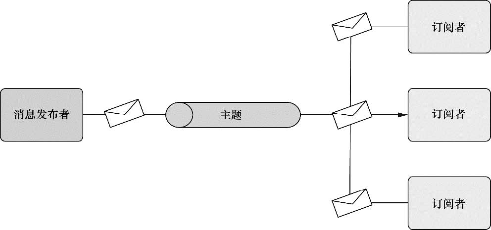<br/>
图17.4　与队列类似，主题可以将消息发送者与消息接收者进行解耦。与队列不同的是，主题消息可以发送给多个主题订阅者

## 1.2　评估异步消息的优点
同步通信机制访问远程服务的客户端存在几个限制，最主要的是：
- 同步通信意味着等待。当客户端调用远程服务的方法时，它必须等待远程方法结束后才能继续执行。如果客户端与远程服务频繁通信，或者远程服务响应很慢，就会对客户端应用的性能带来负面影响。
- 客户端通过服务接口与远程服务相耦合。如果服务的接口发生变化，此服务的所有客户端都需要做相应的改变。
- 客户端与远程服务的位置耦合。客户端必须配置服务的网络位置，这样它才知道如何与远程服务进行交互。如果网络拓扑进行调整，客户端也需要重新配置新的网络位置。
- 客户端与服务的可用性相耦合。如果远程服务不可用，客户端实际上也无法正常运行。

**无需等待**
当使用JMS发送消息时，客户端不必等待消息被处理，甚至是被投递。客户端只需要将消息发送给消息代理，就可以确信消息会被投递给相应的目的地。
因为不需要等待，所以客户端可以继续执行其他任务。这种方式可以有效地节省时间，所以客户端的性能能够极大的提高。

**面向消息和解耦**
与面向方法调用的RPC通信不同，发送异步消息是以数据为中心的。这意味着客户端并没有与特定的方法签名绑定。任何可以处理数据的队列或主题订阅者都可以处理由客户端发送的消息，而客户端不必了解远程服务的任何规范。

**位置独立**
同步RPC服务通常需要网络地址来定位。这意味着客户端无法灵活地适应网络拓扑的改变。如果服务的IP地址改变了，或者服务被配置为监听其他端口，客户端必须进行相应的调整，否则无法访问服务。
与之相反，消息客户端不必知道谁会处理它们的消息，或者服务的位置在哪里。客户端只需要了解需要通过哪个队列或主题来发送消息。因此，只要服务能够从队列或主题中获取消息即可，消息客户端根本不需要关注服务来自哪里。

**确保投递**
为了使客户端可以与同步服务通信，服务必须监听指定的IP地址和端口。如果服务崩溃了，或者由于某种原因无法使用了，客户端将不能继续处理。
但是，当发送异步消息时，客户端完全可以相信消息会被投递。即使在消息发送时，服务无法使用，消息也会被存储起来，直到服务重新可以使用为止。

# 2　使用JMS发送消息
Java消息服务（Java Message Service ，JMS）是一个Java标准，定义了使用消息代理的通用API。

Spring通过基于模板的抽象为JMS功能提供了支持，这个模板也就是JmsTemplate。使用JmsTemplate，能够非常容易地在消息生产方发送队列和主题消息，在消费消息的那一方，也能够非常容易地接收这些消息。Spring还提供了消息驱动POJO的理念：这是一个简单的Java对象，它能够以异步的方式响应队列或主题上到达的消息。

我们将会讨论Spring对JMS的支持，包括JmsTemplate和消息驱动POJO。但是在发送和接收消息之前，我们首先需要一个消息代理，它能够在消息的生产者和消费者之间传递消息.

## 2.1　在Spring中搭建消息代理
ActiveMQ是一个伟大的开源消息代理产品，也是使用JMS进行异步消息传递的最佳选择.
**创建连接工厂**
默认情况下，ActiveMQConnectionFactory会假设ActiveMQ代理监听localhost的61616端口。对于开发环境来说，这没有什么问题，但是在生产环境下，ActiveMQ可能会在不同的主机和/端口上。如果是这样的话，我们可以使用brokerURL属性来指定代理的URL：
```
<bean id="connectionFactory"
      class="org.apache.activemq.spring.ActiveMQConnectionFactory"
      p:brokerURL="tcp://localhost:61616" />
```
**声明ActiveMQ消息目的地**
除了连接工厂外，我们还需要消息传递的目的地。目的地可以是一个队列，也可以是一个主题，这取决于应用的需求。

不论使用的是队列还是主题，我们都必须使用特定的消息代理实现类在Spring中配置目的地bean。例如，下面的`<bean>`声明定义了一个ActiveMQ队列：
```
<bean id="spittleQueue" class="org.apache.activemq.command.ActiveMQQueue"
      c:_="spittle.alert.queue" />
```
同样，下面的`<bean>`声明定义了一个ActiveMQ主题：
```
<bean id="spittleTopic" class="org.apache.activemq.command.ActiveMQTopic"
      c:_="spittle.alert.topic" />
```
ActiveMQ命名空间提供了另一种方式来声明队列和主题。对于队列，我们可以使用`<amq:quence>`元素来声明：
```<amq:queue id="spittleQueue" physicalName="spittle.alert.queue" />```
如果是JMS主题，我们可以使用`<amq:topic>`元素来声明：
```<amq:topic id="spittleTopic" physicalName="spittle.alert.topic" />```
不管是哪种类型，都是借助physicalName属性指定消息通道的名称。

## 2.2　使用Spring的JMS模板
**处理失控的JMS代码**
传统的JDBC代码在处理连接、语句、结果集和异常时是多么冗长和繁杂。遗憾的是，传统的JMS使用了类似的编程模型.

**使用JMS模版**
针对如何消除冗长和重复的JMS代码，Spring给出的解决方案是JmsTemplate。JmsTemplate可以创建连接、获得会话以及发送和接收消息。这使得我们可以专注于构建要发送的消息或者处理接收到的消息。

另外，JmsTemplate可以处理所有抛出的笨拙的JMSException异常：

表17.1　Spring的JmsTemplate会捕获标准的JMSException异常，再以Spring的非检查型异常JmsException子类重新抛出
<br/><br/>
<br/>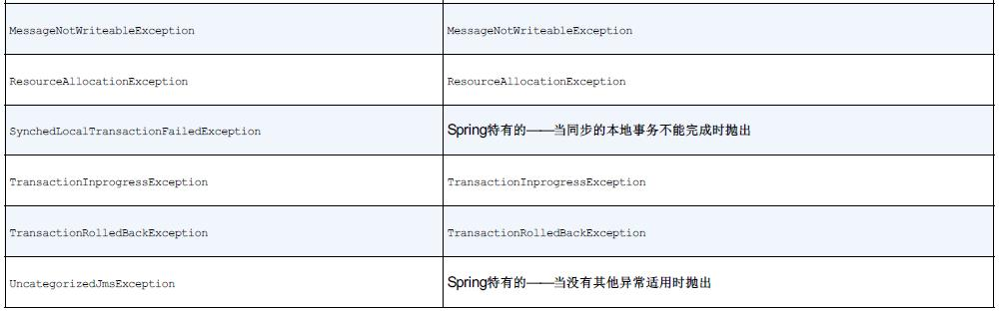<br/>

为了使用JmsTemplate，我们需要在Spring的配置文件中将它声明为一个bean。如下的XML可以完成这项工作：
```
<bean id="jmsTemplate"
      class="org.springframework.jms.core.JmsTemplate"
      c:_-ref="connectionFactory" />
```
**发送消息**
在我们想建立的Spittr应用程序中，其中有一个特性就是当创建Spittle的时候提醒其他用户（或许是通过E-mail）。我们可以在增加Spittle的地方直接实现该特性。但是搞清楚发送提醒给谁以及实际发送这些提醒可能需要一段时间，这会影响到应用的性能。当增加一个新的Spittle时，我们希望应用是敏捷的，能够快速做出响应。

为了在Spittle创建的时候异步发送spittle提醒，让我们为Spittr应用引入AlertService：
```
public interface AlertService {
  void sendSpittleAlert(Spittle spittle);
}
```
- 实现类：
```

public class AlertServiceImpl implements AlertService {

  private JmsOperations jmsOperations;

  public AlertServiceImpl(JmsOperations jmsOperations) {
    this.jmsOperations = jmsOperations;
  }

  public void sendSpittleAlert(final Spittle spittle) {
    jmsOperations.send(
      "spittle.alert.queue",
      new MessageCreator() {
        public Message createMessage(Session session)
                       throws JMSException {
          return session.createObjectMessage(spittle);
        }
      }
    );
  }
}
```
**设置默认目的地**
如果你想指定要创建的目的地类型的话，那么你可以将之前创建的队列或主题的目的地bean装配进来:
```
<bean id="jmsTemplate"
      class="org.springframework.jms.core.JmsTemplate"
      c:_-ref="connectionFactory"
      p:defaultDestination-ref="spittleTopic"/>
```
现在，调用JmsTemplate的send()方法时，我们可以去除第一个参数了：
```
jmsOperations.send(
    new MessageCreator() {
    //...
 )
```

**在发送时，对消息进行转换**
除了send()方法，JmsTemplate还提供了convertAndSend()方法。与send()方法不同，convertAndSend()方法并不需要MessageCreator作为参数。这是因为convertAndSend()会使用内置的消息转换器（message converter）为我们创建消息。

当我们使用convertAndSend()时，sendSpittleAlert()可以减少到方法体中只包含一行代码：
```
  public void sendSpittleAlert(Spittle spittle) {
    jmsOperations.convertAndSend(spittle);
  }
```

**接收消息**
当调用JmsTemplate的receive()方法时，JmsTemplate会尝试从消息代理中获取一个消息。如果没有可用的消息，receive()方法会一直等待，直到获得消息为止。图17.6展示了这个交互过程。
<br/>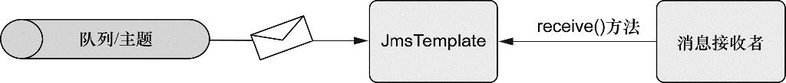<br/>

在convertAndSend()中，我们已经看到了如何将对象转换为Message。不过，它们还可以用在接收端，也就是使用JmsTemplate的receiveAndConvert()：
```
  public Spittle retrieveSpittleAlert() {
    return (Spittle) jmsOperations.receiveAndConvert();
  }
```
使用JmsTemplate接收消息的最大缺点在于receive()和receiveAndConvert()方法都是同步的。这意味着接收者必须耐心等待消息的到来，因此这些方法会一直被阻塞，直到有可用消息（或者直到超时）。同步接收异步发送的消息，是不是感觉很怪异？

这就是消息驱动POJO的用武之处。让我们看看如何使用能够响应消息的组件异步接收消息，而不是一直等待消息的到来。

## 2.3　创建消息驱动的POJO
**配置消息监听器**
为POJO赋予消息接收能力的诀窍是在Spring中把它配置为消息监听器。Spring的jms命名空间为我们提供了所需要的一切。首先，让我们先把处理器声明为bean：
```
<bean id="spittleHandler" class="spittr.alerts.SpittleAlertHandler" />
```
然后，为了把SpittleAlertHandler转变为消息驱动的POJO，我们需要把这个bean声明为消息监听器：
```
<jms:listener-container>
  <jms:listener destination="spittle.alert.queue"
                ref="spittleHandler"
                method="handleSpittleAlert" />
</jms:listener-container>
```

在这里，我们在消息监听器容器中包含了一个消息监听器。消息监听器容器（message listener container）是一个特殊的bean，它可以监控JMS目的地并等待消息到达。一旦有消息到达，它取出消息，然后把消息传给任意一个对此消息感兴趣的消息监听器。如图17.7展示了这个交互过程。
<br/>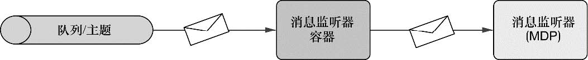<br/>

图17.7　消息监听器容器监听队列和主题。当消息到达时，消息将转给消息监听器（例如消息驱动的POJO）

为了在Spring中配置消息监听器容器和消息监听器，我们使用了Spring jms命名空间中的两个元素。`<jms:listener-container>`中包含了`<jms:listener>`元素。这里的connection-factory属性配置了对connectionFactory的引用，容器中的每个`<jms:listener>`都使用这个连接工厂进行消息监听。

## 2.4　使用基于消息的RPC
**导出基于JMS的服务**
如果HttpInvokerServiceExporter可以导出基于HTTP通信的服务，那么JmsInvoker-ServiceExporter就应该可以导出基于JMS的服务。

为了演示JmsInvokerServiceExporter是如何工作的，考虑如下的AlertServiceImpl。
<br/>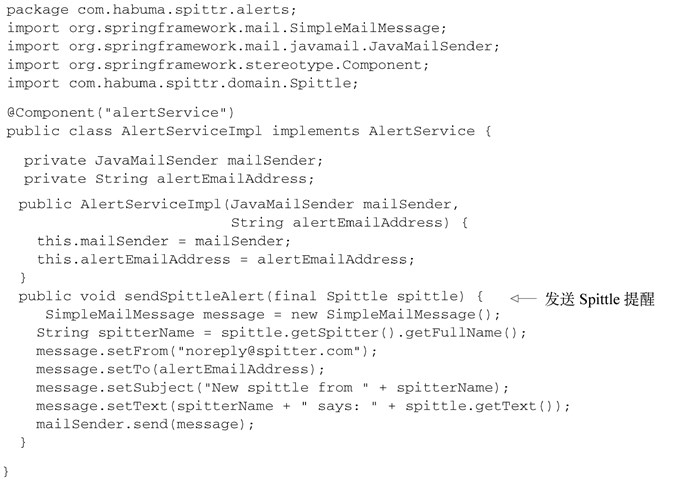<br/>

，AlertServiceImpl使用了@Component注解来标注，所以它会被Spring自动发现并注册为Spring应用上下文中ID
为alertService的bean。在配置JmsInvokerServiceExporter时，我们将引用这个bean：
<br/>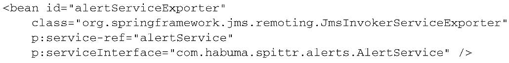<br/>

导出器的属性并没有描述服务如何基于JMS通信的细节。但好消息是JmsInvokerServiceExporter可以充当JMS监听器。因此，我们使用`<jms:listenercontainer>`元素配置它：
<br/>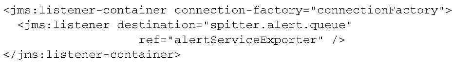<br/>

**使用基于JMS的服务**
为了使用提醒服务，我们可以像下面那样配置JmsInvokerProxyFactoryBean：
<br/>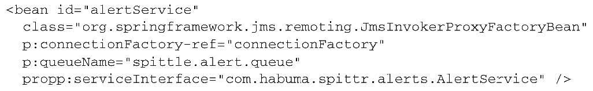<br/>

connectionFactory和queryName属性指定了RPC消息如何被投递——在这里，也就是在给定的连接工厂中，我们所配置的消息代理里面名为spitter.alert.queue的队列。对于serviceInterface，指定了代理应该通过AlertService接口暴露功能。

多年来，JMS一直是Java应用中主流的消息解决方案。但是对于Java和Spring开发者来说，JMS并不是唯一的消息可选方案。在过去的几年
中，高级消息队列协议（Advanced Message Queuing Protocol ，AMQP）得到了广泛的关注。
# 3　使用AMQP实现消息功能
AMQP的线路层协议规范了消息的格式，消息在生产者和消费者间传送的时候会遵循这个格式。这样AMQP在互相协作方面就要优于JMS——它不仅能跨不同的AMQP实现，还能跨语言和平台。（AMQP能够不局限于Java语言和平台，那说明你已经快速抓到了重点。）

## 3.1　AMQP简介
与之不同的是，AMQP的生产者并不会直接将消息发布到队列中。AMQP在消息的生产者以及传递信息的队列之间引入了一种间接的机制：Exchange。这种关系如图17.8所示。
<br/>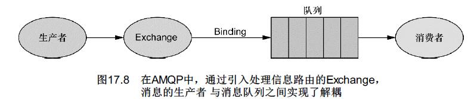<br/>

可以看到，消息的生产者将信息发布到一个Exchange。Exchange会绑定到一个或多个队列上，它负责将信息路由到队列上。信息的消费者会从队列中提取数据并进行处理。

AMQP定义了四种不同类型的Exchange，每一种都有不同的路由算法，这些算法决定了是否要将信息放到队列中。根据Exchange的算法不同，它可能会使用消息的routing key和/或参数，并将其与Exchange和队列之间binding的routing key和参数进行对比。（routing key可以大致理解为Email的收件人地址，指定了预期的接收者。）如果对比结果满足相应的算法，那么消息将会路由到队列上。否则的话，将不会路由到队列上。

四种标准的AMQP Exchange如下所示：
- Direct：如果消息的routing key与binding的routing key直接匹配的话，消息将会路由到该队列上；
- Topic：如果消息的routing key与binding的routing key符合通配符匹配的话，消息将会路由到该队列上；
- Headers：如果消息参数表中的头信息和值都与bingding参数表中相匹配，消息将会路由到该队列上；
- Fanout：不管消息的routing key和参数表的头信息/值是什么，消息将会路由到所有队列上。

## 3.2　配置Spring支持AMQP消息
当我们第一次使用Spring JMS抽象的时候，首先配置了一个连接工厂。与之类似，使用Spring AMQP前也要配置一个连接工厂。只不过，所要配置的不是JMS的连接工厂，而是需要配置AMQP的连接工厂。更具体来讲，需要配置RabbitMQ连接工厂。

**什么是RabbitMQ**
```
 <connection-factory id="connectionFactory" 
    host="${rabbitmq.host}" 
    port="${rabbitmq.port}"
    username="${rabbitmq.username}"
    password="${rabbitmq.password}" />
```

**声明队列、Exchange以及binding**
表17.3　Spring AMQP的rabbit命名空间包含了多个元素，用来创建队列、Exchange以及将它们结合在一起的binding
<br/>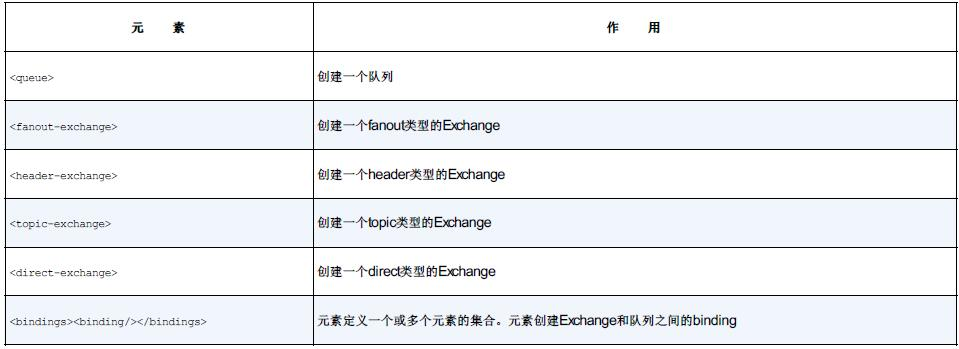<br/>

这些配置元素要与<admin>元素一起使用。<admin>元素会创建一个RabbitMQ管理组件（administrative component），它会自动创建（如果它们在RabbitMQ代理中尚未存在的话）上述这些元素所声明的队列、Exchange以及binding。

例如，如果你希望声明名为spittle.alert.queue的队列，只需要在Spring配置中添加如下的两个元素即可：
```
<admin connection-factory="connectionFactory"/>
<queue id="spittleAlertQueue" name="spittle.alerts" />
```
对于简单的消息来说，我们只需做这些就足够了。这是因为默认会有一个没有名称的direct Exchange，所有的队列都会绑定到这个Exchange上，并且routing key与队列的名称相同。在这个简单的配置中，我们可以将消息发送到这个没有名称的Exchange上，并将routing key设定为spittle.alert.queue，这样消息就会路由到这个队列中。实际上，我们重新创建了JMS的点对点模型。

## 3.3　使用RabbitTemplate发送消息


# 源码
https://github.com/myitroad/spring-in-action-4/tree/master/Chapter_17
