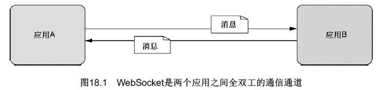
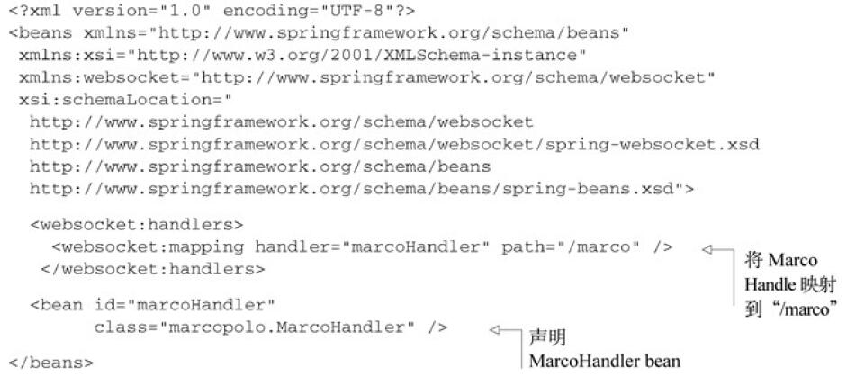
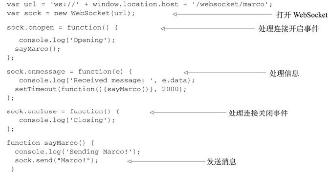
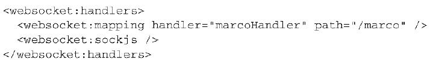

第18章　使用WebSocket和STOMP实现消息功能
-----------
Spring 4.0为WebSocket通信提供了支持，包括：
- 发送和接收消息的低层级API；
- 发送和接收消息的高级API；
- 用来发送消息的模板；
- 支持SockJS，用来解决浏览器端、服务器以及代理不支持WebSocket的问题。

# 1　使用Spring的低层级WebSocket API
按照其最简单的形式，WebSocket只是两个应用之间通信的通道。位于WebSocket一端的应用发送消息，另外一端处理消息。因为它是全双工的，所以每一端都可以发送和处理消息。如图18.1所示。
<br/><br/>

WebSocket通信可以应用于任何类型的应用中，但是WebSocket最常见的应用场景是实现服务器和基于浏览器的应用之间的通信。

为了在Spring使用较低层级的API来处理消息，我们必须编写一个实现WebSocketHandler的类.WebSocketHandler需要我们实现五个方法。相比直接实现WebSocketHandler，更为简单的方法是扩展AbstractWebSocketHandler，这是WebSocketHandler的一个抽象实现。

```java
public class MarcoHandler extends AbstractWebSocketHandler {

	private static final Logger logger = LoggerFactory.getLogger(MarcoHandler.class);
	
	@Override
	protected void handleTextMessage(WebSocketSession session, TextMessage message) throws Exception {
		logger.info("Received message: " + message.getPayload());
		Thread.sleep(2000);
		session.sendMessage(new TextMessage("Polo!"));
	}
	
}
```
除了重载WebSocketHandler中所定义的五个方法以外，我们还可以重载AbstractWebSocketHandler中所定义的三个方法：
- handleBinaryMessage()
- handlePongMessage()
- handleTextMessage()
这三个方法只是handleMessage()方法的具体化，每个方法对应于某一种特定类型的消息。

另外一种方案，我们可以扩展TextWebSocketHandler或BinaryWebSocketHandler。TextWebSocketHandler是AbstractWebSocketHandler的子类，它会拒绝处理二进制消息。它重载了handleBinaryMessage()方法，如果收到二进制消息的时候，将会关闭WebSocket连接。与之类似，BinaryWebSocketHandler也是AbstractWeb-SocketHandler的子类，它重载了handleTextMessage()方法，如果接收到文本消息的话，将会关闭连接。

现在，已经有了消息处理器类，我们必须要对其进行配置，这样Spring才能将消息转发给它。在Spring的Java配置中，这需要在一个配置类上使用@EnableWebSocket，并实现WebSocketConfigurer接口，如下面的程序清单所示。
程序清单18.2　在Java配置中，启用WebSocket并映射消息处理器
```java
@Configuration
@EnableWebSocket
public class WebSocketConfig implements WebSocketConfigurer {

	@Override
	public void registerWebSocketHandlers(WebSocketHandlerRegistry registry) {
//		registry.addHandler(marcoHandler(), "/marco").withSockJS();
		registry.addHandler(marcoHandler(), "/marco");
	}
  
	@Bean
	public MarcoHandler marcoHandler() {
		return new MarcoHandler();
	}

}
```
或XML配置：
程序清单18.3　借助websocket命名空间以XML的方式配置WebSocket
<br/><br/>

不管使用Java还是使用XML，这就是所需的配置。

现在，我们可以把注意力转向客户端，它会发送“Marco!”文本消息到服务器，并监听来自服务器的文本消息。如下程序清单所展示的JavaScript代码开启了一个原始的WebSocket并使用它来发送消息给服务器。

程序清单18.4　连接到“marco” WebSocket的JavaScript客户端
<br/><br/>

通过发送“Marco!”，这个无休止的Marco Polo游戏就开始了，因为服务器端的MarcoHandler作为响应会将“Polo!”发送回来，当客户端收到来自服务器的消息后，onmessage事件会发送另外一个“Marco!”给服务器。这个过程会一直持续下去，直到连接关闭。


# 2　应对不支持WebSocket的场景
WebSocket是一个相对比较新的规范。虽然它早在2011年底就实现了规范化，但即便如此，在Web浏览器和应用服务器上依然没有得到一致的支持。Firefox和Chrome早就已经完整支持WebSocket了，但是其他的一些浏览器刚刚开始支持WebSocket。如下列出了几个流行的浏览器支持WebSocket功能的最低版本：
- Internet Explorer：10.0
- Firefox: 4.0（部分支持），6.0（完整支持）。
- Chrome: 4.0（部分支持），13.0（完整支持）。
- Safari: 5.0（部分支持），6.0（完整支持）。
- Opera: 11.0（部分支持），12.10（完整支持）。
- iOS Safari: 4.2（部分支持），6.0（完整支持）。
- Android Browser: 4.4。

服务器端对WebSocket的支持也好不到哪里去。GlassFish在几年前就开始支持一定形式的WebSocket，但是很多其他的应用服务器在最近的版本中刚刚开始支持WebSocket。例如，我在测试上述例子的时候，所使用的就是Tomcat 8的发布候选构建版本。

即便浏览器和应用服务器的版本都符合要求，两端都支持WebSocket，在这两者之间还有可能出现问题。防火墙代理通常会限制所有除HTTP以外的流量。它们有可能不支持或者（还）没有配置允许进行WebSocket通信。

幸好，提到WebSocket的备用方案，这恰是SockJS所擅长的。SockJS让我们能够使用统一的编程模型，就好像在各个层面都完整支持WebSocket一样，SockJS在底层会提供备用方案。

例如，为了在服务端启用SockJS通信，我们在Spring配置中可以很简单地要求添加该功能。重新回顾一下程序清单18.2中的registerWebSocketHandlers()方法，稍微加一点内容就能启用SockJS：
```java
	@Override
	public void registerWebSocketHandlers(WebSocketHandlerRegistry registry) {
		registry.addHandler(marcoHandler(), "/marco").withSockJS();
	}
```
- XML完成相同的配置效果：
<br/><br/>

要在客户端使用SockJS，需要确保加载了SockJS客户端库。具体的做法在很大程度上依赖于使用JavaScript模块加载器（如require.js或curl.js）还是简单地使用<script>标签加载JavaScript库。加载SockJS客户端库的最简单办法是使用<script>标签从SockJS CDN中进行加载，如下所示：
```xml
<script src="http://cdn.sockjs.org/sockjs-0.3.min.js"></script>
```
除了加载SockJS客户端库以外，在程序清单18.4中，要使用SockJS只需修改两行代码：
```javascript
var url = 'marco';
var sock = new SocktJS(url);
```
所做的第一个修改就是URL。SockJS所处理的URL是“http://”或“https://”模式，而不是“ws://”和“wss://”。即便如此，我们还是可以使用相对URL，避免书写完整的全限定URL。在本例中，如果包含JavaScript的页面位于“http://localhost:8080/websocket”路径下，那么给定的“marco”路径将会形成到“http://localhost:8080/websocket/marco”的连接。

# 3　使用STOMP消息
# 4　为目标用户发送消息
# 5　处理消息异常

# 源码
https://github.com/myitroad/spring-in-action-4/tree/master/Chapter_18