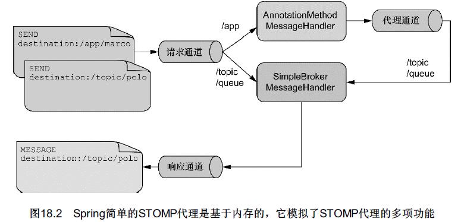
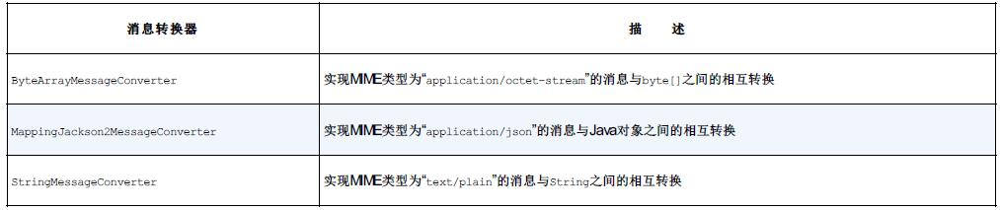
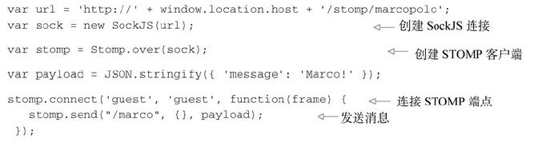
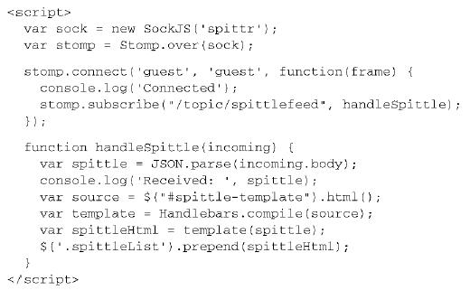
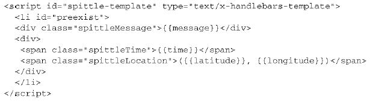

第18章　使用WebSocket和STOMP实现消息功能
-----------
Spring 4.0为WebSocket通信提供了支持，包括：
- 发送和接收消息的低层级API；
- 发送和接收消息的高级API；
- 用来发送消息的模板；
- 支持SockJS，用来解决浏览器端、服务器以及代理不支持WebSocket的问题。

# 1　使用Spring的低层级WebSocket API
按照其最简单的形式，WebSocket只是两个应用之间通信的通道。位于WebSocket一端的应用发送消息，另外一端处理消息。因为它是全双工的，所以每一端都可以发送和处理消息。如图18.1所示。
<br/><br/>

WebSocket通信可以应用于任何类型的应用中，但是WebSocket最常见的应用场景是实现服务器和基于浏览器的应用之间的通信。

为了在Spring使用较低层级的API来处理消息，我们必须编写一个实现WebSocketHandler的类.WebSocketHandler需要我们实现五个方法。相比直接实现WebSocketHandler，更为简单的方法是扩展AbstractWebSocketHandler，这是WebSocketHandler的一个抽象实现。

```java
public class MarcoHandler extends AbstractWebSocketHandler {

	private static final Logger logger = LoggerFactory.getLogger(MarcoHandler.class);
	
	@Override
	protected void handleTextMessage(WebSocketSession session, TextMessage message) throws Exception {
		logger.info("Received message: " + message.getPayload());
		Thread.sleep(2000);
		session.sendMessage(new TextMessage("Polo!"));
	}
	
}
```
除了重载WebSocketHandler中所定义的五个方法以外，我们还可以重载AbstractWebSocketHandler中所定义的三个方法：
- handleBinaryMessage()
- handlePongMessage()
- handleTextMessage()
这三个方法只是handleMessage()方法的具体化，每个方法对应于某一种特定类型的消息。

另外一种方案，我们可以扩展TextWebSocketHandler或BinaryWebSocketHandler。TextWebSocketHandler是AbstractWebSocketHandler的子类，它会拒绝处理二进制消息。它重载了handleBinaryMessage()方法，如果收到二进制消息的时候，将会关闭WebSocket连接。与之类似，BinaryWebSocketHandler也是AbstractWeb-SocketHandler的子类，它重载了handleTextMessage()方法，如果接收到文本消息的话，将会关闭连接。

现在，已经有了消息处理器类，我们必须要对其进行配置，这样Spring才能将消息转发给它。在Spring的Java配置中，这需要在一个配置类上使用@EnableWebSocket，并实现WebSocketConfigurer接口，如下面的程序清单所示。
程序清单18.2　在Java配置中，启用WebSocket并映射消息处理器
```java
@Configuration
@EnableWebSocket
public class WebSocketConfig implements WebSocketConfigurer {

	@Override
	public void registerWebSocketHandlers(WebSocketHandlerRegistry registry) {
//		registry.addHandler(marcoHandler(), "/marco").withSockJS();
		registry.addHandler(marcoHandler(), "/marco");
	}
  
	@Bean
	public MarcoHandler marcoHandler() {
		return new MarcoHandler();
	}

}
```
或XML配置：
程序清单18.3　借助websocket命名空间以XML的方式配置WebSocket
<br/><br/>

不管使用Java还是使用XML，这就是所需的配置。

现在，我们可以把注意力转向客户端，它会发送“Marco!”文本消息到服务器，并监听来自服务器的文本消息。如下程序清单所展示的JavaScript代码开启了一个原始的WebSocket并使用它来发送消息给服务器。

程序清单18.4　连接到“marco” WebSocket的JavaScript客户端
<br/><br/>

通过发送“Marco!”，这个无休止的Marco Polo游戏就开始了，因为服务器端的MarcoHandler作为响应会将“Polo!”发送回来，当客户端收到来自服务器的消息后，onmessage事件会发送另外一个“Marco!”给服务器。这个过程会一直持续下去，直到连接关闭。


# 2　应对不支持WebSocket的场景
WebSocket是一个相对比较新的规范。虽然它早在2011年底就实现了规范化，但即便如此，在Web浏览器和应用服务器上依然没有得到一致的支持。Firefox和Chrome早就已经完整支持WebSocket了，但是其他的一些浏览器刚刚开始支持WebSocket。如下列出了几个流行的浏览器支持WebSocket功能的最低版本：
- Internet Explorer：10.0
- Firefox: 4.0（部分支持），6.0（完整支持）。
- Chrome: 4.0（部分支持），13.0（完整支持）。
- Safari: 5.0（部分支持），6.0（完整支持）。
- Opera: 11.0（部分支持），12.10（完整支持）。
- iOS Safari: 4.2（部分支持），6.0（完整支持）。
- Android Browser: 4.4。

服务器端对WebSocket的支持也好不到哪里去。GlassFish在几年前就开始支持一定形式的WebSocket，但是很多其他的应用服务器在最近的版本中刚刚开始支持WebSocket。例如，我在测试上述例子的时候，所使用的就是Tomcat 8的发布候选构建版本。

即便浏览器和应用服务器的版本都符合要求，两端都支持WebSocket，在这两者之间还有可能出现问题。防火墙代理通常会限制所有除HTTP以外的流量。它们有可能不支持或者（还）没有配置允许进行WebSocket通信。

幸好，提到WebSocket的备用方案，这恰是SockJS所擅长的。SockJS让我们能够使用统一的编程模型，就好像在各个层面都完整支持WebSocket一样，SockJS在底层会提供备用方案。

例如，为了在服务端启用SockJS通信，我们在Spring配置中可以很简单地要求添加该功能。重新回顾一下程序清单18.2中的registerWebSocketHandlers()方法，稍微加一点内容就能启用SockJS：
```java
	@Override
	public void registerWebSocketHandlers(WebSocketHandlerRegistry registry) {
		registry.addHandler(marcoHandler(), "/marco").withSockJS();
	}
```
- XML完成相同的配置效果：
<br/><br/>

要在客户端使用SockJS，需要确保加载了SockJS客户端库。具体的做法在很大程度上依赖于使用JavaScript模块加载器（如require.js或curl.js）还是简单地使用`<script>`标签加载JavaScript库。加载SockJS客户端库的最简单办法是使用`<script>`标签从SockJS CDN中进行加载，如下所示：
```xml
<script src="http://cdn.sockjs.org/sockjs-0.3.min.js"></script>
```
除了加载SockJS客户端库以外，在程序清单18.4中，要使用SockJS只需修改两行代码：
```javascript
var url = 'marco';
var sock = new SocktJS(url);
```
所做的第一个修改就是URL。SockJS所处理的URL是“http://”或“https://”模式，而不是“ws://”和“wss://”。即便如此，我们还是可以使用相对URL，避免书写完整的全限定URL。在本例中，如果包含JavaScript的页面位于“http://localhost:8080/websocket”路径下，那么给定的“marco”路径将会形成到“http://localhost:8080/websocket/marco”的连接。

# 3　使用STOMP消息
直接使用WebSocket（或SockJS）就很类似于使用TCP套接字来编写Web应用。因为没有高层级的线路协议（wire protocol），因此就需要我们定义应用之间所发送消息的语义，还需要确保连接的两端都能遵循这些语义。
不过，好消息是我们并非必须要使用原生的WebSocket连接。就像HTTP在TCP套接字之上添加了请求-响应模型层一样，STOMP在WebSocket之上提供了一个基于帧的线路格式（frame-based wire format）层，用来定义消息的语义。

乍看上去，STOMP的消息格式非常类似于HTTP请求的结构。与HTTP请求和响应类似，STOMP帧由命令、一个或多个头信息以及负载所组成。例如，如下就是发送数据的一个STOMP帧：
```
SEND
destination:/app/marco
content-length:20

{\"message\":\"Marco!\"}
```

## 　3.1 启用STOMP消息功能
在Spring MVC中为控制器方法添加@MessageMapping注解，使其处理STOMP消息，它与带有@RequestMapping注解的方法处理HTTP请求的方式非常类似。但是与@RequestMapping不同的是
- @MessageMapping的功能无法通过@EnableWebMvc启用，而是@EnableWebSocketMessageBroker。
- Spring的Web消息功能基于消息代理（message broker）构建，因此除了告诉Spring我们想要处理消息以外，还有其他的内容需要配置。

```java
@Configuration
@EnableWebSocketMessageBroker
public class WebSocketStompConfig extends AbstractWebSocketMessageBrokerConfigurer {

  @Override
  public void registerStompEndpoints(StompEndpointRegistry registry) {
    registry.addEndpoint("/marcopolo").withSockJS();
  }

  @Override
  public void configureMessageBroker(MessageBrokerRegistry registry) {
//    registry.enableStompBrokerRelay("/queue", "/topic");
    registry.enableSimpleBroker("/queue", "/topic");
    registry.setApplicationDestinationPrefixes("/app");
  }
  
}
```
上述配置，它重载了registerStompEndpoints()方法，将“/marcopolo”注册为STOMP端点。这个路径与之前发送和接收消息的目的地路径有所不同。这是一个端点，客户端在订阅或发布消息到目的地路径前，要连接该端点。

WebSocketStompConfig还通过重载configureMessageBroker()方法配置了一个简单的消息代理。消息代理将会处理前缀为“/topic”和“/queue”的消息。除此之外，发往应用程序的消息将会带有“/app”前缀。图18.2展现了这个配置中的消息流。
<br/><br/>

**启用STOMP代理中继**
对于生产环境下的应用来说，你可能会希望使用真正支持STOMP的代理来支撑WebSocket消息，如RabbitMQ或ActiveMQ。这样的代理提供了可扩展性和健壮性更好的消息功能，当然它们也会完整支持STOMP命令。我们需要根据相关的文档来为STOMP搭建代理。搭建就绪之后，就可以使用STOMP代理来替换内存代理了，只需按照如下方式重载configureMessageBroker()方法即可：
```java
  @Override
  public void configureMessageBroker(MessageBrokerRegistry registry) {
    registry.enableStompBrokerRelay("/queue", "/topic");
    registry.setApplicationDestinationPrefixes("/app");
  }
```
- 上述configureMessageBroker()方法的第一行代码启用了STOMP代理中继（broker relay）功能，并将其目的地前缀设置为“/topic”和“/queue”。这样的话，Spring就能知道所有目的地前缀为“/topic”或“/queue”的消息都会发送到STOMP代理中。

- 在第二行的configureMessageBroker()方法中将应用的前缀设置为“/app”。所有目的地以“/app”打头的消息都将会路由到带有@MessageMapping注解的方法中，而不会发布到代理队列或主题中。

默认情况下，STOMP代理中继会假设代理监听localhost的61613端口，并且客户端的username和password均为“guest”。如果你的STOMP代理位于其他的服务器上，或者配置成了不同的客户端凭证，那么我们可以在启用STOMP代理中继的时候，需要配置这些细节信息：
```java
  @Override
  public void configureMessageBroker(MessageBrokerRegistry registry) {
    registry.enableStompBrokerRelay("/queue", "/topic")
            .setRelayHost("rabbit.someotherserver")
            .setRelayPort(62623)
            .setClientLogin("marcopolo")
            .setClientPasscode("letmein01")
    registry.setApplicationDestinationPrefixes("/app");
  }
```
## 3.2　处理来自客户端的STOMP消息
Spring 4.0引入了@MessageMapping注解，它用于STOMP消息的处理，类似于Spring MVC的@RequestMapping注解。当消息抵达某个特定的目的地时，带有@MessageMapping注解的方法能够处理这些消息。
```java
@Controller
public class MarcoController {

  private static final Logger logger = LoggerFactory
      .getLogger(MarcoController.class);

  @MessageMapping("/marco")
  public Shout handleShout(Shout incoming) {
    logger.info("Received message: " + incoming.getMessage());

    try { Thread.sleep(2000); } catch (InterruptedException e) {}
    
    Shout outgoing = new Shout();
    outgoing.setMessage("Polo!");
    
    return outgoing;
  }

}
```
示handleShout()方法能够处理指定目的地上到达的消息。在本例中，这个目的地也就是“/app/marco”（“/app”前缀是隐含的，因为我们将其配置为应用的目的地前缀）。
- Shout类是个简单的JavaBean
```java
public class Shout {

  private String message;

  public String getMessage() {
    return message;
  }

  public void setMessage(String message) {
    this.message = message;
  }
  
}
```

因为我们现在处理的不是HTTP，所以无法使用Spring的HttpMessageConverter实现将负载转换为Shout对象。Spring 4.0提供了几个消息转换器，作为其消息API的一部分。表18.1描述了这些消息转换器，在处理STOMP消息的时候可能会用到它们。

表18.1　Spring能够使用某一个消息转换器将消息负载转换为Java类型
<br/><br/>

**处理订阅**
@SubscribeMapping的主要应用场景是实现请求-回应模式。在请求-回应模式中，客户端订阅某一个目的地，然后预期在这个目的地上获得一个一次性的响应。
例如，考虑如下@SubscribeMapping注解标注的方法：
```java
  @SubscribeMapping({"/marco"})
  public Shout handleSubscription(){
    Shout outgoing = new Shout();
    outgoing.setMessage("Polo!");
    return outgoing;
  }
```

可以看到，handleSubscription()方法使用了@SubscribeMapping注解，用这个方法来处理对“/app/marco”目的地的订阅（与@MessageMapping类似，“/app”是隐含的）。当处理这个订阅时，handleSubscription()方法会产生一个输出的Shout对象并将其返回。然后，Shout对象会转换成一条消息，并且会按照客户端订阅时相同的目的地发送回客户端。

如果你觉得这种请求-回应模式与HTTP GET的请求-响应模式并没有太大差别的话，那么你基本上是正确的。但是，这里的关键区别在于HTTPGET请求是同步的，而订阅的请求-回应模式则是异步的，这样客户端能够在回应可用时再去处理，而不必等待。

**编写JavaScript客户端**
程序清单18.7　借助STOMP库，通过JavaScript发送消息
<br/><br/>
在本例中，URL引用的是程序清单18.5中所配置的STOMP端点（不包括应用的上下文路径“/stomp”）。

但是，这里的区别在于，我们不再直接使用SockJS，而是通过调用Stomp.over(sock)创建了一个STOMP客户端实例。这实际上封装了SockJS，这样就能在WebSocket连接上发送STOMP消息。

## 3.3　发送消息到客户端
WebSocket通常视为服务器发送数据给浏览器的一种方式，采用这种方式所发送的数据不必位于HTTP请求的响应中。使用Spring和WebSocket/STOMP的话，该如何与基于浏览器的客户端通信呢？
Spring提供了两种发送数据给客户端的方法：
- 作为处理消息或处理订阅的附带结果；
- 使用消息模板。

**在处理消息之后，发送消息**
```java
@MessageMapping("/marco")
  public Shout handleShout(Shout incoming) {
    logger.info("Received message: " + incoming.getMessage());
    Shout outgoing = new Shout();
    outgoing.setMessage("Polo!");
    return outgoing;
  }
```

当@MessageMapping注解标示的方法有返回值的时候，返回的对象将会进行转换（通过消息转换器）并放到STOMP帧的负载中，然后发送给消息代理。

默认情况下，帧所发往的目的地会与触发处理器方法的目的地相同，只不过会添加上“/topic”前缀。就本例而言，这意味着handleShout()方法所返回的Shout对象会写入到STOMP帧的负载中，并发布到“/topic/marco”目的地。不过，我们可以通过为方法添加@SendTo注解，重载目的地：
```java
@MessageMapping("/marco")
@SendTo("/topic/shout")
  public Shout handleShout(Shout incoming) {
    logger.info("Received message: " + incoming.getMessage());
    Shout outgoing = new Shout();
    outgoing.setMessage("Polo!");
    return outgoing;
  }
```
按照这个@SendTo注解，消息将会发布到“/topic/shout”。所有订阅这个主题的应用（如客户端）都会收到这条消息。
按照类似的方式，@SubscribeMapping注解标注的方式也能发送一条消息，作为订阅的回应。
```java
  @SubscribeMapping("/marco")
  public Shout handleSubscription(){
    Shout outgoing = new Shout();
    outgoing.setMessage("Polo!");
    return outgoing;
  }
```
@SubscribeMapping的区别在于这里的Shout消息将会直接发送给客户端，而不必经过消息代理。如果你为方法添加@SendTo注解的话，那么消息将会发送到指定的目的地，这样会经过代理。

**在应用的任意地方发送消息**
@MessageMapping和@SubscribeMapping提供了一种很简单的方式来发送消息，这是接收消息或处理订阅的附带结果。不过，Spring的SimpMessagingTemplate能够在应用的任何地方发送消息，甚至不必以首先接收一条消息作为前提。

我们不必要求用户刷新页面，而是让首页订阅一个STOMP主题，在Spittle创建的时候，该主题能够收到Spittle更新的实时feed。在首页中，我们需要添加如下的JavaScript代码块：
<br/><br/>

Handlebars库将Spittle数据渲染为HTML并插入到列表中。Handlebars模板定义在一个单独的`<script>`标签中，如下所示：
<br/><br/>
在服务器端，我们可以使用SimpMessagingTemplate将所有新创建的Spittle以消息的形式发布到“/topic/spittlefeed”主题上。如下程序清单展现的SpittleFeedServiceImpl就是实现该功能的简单服务：

程序清单18.8　SimpMessagingTemplate能够在应用的任何地方发布消息
```java
@Service
public class SpittleFeedServiceImpl implements SpittleFeedService {

	private SimpMessageSendingOperations messaging;

	@Autowired
	public SpittleFeedServiceImpl(SimpMessageSendingOperations messaging) {
		this.messaging = messaging;
	}

	public void broadcastSpittle(Spittle spittle) {
		messaging.convertAndSend("/topic/spittlefeed", spittle);
	}

}
```
在这个场景下，我们希望所有的客户端都能及时看到实时的Spittle feed，这种做法是很好的。但有的时候，我们希望发送消息给指定的用户，而不是所有的客户端。

# 4　为目标用户发送消息
但是，如果你知道用户是谁的话，那么就能处理与某个用户相关的消息，而不仅仅是与所有客户端相关联。好消息是我们已经了解了如何识别用户。通过使用与第9章相同的认证机制，我们可以使用Spring Security来认证用户，并为目标用户处理消息。

在使用Spring和STOMP消息功能的时候，我们有三种方式利用认证用户：
- @MessageMapping和@SubscribeMapping标注的方法能够使用Principal来获取认证用户；
- @MessageMapping、@SubscribeMapping和@MessageException方法返回的值能够以消息的形式发送给认证用户；
- SimpMessagingTemplate能够发送消息给特定用户。

## 4.1　在控制器中处理用户的消息
在控制器的@MessageMapping或@SubscribeMapping方法中，处理消息时有两种方式了解用户信息。在处理器方法中，通过简单地添加一个Principal参数，这个方法就能知道用户是谁并利用该信息关注此用户相关的数据。除此之外，处理器方法还可以使用@SendToUser注解，表明它的返回值要以消息的形式发送给某个认证用户的客户端（只发送给该客户端）。
```java
  @MessageMapping("/spittle")
  @SendToUser("/queue/notifications")
  public Notification handleSpittle(Principal principal, SpittleForm form) {
	  Spittle spittle = new Spittle(principal.getName(), form.getText(), new Date());
	  spittleRepo.save(spittle);
	  feedService.broadcastSpittle(spittle);
	  return new Notification("Saved Spittle for user: " + principal.getName());
  }
```
JavaScript客户端代码：
```javascript
stomp.subscribe("/user/queue/notifications", handleNotification);
```
在内部，以“/user”作为前缀的目的地将会以特殊的方式进行处理。这种消息不会通过AnnotationMethodMessageHandler（像应用消息那样）来处理，也不会通过SimpleBrokerMessageHandler或StompBrokerRelayMessageHandler（像代理消息那样）来处理，以“/user”为前缀的消息将会通过UserDestinationMessageHandler进行处理，如图18.4所示。
!!!

## 4.2　为指定用户发送消息
除了convertAndSend()以外，SimpMessagingTemplate还提供了convertAndSendToUser()方法。按照名字就可以判断出来，convertAndSendToUser()方法能够让我们给特定用户发送消息。

为了阐述该功能，我们要在Spittr应用中添加一项特性，当其他用户提交的Spittle提到某个用户时，将会提醒该用户。例如，如果Spittle文本中包含“@jbauer”，那么我们就应该发送一条消息给使用“jbauer”用户名登录的客户端。如下程序清单中的broadcastSpittle()方法使用了convertAndSendToUser()，从而能够提醒所谈论到的用户。

```java
@Service
public class SpittleFeedServiceImpl implements SpittleFeedService {

	private SimpMessagingTemplate messaging;
	private Pattern pattern = Pattern.compile("\\@(\\S+)");

	@Autowired
	public SpittleFeedServiceImpl(SimpMessagingTemplate messaging) {
		this.messaging = messaging;
	}

	public void broadcastSpittle(Spittle spittle) {
		messaging.convertAndSend("/topic/spittlefeed", spittle);

		Matcher matcher = pattern.matcher(spittle.getMessage());
		if (matcher.find()) {
			String username = matcher.group(1);
			messaging.convertAndSendToUser(username, "/queue/notifications",
					new Notification("You just got mentioned!"));
		}
	}

}
```
在broadcastSpittle()中，如果给定Spittle对象的消息中包含了类似于用户名的内容（也就是以“@”开头的文本），那么一个新的Notification将会发送到名为“/queue/notifications”的目的地上。因此，如果Spittle中包含“@jbauer”的话，Notification将会发送到“/user/jbauer/queue/notifications”目的地上。

# 5　处理消息异常

# 源码
https://github.com/myitroad/spring-in-action-4/tree/master/Chapter_18