第19章　使用Spring发送Email
--------------------
# 1　配置Spring发送邮件
Spring Email抽象的核心是MailSender接口。顾名思义，MailSender的实现能够通过连接Email服务器实现邮件发送的功能，如图19.1所示。
<br/>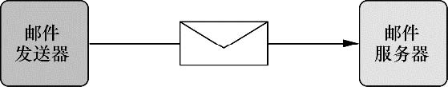<br/>
图19.1　Spring的MailSender接口是Spring Email抽象API的核心组件。它把Email发送给邮件服务器，由服务器进行邮件投递

Spring自带了一个MailSender的实现也就是JavaMailSenderImpl，它会使用JavaMail API来发送Email。Spring应用在发送Email之前，我们必须要将JavaMailSenderImpl装配为Spring应用上下文中的一个bean。

## 1.1　配置邮件发送器
```java
  @Bean
  public MailSender mailSender(Environment env) {
    JavaMailSenderImpl mailSender = new JavaMailSenderImpl();
    mailSender.setHost(env.getProperty("mailserver.host"));
    mailSender.setPort(Integer.parseInt(env.getProperty("mailserver.port")));
    mailSender.setUsername(env.getProperty("mailserver.username"));
    mailSender.setPassword(env.getProperty("mailserver.password"));
    return mailSender;
  }
```

## 1.2　装配和使用邮件发送器
我们想要给Spitter用户发送Email提示他的朋友写了新的Spittle，所以我们需要一个方法来发送Email，这个方法要接受Email地址和Spittle对象信息。
```java
  @Override
  public void sendSimpleSpittleEmail(String to, Spittle spittle) {
    SimpleMailMessage message = new SimpleMailMessage();
    String spitterName = spittle.getSpitter().getFullName();
    message.setFrom("noreply@spitter.com");
    message.setTo(to);
    message.setSubject("New spittle from " + spitterName);
    message.setText(spitterName + " says: " + spittle.getText());
    mailSender.send(message);
  }
```

# 2　构建丰富内容的Email消息
Spring的Email功能并不局限于纯文本的Email。我们可以添加附件，甚至可以使用HTML来美化消息体的内容。让我们首先从基本的添加附件开始，然后更进一步，借助HTML使我们的Email消息更加美观。

## 2.1　添加附件
如果发送带有附件的Email，关键技巧是创建multipart类型的消息——Email由多个部分组成，其中一部分是Email体，其他部分是附件。

对于发送附件这样的需求来说，SimpleMailMessage过于简单了。为了发送multipart类型的Email，你需要创建一个MIME（Multipurpose Internet Mail Extensions）的消息，我们可以从邮件发送器的createMimeMessage()方法开始：
`MimeMessage message = mailSender.createMimeMessage();`

javax.mail.internet.MimeMessage本身的API有些笨重。好消息是，Spring提供的MimeMessageHelper可以帮助我们。为了使用MimeMessageHelper，我们需要实例化它并将MimeMessage传给其构造器：
`MimeMessageHelper helper = new MimeMessageHelper(message, true);`
构造方法的第二个参数，在这里是个布尔值true，表明这个消息是multipart类型的。

得到了MimeMessageHelper实例后，我们就可以组装Email消息了。这里最主要区别在于使用helper的方法来指定Email细节，而不再是设置消息对象.
```java
  @Override
  public void sendSpittleEmailWithAttachment(String to, Spittle spittle) throws MessagingException {
    MimeMessage message = mailSender.createMimeMessage();
    MimeMessageHelper helper = new MimeMessageHelper(message, true);
    String spitterName = spittle.getSpitter().getFullName();
    helper.setFrom("noreply@spitter.com");
    helper.setTo(to);
    helper.setSubject("New spittle from " + spitterName);
    helper.setText(spitterName + " says: " + spittle.getText());
    ClassPathResource couponImage = new ClassPathResource("/collateral/coupon.png");
    helper.addAttachment("Coupon.png", couponImage);
    mailSender.send(message);
  }
```

## 2.2　发送富文本内容的Email
发送富文本的Email与发送简单文本的Email并没有太大区别。关键是将消息的文本设置为HTML。要做到这一点只需将HTML字符串传递给helper的setText()方法，并将第二个参数设置为true：
<br/>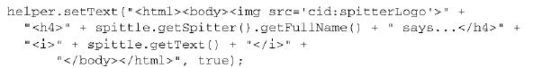<br/>

第二个参数表明传递进来的第一个参数是HTML，所以需要对消息的内容类型进行相应的设置。
要注意的是，传递进来的HTML包含了一个``标签，用来在Email中展现Spittr应用程序的logo。src属性可以设置为标准的“http:”URL，以便于从Web中获取Spittr的logo。但在这里，我们将logo图片嵌入在了Email之中。值“cid:spitterLogo”表明在消息中会有一部分是图片并以spitterLogo来进行标识。

为消息添加嵌入式的图片与添加附件很类似。不过这次不再使用helper的addAttachment()方法，而是要调用addInline()方法：
```java
ClassPathResource couponImage = new ClassPathResource("coupon.png");
helper.addInline("spitterLogo", couponImage);
```

以下是新的sendRichSpitterEmail()方法:
<br/>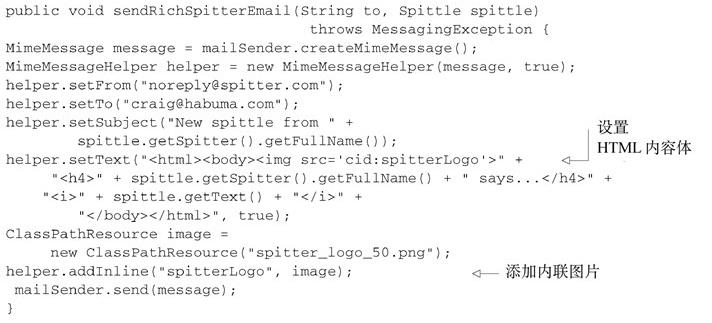<br/>

创建Email体时，使用字符串拼接的办法来构建HTML消息依旧让我觉得美中不足。在结束Email话题之前，让我们看看如何用模板来代替字符串拼接消息。

# 3　使用模板生成Email
我们需要与最终HTML接近的方式来表达Email布局，然后将模板转换成String并传递给helper的setText()方法。在将模板转换为String时，我们有多种模板方案可供选择，包括Apache Velocity和Thymeleaf。让我们看一下如何使用这两种方案创建富文本的Email消息，先从Velocity开始吧。
## 3.1　使用Velocity构建Email消息
为了使用Velocity对Email进行布局，我们需要将VelocityEngine装配到SpitterEmailServiceImpl中。Spring提供了一个名为VelocityEngineFactoryBean的工厂bean，它能够在Spring应用上下文中很便利地生成VelocityEngine。VelocityEngineFactoryBean的声明如下：
<br/>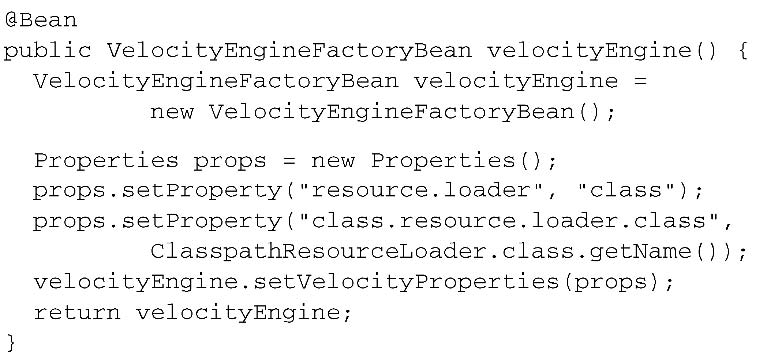<br/>

VelocityEngineFactoryBean唯一要设置的属性是velocityProperties。在本例中，我们将其配置为从类路径下加载Velocity模板（关于配置Velocity的更多细节，请查阅Velocity文档）。

现在，我们可以将Velocity引擎装配到SpitterEmailServiceImpl中。因为SpitterEmailServiceImpl是使用组件扫描实现自动注册的，我们可以使用@Autowired来自动装配velocityEngine属性：
```java
@Autowired
VelocityEngine velocityEngine;
```
现在，velocityEngine属性可用了，我们可以使用它将Velocity模板转换为String，并作为Email文本进行发送。为了帮助我们完成这一点，Spring自带了VelocityEngineUtils来简化将Velocity模板与模型数据合并成String的工作。以下是我们可能的使用方式：
<br/>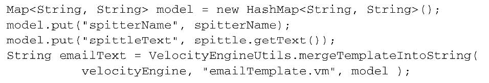<br/>

在Java代码中剩下的事情就是得到合并后的Email文本，并将其传递给helper的setText()方法：
```
    helper.setText(emailText, true);
```

模板位于类路径的根目录下，是一个名为emailTemplate.vm的文件，它看起来可能是这样的：
<br/>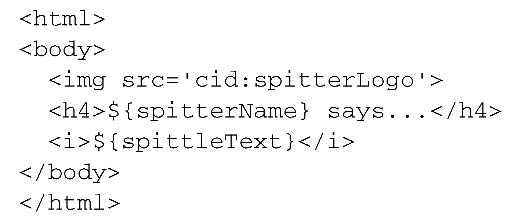<br/>

## 3.2　使用Thymeleaf构建Email消息
当我们将Email模板转换为Thymeleaf模板时，Thymeleaf的WYSIWYG特性体现得非常明显：
<br/>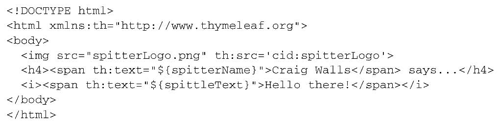<br/>

注意，这里没有任何自定义的标签（在JSP中可能会见到这种情况）。尽管模型属性是通过“${}”标记的，但是它们仅用于属性的值中，不会像Velocity那样用在外边。这种模板可以很容易地在Web浏览器中打开，并且以完整的形式进行展现，不必依赖于Thymeleaf引擎的处理。

使用Thymeleaf来生成和发送Email消息的做法非常类似于Velocity：
<br/>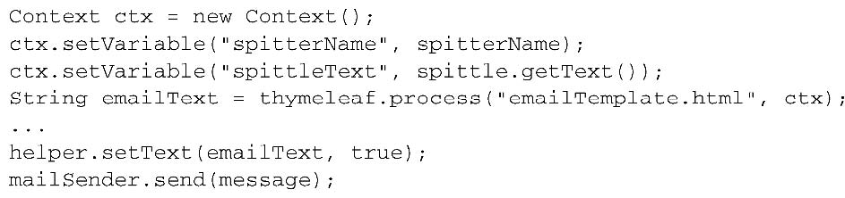<br/>

这里的Thymeleaf引擎与我们在第6章构建Web视图时所使用的SpringTemplateEnginebean是相同的。在这里，我们使用构造器注入的方式将其注入到SpitterEmailServiceImpl中：
<br/>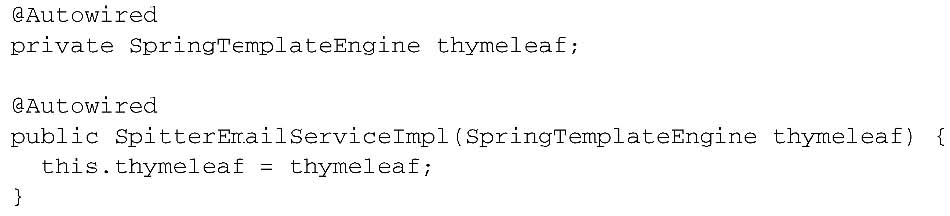<br/>

不过，我们必要要对SpringTemplateEnginebean做一点小修改。在第6章中，它配置为从Servlet上下文中解析模板，而我们的Email模板需要从类路径中解析。所以，除了ServletContextTemplateResolver，还需要一个ClassLoaderTemplateResolver：
<br/>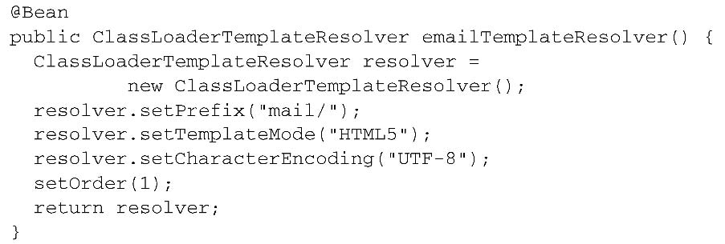<br/>

需要注意，我们将prefix属性设置为“mail/”，这表明它会在类路径根的“mail”目录下开始查找Thymeleaf模板。因此，Email模板文件的名字必须是emailTemplate.html，并且位于类路径根的“mail”目录下。

因为我们现在有两个模板解析器，所以需要使用order属性表明优先使用哪一个。ClassLoaderTemplateResolver的order属性为1，因此我们修改一下ServletContextTemplateResolver，将其order属性设置为2：
<br/>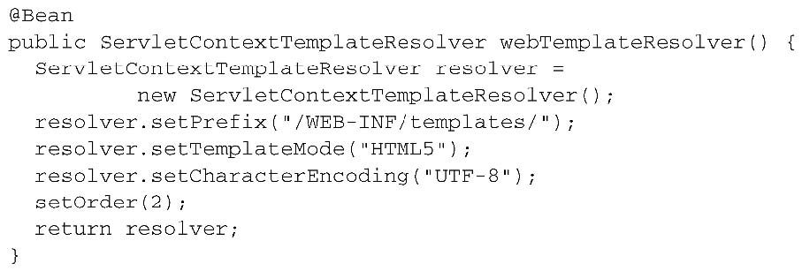<br/>

现在，剩下的任务就是修改SpringTemplateEnginebean的配置，让它使用这两个模板解析器：
<br/>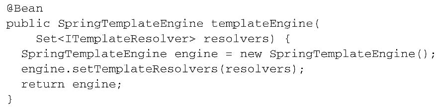<br/>

在此之前，我们只有一个模板解析器，所以可以将其注入到SpringTemplateEngine的templateResolver属性中。但现在我们有了两个模板解析器，所以必须将它们作为Set的成员，然后将这个Set注入到templateResolvers（复数）属性中。


# 源码
https://github.com/myitroad/spring-in-action-4/tree/master/Chapter_19